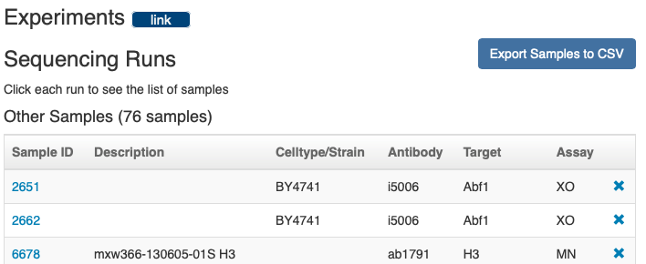

All data not subject to privacy restrictions (e.g. patient-protected samples) should be made publicly available at one of the national genomic data repositories. We submit through [Gene Expression Omnibus (GEO)](https://www.ncbi.nlm.nih.gov/geo/).

:::danger
DO NOT PROCEED unless you are ready to submit your manuscript. It is a pain in the butt to edit a submission later so it is better to finalize your datasets beforehand.
:::

When the data used for your manuscript is somewhat finalized, follow the instructions here to submit your data. Allow for a couple days time for curators at NCBI to process samples but they usually have a quick turnaround time.

## Get the latest instructions
Follow the [GEO submission instructions](https://www.ncbi.nlm.nih.gov/geo/info/submission.html) for submitting the UNPUBLISHED datasets ("Novel Set") used in the manuscript. Almost all data we produce are **"high-throughput sequencing data"** if they are coming from PEGR.

:::note
The instructions from GEO always supercede the documentation on this page. Please talk to a bioinformatician if you run into inconsistencies between the GEO instructions and this page.
:::

## Get your list of PEGR sample IDs to submit

### From Project ID
[1331](https://vesta.cac.cornell.edu/pegr/project/show/1331) is the ID for `Krietenstein 2016 - Cell (Novel Set)`. Check the end of the project URL if you're not sure you have the right project ID (vesta.cac.cornell.edu/pegr/project/show/**1331**)

### From Sample List
Or you can get a list of sample IDs by scrolling down to the "Experiments" section and clicking "Export Samples to CSV"

:::caution
Just use the ["Novel set"][novel-set] samples. Previously published samples (["Reanalyzed set"][reanalyzed-set]) that have been reanalyzed for this manuscript should NOT be included in the submission. These can be cited within the manuscript using their existing NCBI accession info.
:::

## Retrieve data from PEGR
PEGR houses the metadata, raw data file links, and processed data file links that you need to create the GEO submission. We have built command line tools for facilitating the bulk retreival of this data.

:::danger
Please do not manually fill in the GEO submission form or manually download files as that has historically been mistake-prone. Use the PEGR API (see links below).
:::

### (Step 2) Gather raw files (FASTQ)
Use [EGC_utility_scripts](https://github.com/CEGRcode/EGC_utility_scripts/blob/master/generate_FQ_file_from_PEGR.py) to pull the raw FASTQ sample files

### (Step 3) Gather processed files
Samples may be "processed" differently depending on the data type. Use your judgement on what is appropriate for the purposes of the study. Consider referencing [this script](https://github.com/CEGRcode/2022-Mittal_SAGA/blob/main/03_Bulk_Processing/job/bulk_geo_tracks.pbs) for creating BigWig pileups of 5' Read1 coverage across the genome. Or you can pull the BigWig files from the core pipeline (`paired_004`). If you are using `paired_004` BigWigs, note the computational steps from the pipeline and fill in the GEO submission accordingly.

### (Step 4) Gather metadata
Use [EGC_utility_scripts](https://github.com/CEGRcode/EGC_utility_scripts/blob/master/generate_Metadata_file_from_PEGR.py) for pulling metadata from PEGR as a starting point for building the spreadsheet. **You may need to manually adjust the metadata output of this script to fit GEO specifications for the submission.** 

See GEO for downloading the metadata template on the instructions page. Fill it in with the sample metadata and manuscript information.

:::tip
Check Box for previous GEO submission spreadsheets.
:::

## (Step 5) Get MD5 Checksums for all raw and processed files
You can use [ScriptManager][scriptmanager-md5sum] to do this for all your FASTQ and processed (e.g. BigWig) files.

## Organize and submit according to GEO instructions
Follow the GEO instructions for organizing your data. Please separate data from different assays as appropriate. Please or

Then upload the data to their servers (it will give you options, try the FTP server option first). Regarding the date to make the data public, **start with at least a year out**. This can be changed later.

## Follow up on the submission
Once approved, you should get an email from GEO with the newly created `GSEXXXXXX` and `GSMXXXXXX` accessions to include in the manuscript.
* This typically means including the study (`GSEXXXXXX`) accession in the **Methods** or **Data Access** sections and the specific samples (`GSMXXXXXX`) in the **extended methods/tables**. The accessions of reanalyzed data from previously published samples should be similarly included.

Also update with accession:
* Github repo
* PEGR projects (Novel, reanalyzed, and working)

## After manuscript is accepted...
Notify GEO so they can coordinate with the journal to release the data with the manuscript. We don't want the manuscript to be in print but not have the data available to readers!

[novel-set]:./pegr-projects#novel-set
[reanalyzed-set]:./pegr-projects#reanalyzed-set

[scriptmanager-md5sum]:https://pughlab.mbg.cornell.edu/scriptmanager-docs/docs/Tools/file-utilities/md5checksum