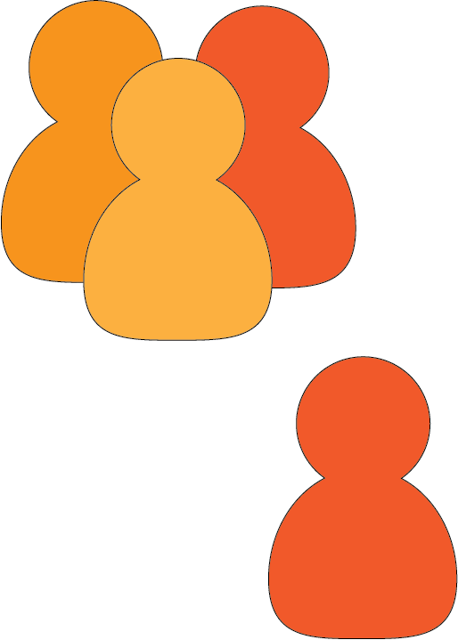
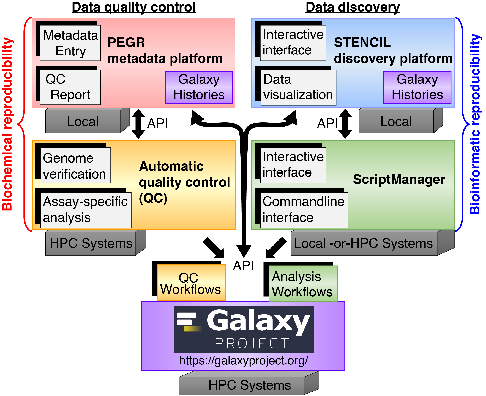

This site serves as a dynamic place for **technical documentation** and **checklists** for the Pugh lab. The goal is to preserve **consistency of workflows** to maximize **comparability of results** between lab members. There are a lot of details on best practices and lab standards throughout with an attempt to organize them by topic for better findability.

:::tip
Please let Olivia (or whoever is maintaining this site) if you have trouble finding anything or if you have suggestions for reorganizing the content for clarity. The markdown format of the site pages was intended to make it easier for lab members to update the documentation so feel free to draft something and then request the site maintainer to deploy your changes.
:::

## Editing this site

This is an example file for a Docusaurus page under General.

Each page should have the above header format with a unique `id`, `title` for display at the top of the page, and `sidebar_label` with the page's name to display in the sidebar. `sidebar_position` is an optional field to customize the order that each page should appear in.

You can add images from `/labtutorial/docs/General/images` like this:

``

where `./` is the current directory your markdown file is stored in (in this case, `/labtutorial/docs/General`).

It will look like this:

If you wish to link a file from another tab's directory (like the software infrastructure image), you can use the `../` string to go down one directory. For example, for an image in `/labtutorial/docs/General/images` getting added to this page, you would include:

``

It will look like this:

