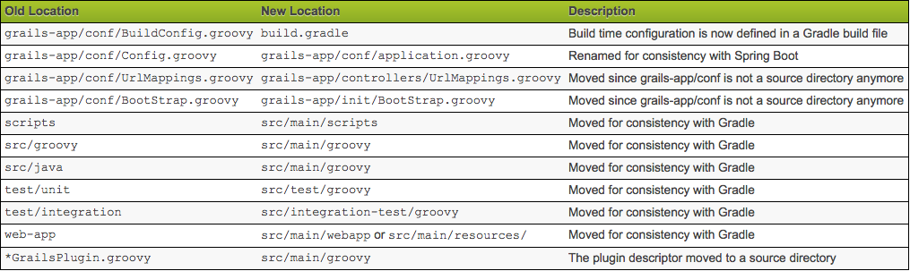
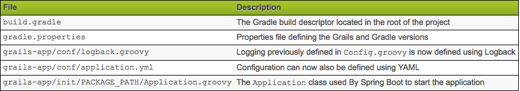
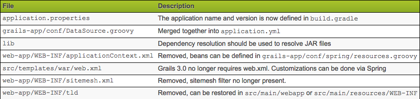

:::warning
This documentation was written for the setting up PEGR on Penn State systems. Please reference the documentation in the [Github repo][github-pegr] for more up-to-date instructions.
:::

## Pre-Install

Install curl (For Windows, use Git Bash)

Install sdkman ([tutorial](http://sdkman.io/install.html)):

  * `$ curl -s "https://get.sdkman.io" | bash`
  * `$ source "$HOME/.sdkman/bin/sdkman-init.sh"`
  * `$ sdk version` # check your sdkman version

Install Grails:

* `$ sdk install grails 2.5.5`
* `$ sdk list grails`      # check your installation of grails
* `$ sdk use grails 2.5.5` # change your default grails to version 2.5.4

-	Now close the terminal and quit the terminal in your dashboard. [Important!]

Install Groovy:

* `$ sdk install groovy 2.4.4`
* `$ sdk list groovy` # check your current version of groovy

Install Java:

* `$ sdk install java 7u141-zulu` # install Java (specific version needed for current PEGR)
* `$ sdk install java 8u141-zulu` # alternate version that is also compatible
* `$ sdk list java` # Check your current version of java

Install MAMP:
* `https://www.mamp.info/en/downloads/` # download link

-	Now Close your terminal and quit the terminal on the dashboard.[Need to do above step, if you want to run pegr locally ;)]

* `$ grails` # check if grails has been successfully installed
* Press ctrl+C to exit the prompt.

## PEGR Install

•	:smile: Go to any directory of your choice and clone the PEGR git repo.

* `$ git clone https://github.com/seqcode/pegr.git` # clone "pegr" in your directory

•	Navigate to pegr/pegr/grails-app/conf/BuildConfig.groovy and edit these lines

    grails.project.target.level = 1.6 -> grails.project.target.level = 1.7
    grails.project.source.level = 1.6 -> grails.project.source.level = 1.7

Download the [MySQL file](https://psu.app.box.com/file/175943271869) and rename it to pegrDB.sql

Go to System Preferences and find MySql icon, then click to start the SQL server.

* `$ mysql.server start` -(mac) if you have installed using homebrew

-	Open the terminal and navigate to the same directory as the pegrDB.sql file

* `$ mysql -u root -p` # Connect to your server

This will prompt you for that password it gave you. [ if you installed MySQL using the .dmg file] otherwise, in the case of homebrew, there is no password set for root. You should be able to see the prompt mysql>

After successfully connected to the MySQL, set the password for root

* `$ mysql> ALTER USER 'root'@'localhost' IDENTIFIED BY '<your new password>';`

•	Create and switch to the new database:

	mysql> Create database pegr;
	mysql> use pegr;
	mysql> source pegrDB.sql
	mysql> show tables;

  •	Successful output [here](image/pegr/pegr12.png)

Create a new user to access your “pegr” database

    mysql> create user 'username'@'localhost' identified by 'password';
    mysql> grant all privileges on *.* to 'username'@'localhost';

For an example,

    mysql> create user hyc5135@localhost identified by 'mypassword';
    mysql> grant all privileges on *.* to hyc5135@localhost;

Modify an existing account to gain a login credentials (need a valid non-WebAccess account)
Within your pegrDB, locate the user "labadmin" and replace the password value:

    $ mysql> UPDATE user set password="password" where username="labadmin";

Open the BuildConfig.groovy file at pegr/grails-app/conf/BuildConfig.groovy and check the plugins block and verify that the build for the tomcat is appropriate to your version and add the below lines within the plugin block

    compile ":spring-security-core:2.0.0"
    compile "org.grails.plugins:quartz:1.0.1"
    compile "org.grails.plugins:mail:1.0.7"

Also, within the dependencies block, uncomment runtime 'mysql' 	[if it is commented]

Now open DataSource.groovy at the pegr/grails-app/conf/DataSource.groovy and edit the datasource block to look like this:

    environments {
        development {
            dataSource {
                dbCreate = "update" // one of 'create', 'create-drop', 'update', 'validate', ''
                url = "database_url"
    			username=" your_username"
    			password="your_password"
            }
        }
    }

Now go into the pegr folder and run pegr

  * `$ grails run-app`

This will successfully start and provide with you an url (http://localhost:8081/pegr) that usually directs you to the login screen of PEGR.

Login using the following labadmin credentials:

    Username: labadmin
    Password: passcode

CONGRATULATIONS, YOU HAVE SUCCESSFULLY SET UP THE LOCAL PEGR!

---

## Grails Tutorial

•	Tutorial link reference: http://grails.asia/

### Introduction
What is Grails?

Grails is an open source web application framework that uses the Apache Groovy programming language (based on Java). It is intended to be a high-productivity framework by following the "coding by convention" paradigm, providing a stand-alone development environment and hiding much of the configuration detail from the developer.

### Benefits

1. Convention over configuration ushers in abundant productivity for the developers.
2. Grails enables you to write DRY code. If you have any existing Java code, reusing it in Grails should be no problem.
3. Developers don’t need to write all the plumbing/boilerplate code with Grails.
Here, developers have a big relief as they can concentrate more on turning your ideas into applications instead of chasing after configuring the framework components.
4. As it is free of XML configuration, the Groovy on Grails can help you to develop the application in real time.
5. Grails supports scaffolding. This helps developers to create applications with CRUD functionalities- Create, Read, Update and delete.
6. Simple and easy to maintain code.

### Migration

Grails 3.0 is a complete ground up rewrite of Grails and introduces new concepts and components for many parts of the framework.
When upgrading an application or plugin from Grails 3.0 there are many areas to consider including:
For step-by-step migration guide click [here]

The migration of Grails app version 2 to 3 can be done with helpful [links](https://www.youtube.com/watch?v=IhehO9aM5bk).

To summarize the video, there are three main changes:

  * Different file directories
  * Merged files
  * Deleted files

There are also more changes as follows:

  Removal of dynamic scaffolding from Grails 3.0.0 till 3.0.4 when it was re-introduced
  Removal of before and after interceptors
  Project structure differences
  File location differences
  Configuration differences
  Package name differences
  Legacy Gant Scripts
  Gradle Build System
  Changes to Plugins
  Source vs Binary Plugins

The biggest suggestion from the video is installing a fresh, new grails 3 app and migrating from the original grails 2 app instead of trying to make the changes in the original app. This will create a clean migration platform.

After the migration, you must test intensively to catch any unexpected errors.


---

## PEGR Upgrade Notes (Grails 2.5.5 -> 3.3.5)
__Written by:__  Pierce Chaffin
__Last Updated:__ 06/27/18

*This is not all inclusive of bugs you will encounter however I am working to add those as soon as I can*
Notes:


### Initial Migration of Files



* First Step is to create a new grails project in grails 3.3.5 in a new directory.sdf
* Next is to migrate all relevant files to their new homes in the new file hierarchy in grails 3.x

#### Start with the source files

```
$ cp -rf ../old_app/src/groovy/* src/main/groovy
$ cp -rf ../old_app/src/java/* src/main/groovy
$ cp -rf ../old_app/grails-app/* grails-app
```
#### Then migrate all test files
```
$ cp -rf ../old_app/test/unit/* src/main/groovy
$ cp -rf ../old_app/src/java/* src/main/groovy
$ cp -rf ../old_app/grails-app/* grails-app
```

* Now that was it for the easy segments … onto all the configuration files and reorganization

* For starters lets migrate all dependencies from BuildConfig.groovy to the new build.gradle file

* (Mind you all of these plugins have new names and access locations as codehaus and other packages no longer exist)

* Ex: As the lib directory no longer is directly supported do this …

```
      compile fileTree(dir:'lib', include:'.jar')
```

#### Additionally, going back to codehaus
* ##### org.codehaus.groovy.grails. has been migrated to grails.code.GrailsApplication.*
* At this point in terminal we are going to want to resolve controller dependencies as well as some domain dependencies
##### Do this by running
```
$ grails compile
```

*Do this quite a few times, looking at the stack trace and resolving as you go*

* First issue you will probably encounter is that of @grails.validation.Validateable
* This is no longer in Grails 3 and needs to be changed to a class implementation
```
class XXXX implements grails.validation.Validateable()
```

#### A few other notes with regards to syntax … a few packages in grails have changed simply in terminology .. i.e. j_username is now simply username in Spring Security Core (auth.gsp)




* Once you compile successfully you can try to run-app but almost assuredly will find that this doesn’t work
* Next comes the configuration files … Start by moving URLMappings.groovy to the controllers directory
* And then change Config.groovy to application.groovy
* And then it is up to you (I went with the YAML file) as to where you want to merge in your DataSource.groovy (Either into application.yml or application.groovy
* Delete log4j from the application.groovy file
* Migrate the URLInterceptMapping to the new formatting and change it to a static rules mapping
##### Run
```
$ grails s2-quickstart User Role
```

#### Past this, a lot of functionality might still not work as some dependencies are still not lining up properly
* At this point the concept of the security in Grails being different in defaults is the largest obstacle.
* In grails 3.x, by default all pages are inaccessible unless explicitly notated in the static rules of the application security for specific rules.
* Thus, as shown below make a mapping for every page with rules with regards to User Roles.

```
[pattern:'/report/togglePreferredAlignment/**', access:['ROLE_ADMIN']],
```
---
[github-pegr]:https://github.com/seqcode/pegr
