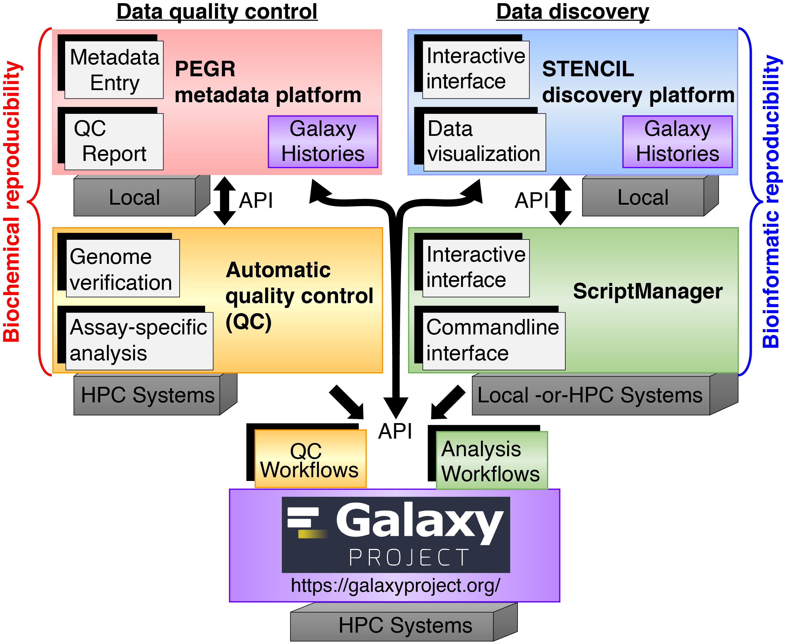

This section contains installation guides to setup primary software packages and development infrastructure for the Pugh/Lai labs.

Every graduate student (WET AND DRY) in the lab will need to perform bioinformatic analysis at some point. Referencing these guides sooner rather than later can SAVE YOU AND THE DRY-BENCH MEMBERS OF THE LAB A LOT OF TIME.

## Infrastructure

The Pugh Lab, Lai Lab, and Epigenomics Core (EGC) are supported by an integrated infrastructure of software and tools that facilitates our research.

 

* [PEGR][pegr] - Manage metadata associated with all sequencing runs for looking up samples and downloading processed datafiles (e.g. BAM formatted alignments).
* [Galaxy][galaxy] - Create data analysis & visualization pipelines for large-scale data processing. The workflow results from these intitial analyses are displayed on PEGR.
* **[ScriptManger][scriptmanager] - For day-to-day bioinformatics.** Generalized toolbox of scripts we use to perform both our standard ChIP-exo analyses and more customized analyses for most of our papers
* [GenoPipe][genopipe] - Quality check tool we use to confirm the genotypes of our samples which ultimately contributes to the reproducibility of our research.

## Our Resources

|Project | Software stack | Computing resources used |
|----|----|----|
| [Galaxy](https://hyperion.cac.cornell.edu) | Externally developed by [The Galaxy Project](https://galaxyproject.org/) | Galaxy is run on [Cornell CAC](https://www.cac.cornell.edu/) servers and also leverages [ACCESS (fromerly XSEDE)](https://allocations.access-ci.org/) resources for compute requirements. |
| [Platform for Epigenetic and Genomic Research (PEGR)](https://vesta.cac.cornell.edu/pegr) | [MySql](https://www.mysql.com/), [Grails](https://grails.org/), [Groovy](https://groovy-lang.org/) | PEGR is also run on [Cornell CAC](https://www.cac.cornell.edu/) servers. |
| [Yeast Epigenome Project (YEP)](http://www.yeastepigenome.org/) | MERN software stack* |
| [Protein Capture Reagent Program Validation (PCRP)](http://www.pcrpvalidation.org/) | MERN software stack* |

*MERN Stack is made up of [MongoDB](https://www.mongodb.com/), [Express](https://expressjs.com/), [React](https://reactjs.org/), [NodeJS](https://nodejs.org/en/)

[pegr]:https://www.pegr.org
[galaxy]:https://galaxyproject.github.io/
[scriptmanager]:http://pughlab.mbg.cornell.edu/scriptmanager-docs/docs/
[genopipe]:https://pughlab.mbg.cornell.edu/GenoPipe-docs/
