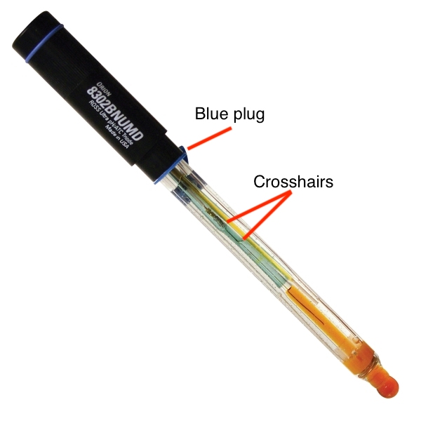
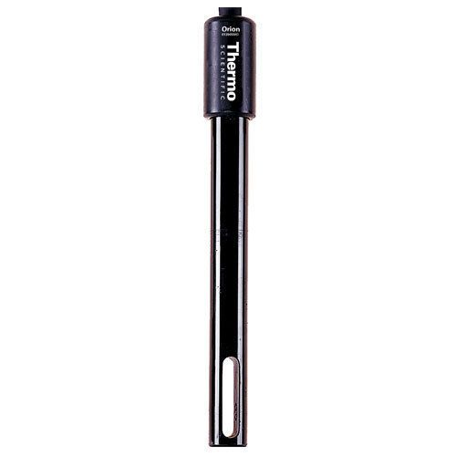

# Buffer Preparation

***

This page is meant to serve as a centralized repository for all buffers and solutions used by the <a href="https://www.pughlab.psu.edu/" target="_blank">Pugh Lab</a> as well as guide new members on preparation procedures.

***

## General Notes

***

### Making Solutions

Use 50% of the total volume to dissolve the solid or liquid components of the buffers unless the protocol states otherwise. Pour the solution into a graduated cylinder once the components are dissolved and bring up to the final volume with ddH2O. Filter sterilize with a <a href="https://us.vwr.com/store/product/4829245/nalgene-rapid-flowtm-filter-units-and-bottle-top-filters-pes-membrane-sterile-thermo-scientific" target="_blank">Nalgene® Rapid-Flow™ Filter Unit</a> of the appropriate size, and store at the recommended temperature listed under each recipe. 

### pH/Conductivity Readings

#### pH Probe Checklist

Before using the pH probe, ensure that the following list of requirements are met:

* pH probe is full to the middle of the crosshairs with <a href="https://www.thermofisher.com/order/catalog/product/510011#/510011" target="_blank">filling solution</a>.
* pH probe is rinsed with ddH2O and DABBED with a Kimwipe after rinsing.
* Parafilm and blue plug removed from the neck of the probe-->replace when finished.
* pH probe has been calibrated in last 30 days.
* All measurements taken from consistent depth in the solution (at least beyond dark red/orange part of probe).

#### Conductivity Probe Checklist

Before using the conductivity probe, ensure that the following list of requirements are met:

* Probe is rinsed with ddH20 and DABBED with a Kimwipe after rinsing.
* Probe has been calibrated in last 30 days.
* All measurements are taken from consistent depth in the solution (at least beyond opening at bottom of the probe).

***

## Buffer Recipes

***

### Reagents and Stock Solutions

#### 10X PBS (1 L)

Final Conc. of Component | MW (g/mol)| Amount
:--------- | :--: | :------:
27 mM <a href="https://www.fishersci.ca/shop/products/potassium-chloride-white-crystals-fisher-bioreagents-2/bp3661" target="_blank">KCl</a>| 74.55 | 2 g
14.7 mM <a href="https://www.sigmaaldrich.com/catalog/product/sigma/p9791?lang=en&region=US" target="_blank">KH2PO4 (monobasic)</a> | 136.09 | 2 g
1.379 M <a href="https://us.vwr.com/store/product/4559541/sodium-chloride-99-0-gr-acs" target="_blank">NaCl</a> | 58.44 | 80 g
81 mM <a href="https://www.sigmaaldrich.com/catalog/product/mm/106586?lang=en&region=US" target="_blank">Na2HPO4 (dibasic)</a> | 141.96 | 11.5 g

Bring final volume to 1 L with ddH2O in a graduated cylinder. Filter sterilize and store at RT.

&nbsp;

#### 10mM Tris-HCl, pH 7.5 (2 L)

Final Conc. of Component | Stock | Amount
:--------- | :--: | :------:
10 mM <a href="https://cegrcode.github.io/GeneralLab/buffers/#1-m-tris-hcl-ph-75-1-l" target="_blank">Tris-HCl, pH 7.5</a> | 1 M | 20 mL

Bring final volume to 2 L with ddH2O in a graduated cylinder. Filter sterilize and store at RT.

&nbsp;

#### TE (Tris-EDTA) (500 mL)

Final Conc. of Component | Stock | Amount
:--------- | :--: | :------:
10 mM <a href="https://cegrcode.github.io/GeneralLab/buffers/#1-m-tris-hcl-ph-80-1-l" target="_blank">Tris-HCl, pH 8.0</a> | 1 M | 5 mL 
1 mM <a href="https://cegrcode.github.io/GeneralLab/buffers/#05-m-edta-ethylenediaminetetraacetic-acid-ph-80-500-ml" target="_blank">EDTA, pH 8.0</a> | 0.5 M | 1 mL

Bring final volume to 500 mL with ddH2O in a graduated cylinder. Filter sterilize and store at RT.

&nbsp;

#### 2X Proteinase K Buffer (50 mL)

Final Conc. of Component | Stock | Amount
:--------- | :--: | :------:
40 mM <a href="https://cegrcode.github.io/GeneralLab/buffers/#1-m-tris-hcl-ph-75-1-l" target="_blank">Tris-HCl, pH 7.5</a> | 1 M | 2 mL
40 mM <a href="https://cegrcode.github.io/GeneralLab/buffers/#05-m-edta-ethylenediaminetetraacetic-acid-ph-80-500-ml" target="_blank">EDTA, pH 8.0</a> | 0.5 M | 4 mL
2% <a href="https://cegrcode.github.io/GeneralLab/buffers/#20-sds-sodium-dodecyl-sulfate-500-ml" target="_blank">SDS</a> | 20% | 5 mL

Bring final volume to 50 mL with ddH2O in a graduated cylinder. Filter sterilize with <a href="https://us.vwr.com/store/product/4830405/pall-acrodisc-sterile-syringe-filters-with-supor-membrane-pall-laboratory" target="_blank">syringe filter</a> and store at RT.

&nbsp;

#### 5X TAE (Tris-Acetic Acid-EDTA) (1 L)

Final Conc. of Component | Stock | Amount
:--------- | :--: | :------:
200 mM <a href="https://us.vwr.com/store/product/4562172/tris-hydroxymethyl-aminomethane-tris-trometamol-99-9-dried-basis-ultrapure-bioreagent-molecular-biology-grade-j-t-baker" target="_blank">Tris Base</a> |  | 24.2 g
100 mM <a href="https://www.fishersci.com/shop/products/acetic-acid-glacial-70/S25118" target="_blank">Glacial Acetic Acid</a> | 17.4 M | 5.7 mL
5 mM <a href="https://cegrcode.github.io/GeneralLab/buffers/#05-m-edta-ethylenediaminetetraacetic-acid-ph-80-500-ml" target="_blank">EDTA, pH 8.0</a> | 0.5 M | 10 mL

Bring final volume to 1 L with ddH2O in a graduated cylinder. Filter sterilize and store at RT.

&nbsp;

#### 1X TAE (Tris-Acetic Acid-EDTA) (20 L)

Final Conc. of Component | Stock | Amount
:--------- | :--: | :------:
40 mM <a href="https://us.vwr.com/store/product/4562172/tris-hydroxymethyl-aminomethane-tris-trometamol-99-9-dried-basis-ultrapure-bioreagent-molecular-biology-grade-j-t-baker" target="_blank">Tris Base</a> |  | 96.9 g
20 mM <a href="https://www.fishersci.com/shop/products/acetic-acid-glacial-70/S25118" target="_blank">Glacial Acetic Acid</a> | 17.4 M | 23 mL
1 mM <a href="https://cegrcode.github.io/GeneralLab/buffers/#05-m-edta-ethylenediaminetetraacetic-acid-ph-80-500-ml" target="_blank">EDTA, pH 8.0</a> | 0.5 M | 40 mL

Bring final volume to 2 L with ddH2O in a graduated cylinder. Pour into 40 L carboy and add 18 L of ddH2O.

&nbsp;

#### 5X TBE (Tris/Borate/EDTA) (1 L)

Final Conc. of Component | Stock | Amount
:--------- | :--: | :------:
445 mM <a href="https://us.vwr.com/store/product/4562172/tris-hydroxymethyl-aminomethane-tris-trometamol-99-9-dried-basis-ultrapure-bioreagent-molecular-biology-grade-j-t-baker" target="_blank">Tris Base</a> |  | 53.9 g
445 mM <a href="https://www.sigmaaldrich.com/catalog/product/mm/bx0865?lang=en&region=US" target="_blank">Boric Acid</a>  |  | 27.5 g
15 mM <a href="https://cegrcode.github.io/GeneralLab/buffers/#05-m-edta-ethylenediaminetetraacetic-acid-ph-80-500-ml" target="_blank">EDTA, pH 8.0</a> | 0.5 M | 30 mL

Bring final volume to 1 L with ddH2O in a graduated cylinder. Filter sterilize and store at RT.

&nbsp;

#### 1X TBE (Tris/Borate/EDTA) (20 L)

Final Conc. of Component | Stock | Amount
:--------- | :--: | :------:
89 mM <a href="https://us.vwr.com/store/product/4562172/tris-hydroxymethyl-aminomethane-tris-trometamol-99-9-dried-basis-ultrapure-bioreagent-molecular-biology-grade-j-t-baker" target="_blank">Tris Base</a> |  | 215.6 g
89 mM <a href="https://www.sigmaaldrich.com/catalog/product/mm/bx0865?lang=en&region=US" target="_blank">Boric Acid</a> |  | 110 g
3 mM <a href="https://cegrcode.github.io/GeneralLab/buffers/#05-m-edta-ethylenediaminetetraacetic-acid-ph-80-500-ml" target="_blank">EDTA, pH 8.0</a> | 0.5 M | 120 mL

Bring final volume to 2 L with ddH2O in a graduated cylinder. Pour into 40 L carboy and add 18 L of ddH2O.

&nbsp;

#### 1X TGS (Tris-Glycine-SDS) (20 L)

Final Conc. of Component | Stock | Amount
:--------- | :--: | :------:
25 mM <a href="https://us.vwr.com/store/product/4562172/tris-hydroxymethyl-aminomethane-tris-trometamol-99-9-dried-basis-ultrapure-bioreagent-molecular-biology-grade-j-t-baker" target="_blank">Tris Base</a> |  | 60.6 g
192 mM <a href="https://us.vwr.com/store/product/4546166/glycine-98-5-101-5-dried-basis-baker-analyzed-biochemical-reagent-j-t-baker" target="_blank">Glycine</a> |  | 288.4 g
0.1% <a href="https://cegrcode.github.io/GeneralLab/buffers/#20-sds-sodium-dodecyl-sulfate-500-ml" target="_blank">SDS</a> | 20% | 100 mL

Bring final volume to 2 L with ddH2O in a graduated cylinder. Pour into 40 L carboy and add 18 L of ddH2O.

&nbsp;

#### 1X TBST (Tris/buffered saline/Tween-20) (8 L)

Final Conc. of Component | Stock | Amount
:--------- | :--: | :------:
10 mM <a href="https://us.vwr.com/store/product/4562172/tris-hydroxymethyl-aminomethane-tris-trometamol-99-9-dried-basis-ultrapure-bioreagent-molecular-biology-grade-j-t-baker" target="_blank">Tris Base</a> |  | 9.7 g
150 mM <a href="https://us.vwr.com/store/product/4559541/sodium-chloride-99-0-gr-acs" target="_blank">NaCl</a> |  | 70 g
0.05% <a href="https://www.fishersci.com/shop/products/tween-20-fisher-bioreagents-2/BP337100" target="_blank">Tween-20</a> | 100% | 4 mL
<a href="https://cegrcode.github.io/GeneralLab/buffers/#1-n-hcl-1-l" target="_blank">HCL</a> | 1 N | 40 mL

Bring final volume to 8 L with ddH20 in a graduated cylinder.

&nbsp;

#### Complete Protease Inhibitor (EDTA-free) (CPI) (1 mL)

Final Conc. of Component | Stock | Amount
:--------- | :--: | :------:
Tablets <a href="https://www.sigmaaldrich.com/catalog/product/roche/11836170001?lang=en&region=US" target="_blank">CPI</a> |  | 1 Tablet
ddH2O |  | 1 mL

Vortex until dissolved. Write the date on the 1.7 mL microcentrifuge tube and store at 4°C for 2 weeks. Throw away the CPI solution after 2 weeks.

&nbsp;

#### 10% Sodium Deoxycholate (200 mL)
_USE MASK--IRRITANT_

Final Conc. of Component | Stock | Amount
:--------- | :--: | :------:
10% <a href="https://us.vwr.com/store/product/7422589/sodium-deoxycholate-high-purity" target="_blank">Deoxycholic Acid Sodium Salt</a> |  | 20 g
Preheated ddH2O |  | 200 mL

Prepare in 250 mL glass beaker. Measure the powder into the beaker, and bring final volume to 200 mL with preheated ddH2O. Filter sterilize and store at RT.

&nbsp;

#### 1 M HEPES-KOH, pH 7.5 (1 L)

Final Conc. of Component | Stock | Amount
:--------- | :--: | :------:
1 M <a href="https://www.sigmaaldrich.com/catalog/product/sigma/h3375?lang=en&region=US" target="_blank">HEPES</a> | | 238.4 g
<a href="https://us.vwr.com/store/product/10073591/potassium-hydroxide-1-0-n-in-aqueous-solution-vwr-chemicals-bdh" target="_blank">KOH</a> | 1 N | 500 mL

Add 400 mL of 1 N KOH to start and monitor pH after adding HEPES. Add additional KOH to desired pH endpoint. Bring final volume to 1 L with ddH2O in a graduated cylinder. Filter sterilize and store at RT.

&nbsp;

#### 20% SDS (Sodium Dodecyl Sulfate) (500 mL)
_USE MASK--IRRITANT_

20% SDS is typically ordered from <a href="https://dotscientific.com/ProductViewmore?ProductName=DSL23100-500Group=Biochemicals%2c-Reagents-and-Kits%20&Category=Alkyl-Sulfates%20&Subc=SDS-20%25-Solution-%5bLauryl-sulfate-20%25-Solution%5d-%20&Title=%20&Id=51%20&CId=374%20&SId=2744%20&TId=0%20&PId=20850" target="_blank">Dot Scientific</a>, but separate SDS powder is kept in the lab at the buffer bench.

Final Conc. of Component | Stock | Amount
:--------- | :--: | :------:
20% SDS | | 100 g
Preheated ddH2O |  | 

Start with 300 mL ddH2O in 500 mL glass beaker and heat the water in microwave, then add SDS powder. Bring to 500 mL with ddH2O in a graduated cylinder. Filter sterilize and store at RT.

&nbsp;

#### 5 M NaCl (1 L)

Final Conc. of Component | Stock | Amount
:--------- | :--: | :------:
5 M <a href="https://us.vwr.com/store/product/4559541/sodium-chloride-99-0-gr-acs" target="_blank">NaCl</a> | | 292.2 g
Preheated ddH2O |  | 

Bring final volume to 1 L with ddH2O in a graduated cylinder. Filter sterilize and store at RT. Occasionally, solution will not flow through the filter immediately--allow the solution to cool and it will flow within a minute.

&nbsp;

#### 2 M KCL (1 L)

Final Conc. of Component | Stock | Amount
:--------- | :--: | :------:
2 M <a href="https://www.fishersci.ca/shop/products/potassium-chloride-white-crystals-fisher-bioreagents-2/bp3661" target="_blank">KCl</a> | | 149.1 g
ddH2O |  | 

Bring final volume to 1 L with ddH2O in a graduated cylinder. Filter sterilize and store at RT.

&nbsp;

#### 25% Triton X-100 (200 mL)

Final Conc. of Component | Stock | Amount
:--------- | :--: | :------:
25% <a href="https://www.sigmaaldrich.com/catalog/product/sial/x100?lang=en&region=US" target="_blank">Triton X-100</a> | 100% | 50 mL
Preheated ddH2O |  | 

Measure Triton X-100 directly into 250 mL glass beaker. Bring final volume to 200 mL with preheated ddH2O. Let stir on magnetic plate until completely dissolved (up to one hour) Filter sterilize and store at RT.

&nbsp;

#### 1 M Tris-HCl, pH 7.5 (1 L)

Final Conc. of Component | Stock | Amount
:--------- | :--: | :------:
1 M <a href="https://us.vwr.com/store/product/4562172/tris-hydroxymethyl-aminomethane-tris-trometamol-99-9-dried-basis-ultrapure-bioreagent-molecular-biology-grade-j-t-baker" target="_blank">Tris Base</a> | | 121.2 g
<a href="https://cegrcode.github.io/GeneralLab/buffers/#1-n-hcl-1-l" target="_blank">HCl</a> | 1 N | 800 mL 

Confirm pH with meter and adjust as needed. Bring final volume to 1 L with ddH2O in a graduated cylinder. 

&nbsp;

#### 1 M Tris-HCl, pH 8.0 (1 L)

Final Conc. of Component | Stock | Amount
:--------- | :--: | :------:
1 M <a href="https://us.vwr.com/store/product/4562172/tris-hydroxymethyl-aminomethane-tris-trometamol-99-9-dried-basis-ultrapure-bioreagent-molecular-biology-grade-j-t-baker" target="_blank">Tris Base</a> | | 121.2 g
<a href="https://cegrcode.github.io/GeneralLab/buffers/#1-n-hcl-1-l" target="_blank">HCl</a> | 1 N | 500 mL

Confirm pH with meter and adjust as needed. Bring final volume to 1 L with ddH2O in a graduated cylinder.

&nbsp;

#### 10% IGEPAL (Chemically indistinct from NP-40) (200 mL)

Final Conc. of Component | Stock | Amount
:--------- | :--: | :------:
10% <a href="https://www.sigmaaldrich.com/catalog/product/sial/i3021?lang=en&region=US" target="_blank">IGEPAL</a> | 100% | 20 mL
Preheated ddH2O |  | 

Measure IGEPAL in a 250 mL glass beaker. Bring final volume to 200 mL with preheated ddH2O. Filter sterilize and store at RT.

&nbsp;

#### 1 M LiCl (1 L)

Final Conc. of Component | Stock | Amount
:--------- | :--: | :------:
1 M <a href="https://us.vwr.com/store/product/4548669/lithium-chloride-99-0-by-argentometric-titration-granular-baker-analyzed-acs-j-t-baker" target="_blank">LiCl</a> |  | 42.39 g

Bring final volume to 1 L with ddH2O in a graduated cylinder. Filter sterilize and store at RT.

&nbsp;

#### 0.5 M EDTA (Ethylenediaminetetraacetic acid), pH 8.0 (500 mL)

Final Conc. of Component | Stock | Amount
:--------- | :--: | :------:
0.5 M <a href="https://dotscientific.com/ProductViewmore?ProductName=DSE57020-500&Group=Biochemicals%2C-Reagents-and-Kits&Category=Biochemical-Reagents&Subc=EDTA&Title=EDTA-Disodium-Salt-%5BEthylenediaminetetra-acetic-acid%2C-disodium-salt-dihydrate%5D&Id=51&CId=375&SId=3461&TId=3510&PId=20274" target="_blank">EDTA</a> |  | 93.1 g
<a href="https://www.sigmaaldrich.com/catalog/product/mm/sx0590?lang=en&region=US" target="_blank">NaOH</a> (Pellets) | | ~10 g

Add EDTA to 350 mL of ddH2O (EDTA will not dissolve until a certain pH is reached). Add half of the NaOH pellets and allow them to dissolve. Use the pH meter to monitor continuously, adding a few pellets at a time until the pH reaches 8.0. Bring final volume to 500 mL in a graduated cylinder. Filter sterilize and store at RT.

&nbsp;

#### 1 N HCl (1 L)

Final Conc. of Component | Stock | Amount
:--------- | :--: | :------:
1 N <a href="https://us.vwr.com/store/product/4546564/hydrochloric-acid-36-5-38-0-gr-acs" target="_blank">HCl</a> | 37% | 83.3 mL

Bring final volume to 1 L with ddH2O in a graduated cylinder. Store at RT in a glass bottle in the acids cabinet.

&nbsp;

#### 100 mM PMSF (Phenylmethane sulfonyl fluoride) (10 mL)
_HIGHLY TOXIC--WEAR A MASK_

Final Conc. of Component | Stock | Amount
:--------- | :--: | :------:
100 mM <a href="https://www.thermofisher.com/order/catalog/product/36978#/36978" target="_blank">PMSF</a> |  | 0.174 g
<a href="https://us.vwr.com/store/product/4542414/ethanol-pure-200-proof-100-usp-koptec" target="_blank">EtOH</a> | 100% | 10 mL

Prepare in a 15 mL conical tube. Store at -20°C.

&nbsp;

#### 3 M Sodium Acetate (50 mL)

Final Conc. of Component | Stock | Amount
:--------- | :--: | :------:
3 M <a href="https://www.fishersci.ca/shop/products/sodium-acetate-anhydrous-fused-crystals-certified-acs-fisher-chemical-2/s210500" target="_blank">Sodium Acetate, Anhydrous</a> |  |12.3 g
<a href="https://www.fishersci.com/shop/products/acetic-acid-glacial-70/S25118" target="_blank">Glacial Acetic Acid</a> |  | 4.3 mL
ddH2O |  | 20 mL

Adjust volume to 40 mL. Confirm pH 5.2 with pH meter and adjust with glacial acetic acid if necessary. Bring final volume to 50 mL with ddH2O in graduated cylinder. Filter sterilize and store at RT.

&nbsp;

#### 0.1% Tween-20 (1 L)

Final Conc. of Component | Stock | Amount
:--------- | :--: | :------:
0.1% <a href="https://www.fishersci.com/shop/products/tween-20-fisher-bioreagents-2/BP337100" target="_blank">Tween-20</a> | 100% | 1 mL
ddH2O |   | 999 mL

Add 1 mL of Triton to a 1 L graduated cylinder and bring final volume to 1 L with ddH2O. Filter sterilize and store at RT.

***

### Yeast Harvest and Sonication Solutions

#### YPD (Yeast Peptone Dextrose) Media (1 L)

Component | Stock | Amount
:--------- | :--: | :------:
<a href="https://us.vwr.com/store/product/16078053/bactotm-yeast-extract-life-technologies#order" target="_blank">Yeast Extract</a> |  | 10 g
<a href="https://us.vwr.com/store/product/16078369/bactotm-peptone-life-technologies" target="_blank">Bacto Peptone</a> |  | 20 g
<a href="https://www.fishersci.ca/shop/products/dextrose-d-glucose-anhydrous-granular-powder-certified-acs-fisher-chemical-6/p-98685" target="_blank">Dextrose</a> |  | 20 g

Add 700 mL of dH2O to a 2 L beaker and add each of the powders sequentially. Bring up to 1 L with dH2O and autoclave for 20 minutes on liquid cycle in a glass bottle. Store at RT.

&nbsp;

#### YPD Media Plates (1 L)

Component | Stock | Amount
:--------- | :--: | :------:
<a href="https://us.vwr.com/store/product/16078053/bactotm-yeast-extract-life-technologies#order" target="_blank">Yeast Extract</a> |  | 10 g
<a href="https://us.vwr.com/store/product/16078369/bactotm-peptone-life-technologies" target="_blank">Bacto Peptone</a>  |  | 20 g
<a href="https://www.fishersci.ca/shop/products/dextrose-d-glucose-anhydrous-granular-powder-certified-acs-fisher-chemical-6/p-98685" target="_blank">Dextrose</a> |  | 20 g
<a href="https://www.fishersci.com/shop/products/bd-bacto-dehydrated-agar-4/p-4886721" target="_blank">Bacto Agar</a> |  | 20 g

Add 700 mL of dH2O to a 2 L beaker and add each of the powders sequentially. Bring up to 1 L with dH2O and autoclave for 20 minutes on liquid cycle in a glass bottle. Pour media into plates when media cools to ~60°C (tolerable to touch for several seconds on bare hand).

&nbsp;

#### CSM (Complete Supplement Mixture) His- Media (1 L)

Component | Stock | Amount
:--------- | :--: | :------:
<a href="https://www.fishersci.com/shop/products/bd-difco-dehydrated-culture-media-yeast-nitrogen-base-without-amino-acids-6/p-4901538" target="_blank">Yeast Nitrogen Base</a> |  | 6.7 g
<a href="https://www.fishersci.ca/shop/products/dextrose-d-glucose-anhydrous-granular-powder-certified-acs-fisher-chemical-6/p-98685" target="_blank">Dextrose</a> |  | 20 g
<a href="https://www.mpbio.com/114510312-csm-his-powder-cf" target="_blank">CSM His-</a>  |  | 0.77 g
<a href="https://www.sigmaaldrich.com/catalog/product/sigma/a9126?lang=en&region=US" target="_blank">Adenine (Hemisulfate)</a> |  | 0.04 g

Add 700 mL of dH2O to a 2 L beaker and add each of the powders sequentially. Bring up to 1 L with dH2O and autoclave for 20 minutes on liquid cycle in a glass bottle. Store at RT.

&nbsp;

#### 2.5 M Glycine (1 L)

Final Conc. of Component | Stock | Amount
:--------- | :--: | :------:
2.5 M <a href="https://us.vwr.com/store/product/4546166/glycine-98-5-101-5-dried-basis-baker-analyzed-biochemical-reagent-j-t-baker" target="_blank">Glycine</a> |  | 187.5 g

Preheat 700 mL ddH2O in a 1 L glass beaker. Pour in powder and let dissolve. Bring final volume to 1 L with ddH2O in a graduated cylinder. Filter sterilize and store at RT.

&nbsp;

#### ST Buffer (1 L)

Final Conc. of Component | Stock | Amount
:--------- | :--: | :------:
10 mM <a href="https://cegrcode.github.io/GeneralLab/buffers/#1-m-tris-hcl-ph-75-1-l" target="_blank">Tris-HCl, pH 7.5</a> | 1 M | 10 mL
100 mM <a href="https://cegrcode.github.io/GeneralLab/buffers/#5-m-nacl-1-l" target="_blank">NaCl</a> | 5 M | 20 mL

Bring final volume to 1 L with ddH2O in a graduated cylinder. Filter sterilize and store at 4°C.

&nbsp;

#### FA Lysis Buffer (1 L)

Final Conc. of Component | Stock | Amount
:--------- | :--: | :------:
50 mM <a href="https://cegrcode.github.io/GeneralLab/buffers/#1-m-hepes-koh-ph-75-1-l" target="_blank">HEPES-KOH, pH 7.5</a> | 1 M | 50 mL
150 mM <a href="https://cegrcode.github.io/GeneralLab/buffers/#5-m-nacl-1-l" target="_blank">NaCl</a> | 5 M | 30 mL
2 mM <a href="https://cegrcode.github.io/GeneralLab/buffers/#05-m-edta-ethylenediaminetetraacetic-acid-ph-80-500-ml" target="_blank">EDTA, pH 8.0</a> | 0.5 M | 4 mL
0.1% <a href="https://cegrcode.github.io/GeneralLab/buffers/#10-sodium-deoxycholate-200-ml" target="_blank">Sodium Deoxycholate</a> | 10% | 10 mL
1% <a href="https://cegrcode.github.io/GeneralLab/buffers/#25-triton-x-100-200-ml" target="_blank">Triton X-100</a> | 25% | 40 mL

Bring volume up to 1 L with ddH2O in a graduated cylinder. Filter sterilize and store at 4˚C.

&nbsp;

####10 mM Hydrogen Peroxide (100 mL)
Final Conc. of Component | Stock | Amount
:----------------------- | :---: | :-----:
10 mM <a href="https://www.sigmaaldrich.com/catalog/product/sigma/h1009?lang=en&region=US" target="_blank">30% H2O2</a> | 9.7 M | 102 μL

Add to 100mL of ddH2O

***

### Mammalian Harvest and Sonication Solutions

#### Complete Iscove's Modified Dulbecco's Medium (IMDM) (1.11 L)

Final Conc. of Component | Stock | Amount
:--------- | :------ | :-----: 
<a href="https://www.thermofisher.com/order/catalog/product/12440046#/12440046" target="_blank">IMDM</a>| 1X | 1000 mL
1% <a href="https://www.thermofisher.com/order/catalog/product/15140163#/15140163" target="_blank">Penicillin-Streptomycin</a> | 10,000 U/mL | 10 mL
10% <a href="https://us.vwr.com/store/product/18706419/avantor-seradigm-usda-approved-origin-fetal-bovine-serum-fbs" target="_blank">Fetal Bovine Serum (FBS)</a> | 100% | 100 mL

*Note: Procedure below prepares enough media for one full week of passaging and harvesting at 3 L scale K562 cell culture. Adjust number of media bottles to prepare as necessary.*

Turn on the UV light in the biological safety cabinet and thaw 2 FBS bottles and 1 Penicillin-Streptomycin bottle in a 37°C water bath for 30 minutes. 

After 30 minutes, obtain 10 IMDM bottles. Wipe down all bottles, one serological pipette, a 50 mL serological pipette tip, and a 10 mL serological pipette tip with 70% ethanol, and place under the hood. Add each component to the IMDM carefully without placing lids on surface of hood. Cap the IMDM bottles and label them with a sharpie with the date and contents (10% FBS, 1% Pen/Strep). Store at 4˚C until needed.

Pour 10% bleach in the empty FBS and Pen/Strep bottles and let incubate for 30 minutes.  Wipe down the surface of the biological safety hood with 70% ethanol and turn on UV light for 30 minutes. Decant the solutions in FBS and Pen/Strep bottles in sink after 30 minutes.

&nbsp;

#### Complete Dulbecco's Modified Eagle Medium (DMEM) (1.11 L)

Final Conc. of Component | Stock | Amount
:--------- | :------ | :-----: 
<a href="https://www.thermofisher.com/order/catalog/product/11965126#/11965126" target="_blank">DMEM</a>| 1X | 1000 mL
1% <a href="https://www.thermofisher.com/order/catalog/product/15140163#/15140163" target="_blank">Penicillin-Streptomycin</a> | 10,000 U/mL | 10 mL
10% <a href="https://us.vwr.com/store/product/18706419/avantor-seradigm-usda-approved-origin-fetal-bovine-serum-fbs" target="_blank">Fetal Bovine Serum (FBS)</a> | 100% | 100 mL

Turn on the UV light in the biological safety cabinet and thaw 1 FBS bottle and 1 Penicillin-Streptomycin bottle in a 37°C water bath for 30 minutes. 

After 30 minutes, obtain 2 DMEM bottles. Wipe down all bottles, one serological pipette, a 50 mL serological pipette tip, and a 10 mL serological pipette tip with 70% ethanol, and place under the hood. Add each component to the DMEM carefully without placing lids on surface of hood. Cap the DMEM bottles and label them with a sharpie with the date and contents (10% FBS, 1% Pen/Strep). Store at 4˚C until needed.

Pour 10% bleach in any empty FBS and Pen/Strep bottles and let incubate for 30 minutes.  Wipe down the surface of the biological safety hood with 70% ethanol and turn on UV light for 30 minutes. Decant the solutions in FBS and Pen/Strep bottles in sink after 30 minutes.

&nbsp;

#### Complete Roswell Park Memorial Institute (RPMI) 1640 Medium (1.11 L)

Final Conc. of Component | Stock | Amount
:--------- | :------ | :-----: 
<a href="https://www.thermofisher.com/order/catalog/product/11875135#/11875135" target="_blank">RPMI 1640</a> | 1X | 1000 mL
1% <a href="https://www.thermofisher.com/order/catalog/product/15140163#/15140163" target="_blank">Penicillin-Streptomycin</a> | 10,000 U/mL | 10 mL
10% Heat-Inactivated <a href="https://us.vwr.com/store/product/18706419/avantor-seradigm-usda-approved-origin-fetal-bovine-serum-fbs" target="_blank">Fetal Bovine Serum (FBS)</a> | 100% | 100 mL
10 µM <a href="https://www.thermofisher.com/order/catalog/product/21985023#/21985023" target="_blank">2-Mercaptoethanol</a> | 55 mM | 202 µL

Thaw 2 FBS bottles in a 37°C water bath for 30 minutes.

After the FBS is thawed, turn on the UV light in the biological safety cabinet, heat-inactivate the 2 FBS bottles in a 56°C water bath for 30 minutes, and thaw 1 Penicillin-Streptomycin bottle in a 37°C water bath for 30 minutes. 

After 30 minutes, obtain 10 RPMI bottles and one bottle of 2-Mercaptoethanol. Wipe down all bottles, one serological pipette, a 50 mL serological tip, a 10 mL serological tip, a p200 pipette and a p200 tip box with 70% ethanol, and place under the hood. 

Add each component, except for 2-Mercaptoethanol, to the RPMI 1640 bottles carefully without placing lids on surface of hood. Only add 2-Mercaptoethanol to the first bottle of media you need on that day. Cap the RPMI 1640 bottles and label them with a sharpie with the date and contents (10% FBS, 1% Pen/Strep, 10 µM 2-Mercaptoethanol for the first bottle, and 10% FBS, 1% Pen/Strep for the others). Store at 4˚C until needed.

Pour 10% bleach in any empty FBS and Pen/Strep bottles and let incubate for 30 minutes.  Wipe down the surface of the biological safety hood with 70% ethanol and turn on UV light for 30 minutes. Decant the solutions in FBS and Pen/Strep bottles in sink after 30 minutes.

&nbsp;

#### 3 M Tris-HCl, pH 7.8 (4 L)

Final Conc. of Component | Stock | Amount
:--------- | :--: | :------:
1 M <a href="https://us.vwr.com/store/product/4562172/tris-hydroxymethyl-aminomethane-tris-trometamol-99-9-dried-basis-ultrapure-bioreagent-molecular-biology-grade-j-t-baker" target="_blank">Tris Base</a> | | 1454.4 g
<a href="https://cegrcode.github.io/GeneralLab/buffers/#1-n-hcl-1-l" target="_blank">HCl</a> | 37% | 550  mL 

Confirm pH with meter and adjust as needed. Bring final volume to 4 L with ddH2O in a graduated cylinder. Filter sterilize and store in 1 L glass bottles.

&nbsp;

#### Modified Farnham Lysis Buffer (2 L)

Final Conc. of Component | Stock | Amount
:--------- | :--: | :------:
20 mM <a href="https://cegrcode.github.io/GeneralLab/buffers/#1-m-tris-hcl-ph-80-1-l" target="_blank">Tris-HCl, pH 8.0</a> | 1 M | 40 mL
85 mM <a href="https://cegrcode.github.io/GeneralLab/buffers/#2-m-kcl-1-l" target="_blank">KCl</a> | 2 M | 85 mL
0.5% <a href="https://cegrcode.github.io/GeneralLab/buffers/#10-igepal-chemically-indistinct-from-np-40-200-ml" target="_blank">IGEPAL</a> | 10% | 100 mL
0.5% <a href="https://cegrcode.github.io/GeneralLab/buffers/#25-triton-x-100-200-ml" target="_blank">Triton X-100</a> | 25% | 40 mL

Bring final volume to 2 L with ddH2O in a graduated cylinder. Filter sterilize and store at 4°C. Record conductivity reading in buffer log folder.

QC Conductivity Reading: 12 (+/-2) mS/cm

&nbsp;

#### Nuclear Lysis Buffer -- RIPA Variant (2 L)

Final Conc. of Component | Stock | Amount
:--------- | :--: | :------:
1X <a href="https://cegrcode.github.io/GeneralLab/buffers/#10x-pbs-1-l" target="_blank">PBS</a> | 10X | 200 mL
1% <a href="https://cegrcode.github.io/GeneralLab/buffers/#10-igepal-chemically-indistinct-from-np-40-200-ml" target="_blank">IGEPAL</a> | 10% | 200 mL
0.5% <a href="https://cegrcode.github.io/GeneralLab/buffers/#10-sodium-deoxycholate-200-ml" target="_blank">Sodium Deoxycholate</a> | 10% | 100 mL
0.1% <a href="https://cegrcode.github.io/GeneralLab/buffers/#20-sds-sodium-dodecyl-sulfate-500-ml" target="_blank">SDS</a> | 20% | 10 mL

Bring final volume to 2 L with ddH2O in a graduated cylinder. Filter sterilize and store at 4°C. Record conductivity reading in buffer log folder.

QC Conductivity Reading: 16 (+/-1) mS/cm

&nbsp;

#### 1X PBS (1 L)

Purchased from <a href="https://www.thermofisher.com/order/catalog/product/14190250" target="_blank">Thermo Fisher Scientific</a>, but can also be made as a dilution from <a href="https://cegrcode.github.io/GeneralLab/buffers/#10x-pbs-1-l" target="_blank">10X PBS</a>. Components and gram amounts shown below for convenience and knowledge purposes.

Final Conc. of Component | MW (g/mol) | Amount
:--------- | :--: | :------:
2.7 mM <a href="https://www.fishersci.ca/shop/products/potassium-chloride-white-crystals-fisher-bioreagents-2/bp3661" target="_blank">KCl</a> | 74.55 | 0.2 g
1.47 mM <a href="https://www.sigmaaldrich.com/catalog/product/sigma/p9791?lang=en&region=US" target="_blank">KH2PO4 (monobasic)</a> | 136.09 | 0.2 g 
137.9 mM <a href="https://us.vwr.com/store/product/4559541/sodium-chloride-99-0-gr-acs" target="_blank">NaCl</a> | 58.44 | 8 g
8.1 mM <a href="https://www.sigmaaldrich.com/catalog/product/mm/106586?lang=en&region=US" target="_blank">Na2HPO4 (dibasic)</a> | 141.96 | 1.15 g

&nbsp;

#### 10 mM Tris-HCl, pH 8.0 + 150 mM NaCl (2 L)

Final Conc. of Component | Stock | Amount
:--------- | :--: | :------:
10 mM <a href="https://cegrcode.github.io/GeneralLab/buffers/#1-m-tris-hcl-ph-80-1-l" target="_blank">Tris-HCl, pH 8.0</a> | 1 M | 20 mL
150 mM <a href="https://cegrcode.github.io/GeneralLab/buffers/#5-m-nacl-1-l" target="_blank">NaCl</a> | 5 M | 60 mL

QC: Adjust pH using HCl if above 8.0.

Bring final volume to 2 L with ddH2O in a graduated cylinder. Filter sterilize and store at 4°C.

***

### ChIP Solutions
#### IP Dilution Buffer (2 L)

Final Conc. of Component | Stock | Amount
:--------- | :--: | :------:
20 mM <a href="https://cegrcode.github.io/GeneralLab/buffers/#1-m-tris-hcl-ph-80-1-l" target="_blank">Tris-HCl, pH 8.0</a> | 1 M | 40 mL
2 mM <a href="https://cegrcode.github.io/GeneralLab/buffers/#05-m-edta-ethylenediaminetetraacetic-acid-ph-80-500-ml" target="_blank">EDTA, pH 8.0</a> | 0.5 M | 8 mL
150 mM  <a href="https://cegrcode.github.io/GeneralLab/buffers/#5-m-nacl-1-l" target="_blank">NaCl</a> | 5 M | 60 mL
1% <a href="https://cegrcode.github.io/GeneralLab/buffers/#25-triton-x-100-200-ml" target="_blank">Triton X-100</a> | 25% | 80 mL

Bring volume up to 2 L with ddH2O. Filter sterilize and store at 4°C.

&nbsp;

#### FA Lysis Buffer (2 L)

Final Conc. of Component | Stock | Amount
:--------- | :--: | :------:
50 mM <a href="https://cegrcode.github.io/GeneralLab/buffers/#1-m-hepes-koh-ph-75-1-l" target="_blank">HEPES-KOH, pH 7.5</a>  | 1 M | 100 mL
150 mM <a href="https://cegrcode.github.io/GeneralLab/buffers/#5-m-nacl-1-l" target="_blank">NaCl</a> | 5 M | 60 mL
2 mM <a href="https://cegrcode.github.io/GeneralLab/buffers/#05-m-edta-ethylenediaminetetraacetic-acid-ph-80-500-ml" target="_blank">EDTA, pH 8.0</a> | 0.5 M | 8 mL
0.1% <a href="https://cegrcode.github.io/GeneralLab/buffers/#10-sodium-deoxycholate-200-ml" target="_blank">Sodium Deoxycholate</a> | 10% | 20 mL
1% <a href="https://cegrcode.github.io/GeneralLab/buffers/#25-triton-x-100-200-ml" target="_blank">Triton X-100</a>  | 25% | 80 mL

Bring volume up to 2 L with ddH2O in a graduated cylinder. Filter sterilize and store at 4˚C. Record conductivity reading in buffer log folder.

QC Conductivity Reading: 18.5(+/-1) mS/cm

&nbsp;

#### NaCl Buffer 250 (2 L)

Final Conc. of Component | Stock | Amount
:--------- | :--: | :------:
50 mM <a href="https://cegrcode.github.io/GeneralLab/buffers/#1-m-hepes-koh-ph-75-1-l" target="_blank">HEPES-KOH, pH 7.5</a> | 1 M | 100 mL
250 mM <a href="https://cegrcode.github.io/GeneralLab/buffers/#5-m-nacl-1-l" target="_blank">NaCl</a>  | 5 M | 100 mL
2 mM <a href="https://cegrcode.github.io/GeneralLab/buffers/#05-m-edta-ethylenediaminetetraacetic-acid-ph-80-500-ml" target="_blank">EDTA, pH 8.0</a>  | 0.5 M | 8 mL
1% <a href="https://cegrcode.github.io/GeneralLab/buffers/#25-triton-x-100-200-ml" target="_blank">Triton X-100</a> | 25% | 80 mL
0.1% <a href="https://cegrcode.github.io/GeneralLab/buffers/#10-sodium-deoxycholate-200-ml" target="_blank">Sodium Deoxycholate</a> | 10% | 20 mL

Bring volume up to 2 L with ddH2O in a graduated cylinder. Filter sterilize and store at 4˚C. Record conductivity reading in buffer log folder.

QC Conductivity Reading: 25(+/-2) mS/cm

&nbsp;

#### LiCl Buffer 250 (2 L)

Final Conc. of Component | Stock | Amount
:--------- | :--: | :------:
100 mM <a href="https://cegrcode.github.io/GeneralLab/buffers/#1-m-tris-hcl-ph-80-1-l" target="_blank">Tris-HCl, pH 8.0</a> | 1 M | 200 mL
250 mM <a href="https://cegrcode.github.io/GeneralLab/buffers/#1-m-licl-1-l" target="_blank">LiCl</a> | 1 M | 500 mL
1% <a href="https://cegrcode.github.io/GeneralLab/buffers/#10-igepal-chemically-indistinct-from-np-40-200-ml" target="_blank">IGEPAL</a> | 10% | 200 mL
1% <a href="https://cegrcode.github.io/GeneralLab/buffers/#10-sodium-deoxycholate-200-ml" target="_blank">Sodium Deoxycholate</a> | 10% | 200 mL

Bring volume up to 2 L with ddH2O in a graduated cylinder. Filter sterilize and store at 4˚C. Record conductivity reading in buffer log folder.

QC Conductivity Reading: 25(+/-2) mS/cm

&nbsp;

#### 10 mM Tris-HCl, pH 8.0 (2 L)

Final Conc. of Component | Stock | Amount
:--------- | :--: | :------:
10 mM <a href="https://cegrcode.github.io/GeneralLab/buffers/#1-m-tris-hcl-ph-80-1-l" target="_blank">Tris-HCl, pH 8.0</a> | 1 M | 20 mL

Bring volume up to 2 L with ddH2O in a graduated cylinder. Filter sterilize and store at 4˚C. Record pH reading in buffer log folder.

QC pH Reading: 8.0

&nbsp;

#### ChIP Elution Buffer (50 mL)

Final Conc. of Component | Stock | Amount
:--------- | :--: | :------:
25 mM <a href="https://cegrcode.github.io/GeneralLab/buffers/#1-m-tris-hcl-ph-75-1-l" target="_blank">Tris-HCl, pH 7.5</a> | 1 M | 1.25 mL
2 mM <a href="https://cegrcode.github.io/GeneralLab/buffers/#05-m-edta-ethylenediaminetetraacetic-acid-ph-80-500-ml" target="_blank">EDTA, pH 8.0</a> | 0.5 M | 0.2 mL
200 mM <a href="https://cegrcode.github.io/GeneralLab/buffers/#5-m-nacl-1-l" target="_blank">NaCl</a> | 5 M | 2 mL
0.5% <a href="https://cegrcode.github.io/GeneralLab/buffers/#20-sds-sodium-dodecyl-sulfate-500-ml" target="_blank">SDS</a> | 20% | 1.25 mL 

Bring final volume up to 50 mL with ddH2O in a graduated cylinder. Filter sterilize with <a href="https://us.vwr.com/store/product/4830405/pall-acrodisc-sterile-syringe-filters-with-supor-membrane-pall-laboratory" target="_blank">syringe filter</a> and store at RT. Record pH and conductivity reading in buffer log folder.

QC pH Reading: 8.0

QC Conductivity Reading: 23 (+/-1) mS/cm

***