# ChIP-exo 5.0

***

This page is meant to serve as a centralized repository for the <a href="https://www.pughlab.psu.edu/" target="_blank">Pugh Lab</a> ChIP-exo 5.0 protocol and its associated personal notes for steps that vary between users, as well as provide guidance for new members on how to handle enzyme mixes, operate multichannel pipettes, and visualize the unique biochemistry of the assay.

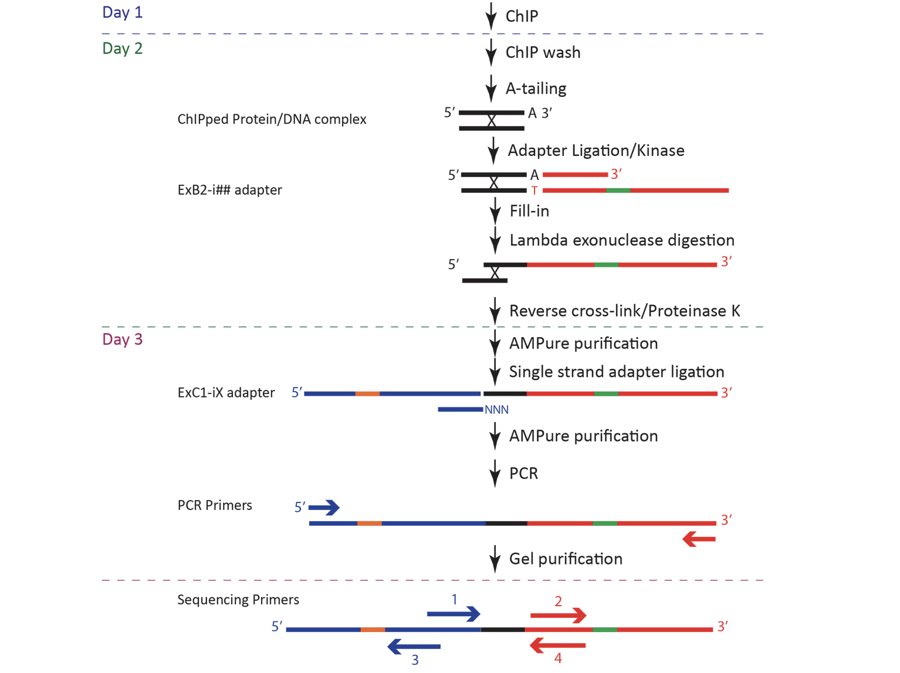

***

##Day 1 (ChIP)

| ***Recipes*** (*Prepare ahead of time*) |
| ----- |
|<a href="https://cegrcode.github.io/GeneralLab/buffers/#ip-dilution-buffer-2-l"target="_blank">IP Dilution Buffer</a>|
|IgG-Dynabeads|
|Dynabeads Protein A|
|Dynabeads Protein G|
|<a href="https://cegrcode.github.io/GeneralLab/buffers/#complete-protease-inhibitor-edta-free-cpi-1-ml"target="_blank">Complete Protease Inhibitor (CPI)</a>|

**NOTE:** Type of DynaBead to use depends on what sample is being ChIPped. See <a href="https://cegrcode.github.io/GeneralLab/chipexo5.0/#determine-proper-resin-for-chip">Determine Proper Resin for ChIP</a>

***

#####Determine Proper Resin for ChIP
*The choice of resin will depend on the antibody used for each ChIP*

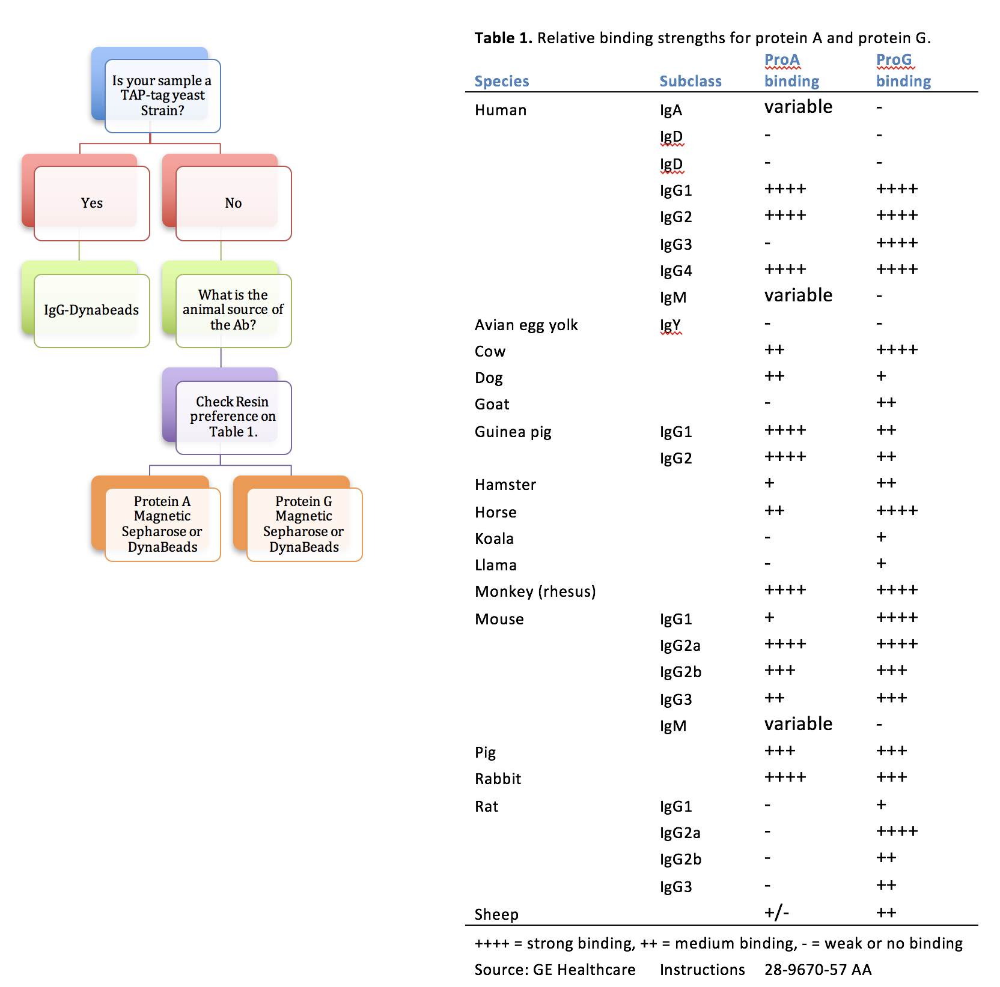

#####Preparing DynaBeads (TAP-tag yeast strains ONLY)
*If you are not using TAP-tag yeast strains, skip to <a href="https://cegrcode.github.io/GeneralLab/chipexo5.0/#preparing-protein-ag-magnetic-sepharose-beads" target="_blank">Preparing Protein A/G Magnetic Sepharose Beads or DynaBeads</a>*

***Notes:** Each ChIP requires 50 ul of IgG-DynaBeads slurry. Example volumes listed below are for 8 samples in 1x 8-strip tube. DO NOT let the beads be dry for more than 30 seconds*

1. Calculate the volume of IgG-Dynabeads needed as follows:
	* 1.1 x 8 x (50 ul stock slurry/sample) = 440 ul of IgG-DynaBeads
	* **NOTE:** 8 = number of samples. Adjust this number accordingly. For example, if you have 48 samples, 2640 uL of IgG-DynaBeads is needed.  
2. Mix stock of beads by vortexing.
3. Transfer the calculated volume *(440 ul for 8 samples)* of **IgG-Dynabeads** slurry to a 1.5 ml tube. *If pipetting, draw up the beads slowly over ~5 sec.*
	* **NOTE:** If using a volume of IgG-DynaBeads greater than 1 mL, transfer 1 mL of the slurry to the 1.5 mL tube. Place the tube in a magnetic rack, and draw off supernatant. Quickly add another 1 mL of the slurry on top of the beads. Repeat this until the total volume of stock IgG-DynaBeads is consolidated in the 1.5 mL tube.  
4. Wash the beads
	* Place against magnet for 1 min to collect beads, and draw off supernatant.
	* Remove from magnet, and immediately add **1 ml IP Dilution Buffer + CPI** (4°C).
	* Mix, and place on rototorque at 4˚C for 1 min.
5. Block the beads
	* Place against magnet for 1 min to collect beads, and draw off supernatant.
	* Remove from magnet, and immediately add 160 ul **IP Dilution Buffer + CPI**  (4°C).
		* **NOTE:** (number of samples) x 20 uL = volume of IP Dilution Buffer to use
	* Add 8 ul of **~10 mg/ml tRNA**. (~1 ul /ChIP)
	* Mix, and place on rototorque at 4˚C for 15 min.
6. Transfer 20 ul of bead slurry (containing the tRNA) to each well in a single 8-well strip tube.
7. Store at 4˚C until ready to use.
8. Continue protocol with <a href="https://cegrcode.github.io/GeneralLab/chipexo5.0/#chromatin-immunoprecipitation"">Chromatin Immunoprecipitation</a>.

#####Preparing Protein A/G Magnetic Sepharose Beads or DynaBeads

***ProA/ProG Dynabeads are preferred/most commonly used***

Use this protocol for non-TAP-tag yeast strains and mammalian samples. Generally, use this protocol for any samples that will require antibody attachment.

***Notes:** Example volumes listed below are for 8 samples in 1x 8-strip tube. DO NOT let the beads be dry for more than 30 seconds.*

1. Calculate the volume of Protein A/G **magnetic** sepharose (or IgG-coupled **magnetic** sepharose for TAP-tagged factors) beads needed as follows:
	* 1.1 x 8 x (10 ul stock slurry/sample) = 88 ul
	* **NOTE:** 8 = number of samples. Adjust this number accordingly.
	* *Stock slurry should be 25% bed volume. Total of 450 mg Protein A/G beads per ChIP sample.
	* Generally, 1/2 of total volume should be Protein A and other half should be Protein G. For example, 88 uL total volume = 44 uL Protein A + 44 uL Protein G
	* *Magnetic IgG-sepharose needs to be made via covalent coupling of IgG to NHS-activated resin.*
2. Mix stock of beads by vortexing.
3. Transfer the calculated volume* (88 ul for 8 samples) of **magnetic sepharose** beads slurry to a 1.5 ml tube. If pipetting, draw up the beads slowly over ~5 sec.
4. Wash the beads
	* Place against magnet for 1 min to collect beads, and draw off supernatant.
	* Remove from magnet, and immediately add 1 ml **IP Dilution Buffer + CPI** (4°C).
	* Mix, and place on rototorque at 4˚C for 1 min.
5. Block the beads
	* Place against magnet for 1 min to collect beads, and draw off supernatant.
	* Remove from magnet, and immediately add 790 ul **IP Dilution Buffer + CPI** (4°C).
	* Add 10 ul of **~10 mg/ml tRNA**. (~1 ul /ChIP)
		* Adjust this number accordingly
	* Mix, and place on rototorque at 4˚C for 15 min.
6. Transfer 100 ul of bead slurry (containing the tRNA) to each well in a single 8-well strip tube.
7. Store at 4˚C until ready to use.

#####Attaching Antibody to Protein A/G Magnetic Sepharose Beads or DynaBeads

*Notes: If using IgG -Dynabeads (TAP-strains) **skip this step**.*  

1. Add ~3 ug antibody to the **8-well strip tube** containing the blocked Protein A/G magnetic sepharose beads according to a matrix Table above.
	* *Use aerosol resistant tips*
	* *The amount indicated is on a per ChIP rxn basis. Rule of thumb is to use 1-3 ug Ab per ChIP rxn.  If the wrong numbers of tags are obtained in the end, then try 3x more or less, until the right number is achieved.  The right number of tags is >500 for the strongest bound locations.*

2. Cap the tubes. Flick to mix. Place on rototorque at 4˚C for 5-7 hr.
	* Minimum of 1-2 hr. is permissible.
3. Spin, place against magnet for 1 min to collect beads, and draw off supernatant.
4. Remove from magnet, and immediately add 200 ul **IP Dilution Buffer + CPI** (4°C).
5. Spin, place against magnet for 1 min to collect beads, and draw off supernatant.
6. Add Extract (see below).

#####Chromatin Immunoprecipitation

1. Thaw sonicated, cross-linked chromatin extract in 37˚C heat block for 5 min. Centrifuge (VWR Galaxy microstar) at maximum speed for 15 min at 4˚C.

2. Transfer 190 ul of pre-cleared extract (supernatant) to tubes containing blocked beads. Vortex to combine beads and extract.
	* (For a standard ChIP of yeast chromatin use 150 ml cell equivalent of a culture grown to an OD600 = 0.8.  For a standard ChIP of mammalian chromatin, use at least 10 million cells.)

3. Cap tubes (hard caps) and place on rototorque at 4˚C overnight (16 hr). Secure 8-strip tubes on rototorque by placing them in a 200 ul disposable tip rack or tube rack. Place a hard plastic cover over the rack, and tape on both ends. Place the rack under the rubber bands on the rototorque in the 4C fridge. Check after ~10 min to make sure samples are not leaking, and are properly mixing.

4. Optional:  Save 0.5 ul of remaining extract into an 8-well strip tube to be used as “input”.  The rest can be frozen and stored at -80˚C.

**Notes on Day 1**

Section | Step | Name | Note
 -----  | :--: | :--: | :--:
Preparing DynaBeads   | 1    | Ann  | X

***

##Day 2

| ***Recipes*** (*Prepare ahead of time*) |
| ----- |
| <a href="https://cegrcode.github.io/GeneralLab/buffers/#fa-lysis-buffer-2-l"target="_blank">FA Lysis Buffer</a> |
| <a href="https://cegrcode.github.io/GeneralLab/buffers/#nacl-buffer-250-2-l"target="_blank">NaCl Buffer 250</a> |
| <a href="https://cegrcode.github.io/GeneralLab/buffers/#licl-buffer-250-2-l"target="_blank">LiCl Buffer 250</a> |
| <a href="https://cegrcode.github.io/GeneralLab/buffers/#10-mm-tris-hcl-ph-80-2-l"target="_blank">10 mM Tris-HCl, pH 8.0</a> |
| <a href="https://cegrcode.github.io/GeneralLab/buffers/#25-triton-x-100-200-ml"target="_blank">25% Triton-X |
| <a href="https://cegrcode.github.io/GeneralLab/buffers/#complete-protease-inhibitor-edta-free-cpi-1-ml"target="_blank">Complete Protease Inhibitor (CPI)</a>|
| <a href="https://cegrcode.github.io/GeneralLab/buffers/#chip-elution-buffer-50-ml"target="_blank">ChIP Elution Buffer</a> |

***

The protocol for Day 2 of ChIP-exo can be found in Box in a file named `c_ChIP-exo_5.0_Protocol master mix table.xlsx`. Before starting Day 2, change the "# of samples" (circled in the screenshot below) to the number of samples that you will be working with, and this will adjust the volumes of the reagents required for each master mix. Please note that Day 2 ends after completing Elution & Reverse XL.  

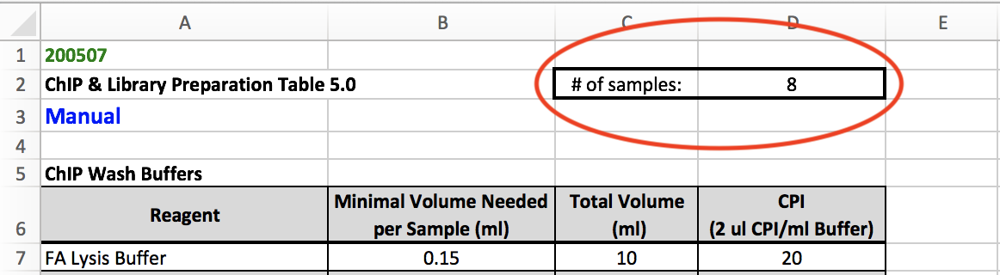

&nbsp;

***GENERAL NOTES BEFORE BEGINNING DAY 2***

* Again, change the number of samples you will be working with in `c_ChIP-exo_5.0_Protocol master mix table.xlsx`. Print out this table and check off each step as you progress through Day 2.
* Use a <a href="https://assets.thermofisher.com/TFS-Assets/LSG/product-images/12331D-650x600.jpg-250.jpg"target="_blank">magnetic rack</a> and multichannel pipette to add and pull off washes and master mixes from 0.2 mL PCR strip tubes containing the DynaBeads.
	* When placing strip tubes in the magnetic rack, the DynaBeads will bead up on one side of the tube. Angle the multichannel pipette so that you are adding and pulling off solutions on the opposite side of the beads.
* Do not let beads dry for more than **30 seconds** between washes and addition of master mixes.
* ***Washes (green text)***
	* Reagent reservoirs are used to hold wash buffers. Reuse the <a href="https://cdn.shopify.com/s/files/1/1824/9767/products/reagent-reservoir-base-25ml_1024x1024.jpg?v=1551976440"target="_blank">reservoir base</a> and <a href="https://www.integra-biosciences.com/sites/default/files/styles/medium/public/2016-10/reagent-reservoirs-6.png?itok=zQEpk58e"target="_blank">disposable reservoir inserts</a>. Use one <a href="https://www.integra-biosciences.com/sites/default/files/styles/medium/public/2016-10/reagent-reservoirs-6.png?itok=zQEpk58e"target="_blank">disposable reservoir insert</a> per wash buffer and label these accordingly.
	* All washes are done at **180 uL**.
	* Washes are to be done in the order they appear on the table.
	* Work with one strip tube at a time.
	* Pull off liquid, quickly add 180 uL of wash buffer to beads, take strip tube out of magnetic rack, resuspend beads using the multichannel, put strip tube back in the magnetic rack, and repeat with next strip tube.
	* Samples are stable in <a href="https://cegrcode.github.io/GeneralLab/buffers/#10-mm-tris-hcl-ph-80-2-l"target="_blank">10 mM Tris-HCl, pH 8.0</a> on ice for up to one hour.
* ***Master mixes***
	* Add components of the master mix to an appropriate tube (1.5 ml, 1.7 mL, or 5 mL) in the order that they appear on the table. Make sure the master mix is vortexed before adding the enzyme.
	* <a href="https://cegrcode.github.io/GeneralLab/buffers/#10-mm-tris-hcl-ph-80-2-l"target="_blank">10 mM Tris-HCl, pH 8.0</a> is removed from samples using a multichannel pipette, and master mixes are added to samples using a single channel pipette.
	* Water used in master mixes must be ddH20.
* ***Enzymes***
	* When removing enzymes from the -20˚C freezer, transfer the tube containing the enzyme to your bench in an <a href="https://assets.fishersci.com/TFS-Assets/CCG/product-images/F30136~p.eps-650.jpg"target="_blank">insulated cold box</a>.
	* After adding the enzyme to the master mix, return the enzyme to the -20˚C freezer as soon as possible.
* ***Generic enzymatic step protocol***
	* Following preceding enzymatic incubation
	* Spin, place tubes against magnet for 1 min, and draw off supernatant.
	* Remove from magnet, and add 180 μl **<a href="https://cegrcode.github.io/GeneralLab/buffers/#10-mm-tris-hcl-ph-80-2-l"target="_blank">10 mM Tris-HCl, pH 8.0</a>** (4°C).
	* Make **Master Mix** in appropriate-sized tube (refer to table). Vortex to mix.
	* Spin, place tubes against magnet for 1 min, and draw off supernatant.
	* Transfer X μl of **Master mix** to each sample, and vortex gently.
	* Incubate samples in thermomixer for Y min at Z°C.
	* Return to Step 1.

* ***Enzymatic reactions***
	* After adding the master mix to samples, cap the strip tubes. DO NOT CAP STRIP TUBES IN ICE BUCKET.
	* Vortex tubes thoroughly until beads are completely resuspended. Avoid vortexing beads into the cap.
	* Place strip tubes in a thermomixer set to the required time and temperature for each enzymatic reaction.
	* When the enzymatic reaction is complete, remove samples from the thermomixer and change settings to the time and temperature of the next enzymatic reaction. This will give the heat block time to adjust the temperature.
	* Spin down the strip tubes before continuing to wash steps.
* ***How to read master mix table***
	* The "Reagent" column lists the components of the master mix in the order that they should be added to a tube.
	* "Total Volume (uL)" is slightly more than (Volume per Sample) x (# of Samples)
	* [Final] = final concentration of each component in the master mix.
	* For enzymatic reactions, use the volumes listed in the "Total Volume (uL)" when making the master mix. Add these volumes to an appropriately sized tube and make sure the components are mixed.
	* The number in red in the "Volume per Sample (uL)" column is the volume of master mix to add to each sample/well in strip tubes using a single channel pipette.
	* Black text under each master mix table are thermomixer settings for each enzymatic step.
	* Green text are wash steps.
* This page will display screenshots of `c_ChIP-exo_5.0_Protocol master mix table.xlsx`. The values in this table are based on **8 samples**.

#####ChIP Wash Buffers

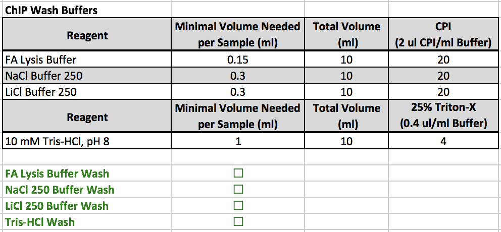

* All reagents are located in a 4˚C refrigerator
* This table contains directions on how to prep the wash buffers.
	* Aliquot the volumes in the "Total Volume (mL)" column into four appropriately sized Falcon tubes (In this example, use 15 mL falcon tubes).
* After the buffers are aliquoted, add the designated amount of <a href="https://cegrcode.github.io/GeneralLab/buffers/#complete-protease-inhibitor-edta-free-cpi-1-ml"target="_blank">CPI</a> to the <a href="https://cegrcode.github.io/GeneralLab/buffers/#fa-lysis-buffer-2-l"target="_blank">FA Lysis Buffer</a>, <a href="https://cegrcode.github.io/GeneralLab/buffers/#nacl-buffer-250-2-l"target="_blank">NaCl Buffer 250</a>, and <a href="https://cegrcode.github.io/GeneralLab/buffers/#licl-buffer-250-2-l"target="_blank">LiCl Buffer 250</a>.
* Add the designated amount of <a href="https://cegrcode.github.io/GeneralLab/buffers/#25-triton-x-100-200-ml"target="_blank">25% Triton-X</a> to the <a href="https://cegrcode.github.io/GeneralLab/buffers/#10-mm-tris-hcl-ph-80-2-l"target="_blank">10 mM Tris-HCl, pH 8.0</a>.
* Set thermomixer to **30 min, 37˚C**.
* Remove samples from the rototorque in the 4˚C refrigerator, and begin the wash steps.
* After re-suspending in <a href="https://cegrcode.github.io/GeneralLab/buffers/#10-mm-tris-hcl-ph-80-2-l"target="_blank">Tris</a>, move samples to ice block and continue to <a href="https://cegrcode.github.io/GeneralLab/chipexo5.0/#a-tailing-reaction" target="_blank">A-tailing Reaction</a>.

#####A-tailing Reaction

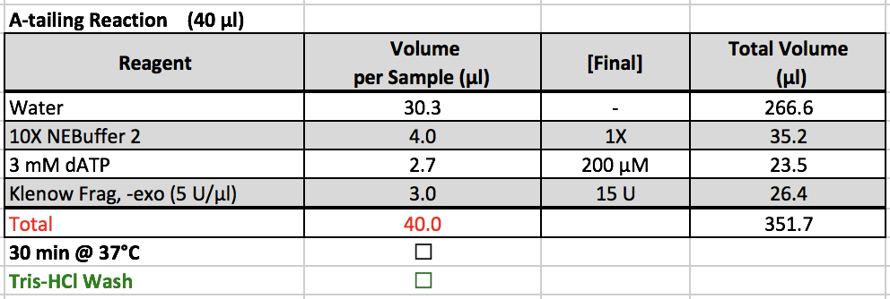

* 10X NEBuffer 2 and 3 mM dATP are located in ChIP boxes in the -20˚C freezer.
* Klenow Frag, -exo is located in the <a href="https://assets.thermofisher.com/TFS-Assets/LCD/product-images/F9106-01~p.eps-650.jpg"target="_blank">enzyme box</a> in the -20˚C freezer.
* After removing samples from the thermomixer
	* Set the thermomixer to **1 hr, 25˚C**
	* Spin down samples and make sure beads are not in cap.
	* Continue to <a href="https://cegrcode.github.io/GeneralLab/buffers/#10-mm-tris-hcl-ph-80-2-l"target="_blank">Tris</a> wash.
* After re-suspending in <a href="https://cegrcode.github.io/GeneralLab/buffers/#10-mm-tris-hcl-ph-80-2-l"target="_blank">Tris</a>, move samples to ice block and continue to <a href="https://cegrcode.github.io/GeneralLab/chipexo5.0/#adapter-ligation" target="_blank">Adapter Ligation</a>.

#####Adapter Ligation

* At Penn State, the pair of index sets that were used for ChIP-exo were written on a whiteboard. Each index set would correspond to a code. For example, using the 1-6 set for the first adapter ligation and the A-H set for the second adapter ligation would correspond to  the code A01. After choosing the sets of adapters, the code would be written next to your name on the board. ***DO NOT select an index set that has already been chosen by another lab member.***
* Select an index from the -20˚C freezer. For the first adapter ligation, use the indexes that correspond to numbers.
	* Select only one of the following sets:
		* 1-6
		* 7-12
		* 13-18
		* 19-24

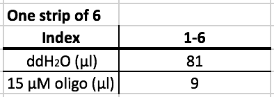

* After selecting the index, prepare the index according to the table above.
	* The oligos are already in the strip tube. Add the designated amount of water in each well that is planned to be used.
* For the first adapter ligation, each strip tube receives the same adapter. For example, The strip tube containing samples 1-8 would receive adapter 1.
* Arrange your samples on the 96 well ice block according to the image below. Different lab members orient samples and adapters in various ways for this step. Find what works best for you.

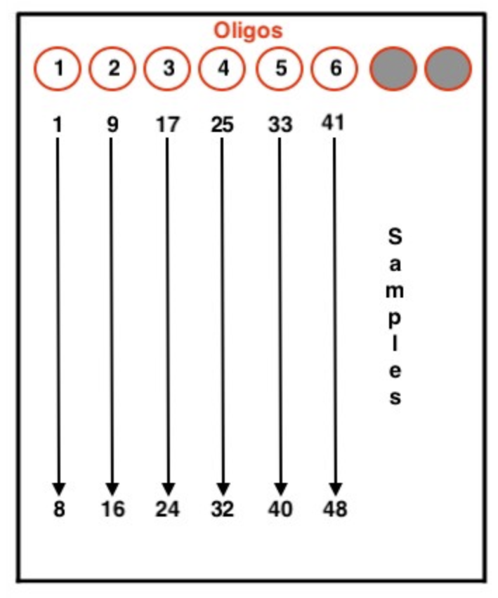

* **10 uL** of adapters are added to each sample.
* If orienting strip tubes in this way, pull off the <a href="https://cegrcode.github.io/GeneralLab/buffers/#10-mm-tris-hcl-ph-80-2-l"target="_blank">Tris</a> and use a 10 uL multichannel pipette to distribute adapters to the samples. Pull adapters 1-6, and pipette those adapters into each row. For example, adapters 1-6 would be first distributed into samples 1, 9, 17, 25, 33, and 41, respectively.

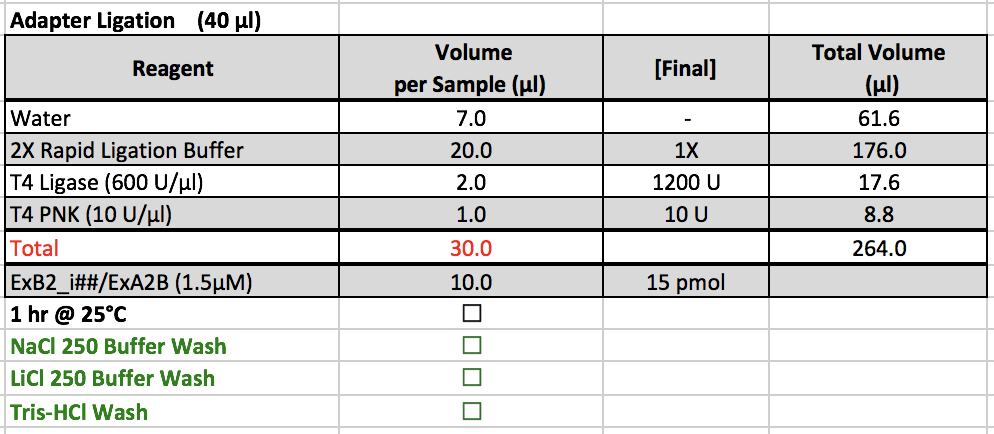

* 2X Rapid Ligation Buffer is kept in a ChIP box in the -20˚C freezer, and T4 Ligase and T4 PNK are kept in the <a href="https://assets.thermofisher.com/TFS-Assets/LCD/product-images/F9106-01~p.eps-650.jpg"target="_blank">enzyme box</a> in the -20˚C freezer.
* After adding adapters, prepare the master mix and add 30 uL of the master mix to each sample. Cap the strip tubes and re-suspend the beads by vortexing. Put the samples on the thermomixer.
	* **NOTE:** If taking a lunch break or tending to other duties, samples can be left on the thermomixer for longer than one hour.
* After removing samples from the thermomixer, set it to **20 min, 30˚C** for next enzymatic reaction.
* Continue to wash steps. After re-suspending in <a href="https://cegrcode.github.io/GeneralLab/buffers/#10-mm-tris-hcl-ph-80-2-l"target="_blank">Tris</a>, move samples to ice block and continue to <a href="https://cegrcode.github.io/GeneralLab/chipexo5.0/#fill-in-reaction" target="_blank">Fill-in Reaction</a>.

#####Fill-in Reaction

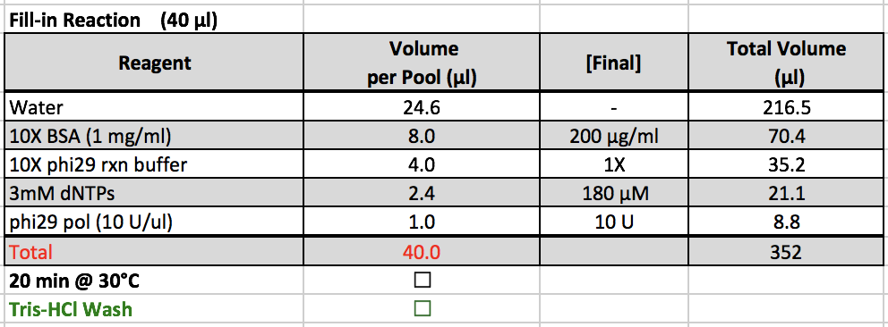

* 10X BSA, 10X phi29 rxn buffer, and 3mM dNTPs are located in a ChIP box in the -20˚C freezer.
* Phi29 pol is kept in the <a href="https://assets.thermofisher.com/TFS-Assets/LCD/product-images/F9106-01~p.eps-650.jpg"target="_blank">enzyme box</a> in the -20˚C freezer.
* After removing samples from the thermomixer
	* Set the thermomixer to **30 min, 37˚C** for next enzymatic reaction.
	* Spin down samples and make sure beads are not in cap.
	* Continue to <a href="https://cegrcode.github.io/GeneralLab/buffers/#10-mm-tris-hcl-ph-80-2-l"target="_blank">Tris</a> wash.
* After re-suspending in <a href="https://cegrcode.github.io/GeneralLab/buffers/#10-mm-tris-hcl-ph-80-2-l"target="_blank">Tris</a>, move samples to ice block and continue to <a href="https://cegrcode.github.io/GeneralLab/chipexo5.0/##lambda-exonuclease-digest" target="_blank">Lambda Exonuclease Digest</a>.

#####Lambda Exonuclease Digest

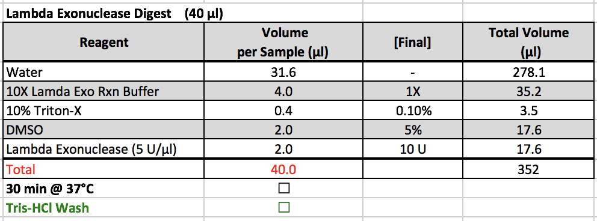

* 10X Lambda Exo Rxn Buffer, 10% Triton-X, and DMSO are located in a ChIP box in the -20˚C freezer.
	* DMSO should not be kept on ice after removing from the freezer as it has a relatively high freezing point.
* Lambda Exonuclease is kept in the <a href="https://assets.thermofisher.com/TFS-Assets/LCD/product-images/F9106-01~p.eps-650.jpg"target="_blank">enzyme box</a> in the -20˚C freezer.
* When creating the master mix, it is important to ensure that the reagents are mixed together very well before adding lambda exonuclease. If it is not combined well, then the DMSO will kill the activity of the enzyme.
* After removing samples from the thermomixer
	* Turn off the thermomixer
	* Turn on the digital dry bath and set it to 65˚C.
	* Spin down samples and make sure beads are not in cap.
	* Continue to <a href="https://cegrcode.github.io/GeneralLab/buffers/#10-mm-tris-hcl-ph-80-2-l"target="_blank">Tris</a> wash.
* After re-suspending in <a href="https://cegrcode.github.io/GeneralLab/buffers/#10-mm-tris-hcl-ph-80-2-l"target="_blank">Tris</a>, move samples to ice block and continue to <a href="https://cegrcode.github.io/GeneralLab/chipexo5.0/#lambda-exonuclease-digest" target="_blank">Lambda Exonuclease Digest</a>.

#####Elution & Reverse XL

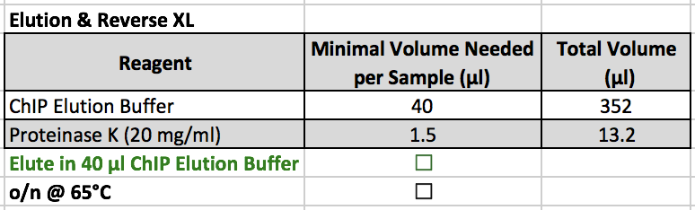

* ChIP Elution Buffer ***SHOULD NOT*** be kept on ice. This step should be completed at **room temperature**.
* The stock of ChIP Elution Buffer should be kept at the buffer bench. Keep an aliquot of ChIP Elution Buffer at your bench.
* Proteinase K is kept in a 4˚C refrigerator.
* After adding this master mix to the samples, leave samples overnight in the digital dry bath that has been set to 65˚C.

**END DAY 2**

***

##Day 3

| ***Recipes*** (*Prepare ahead of time*) |
| ----- |
|  |

***

#####TotalPure Purification

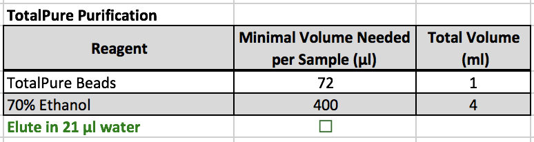

1. Transfer samples to strip tubes (40 μl).
2. Add 1.8 volumes of TotalPure beads (72 ul) to the sample. Mix 10 times with a pipette.
3. Incubate for 5 min at RT.
4. Place the tube in the magnetic rack for 1 min. Remove the supernatant.
5. Add 180 μl of 70% EtOH, incubate for 30 sec (do not disturb beads).
6. Remove the supernatant. Repeat EtOH wash once more.
7. Place the tube in the magnetic rack. Remove the supernatant.
8. Dry the beads at room temp for 12-15 min. Be sure no EtOH is eluted with the sample, or is completely dried.
	* Beads should begin to "crack" and lose shininess when they are dry.
	* EtOH in the sample could kill the subsequent enzymatic reaction. However, if beads are left to dry for too long, DNA will be lost.
9. Elute the DNA by adding 21 μl of water, Mix 10 times with a pipette.
10. Place tube in the magnetic rack. Save the eluted sample in fresh strip tubes.
11. Continue protocol to <a href="https://cegrcode.github.io/GeneralLab/chipexo5.0/#ssdna-adapter-ligation" target="_blank">ssDNA Adapter Ligation</a>.

#####ssDNA Adapter Ligation

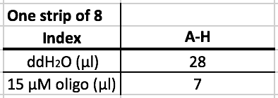

* Add 7 uL of water to the oligos.
* Based on the index code that was selected, retrieve the corresponding index set for the second adapter ligation. The adapters will be a range of letters.
	* For example, if the code "A01" was chosen, use adapters A-H.
* Arrange your samples on the 96 well ice block according to the image below.

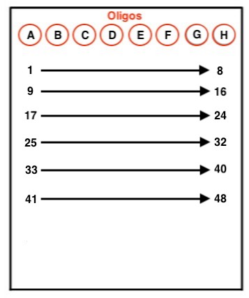

* **5 uL** of adapters are added to each sample.
* If orienting strip tubes in this way, pull off the Tris and use a 10 uL multichannel pipette to distribute adapters to the samples. Pull adapters 1-6, and pipette those adapters into each row. For example, adapters A-H would be first distributed into samples 1-8, respectively.

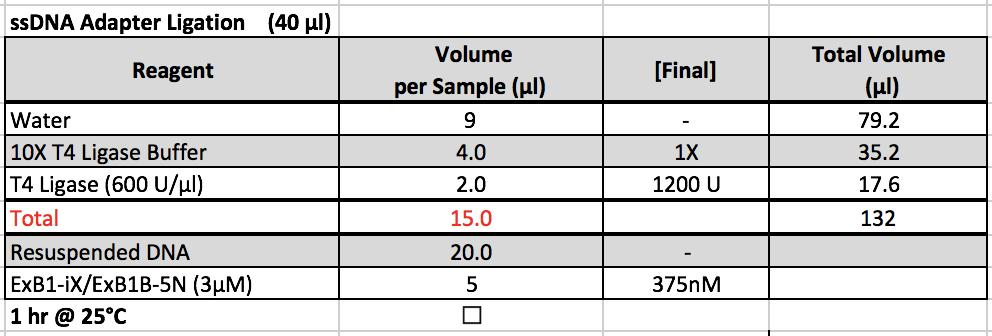

* 10X Rapid Ligation Buffer is kept in a ChIP box in the -20˚C freezer, and T4 Ligase is kept in the <a href="https://assets.thermofisher.com/TFS-Assets/LCD/product-images/F9106-01~p.eps-650.jpg"target="_blank">enzyme box</a> in the -20˚C freezer.
* After adding adapters, prepare the master mix and add 15 uL of the master mix to each sample. Cap the strip tubes and re-suspend the beads by vortexing. Put the samples on the thermomixer.
	* **NOTE:** If taking a lunch break or tending to other duties, samples can be left on the thermomixer for longer than one hour.
* Turn off thermomixer after removing samples.
* Continue to <a href="https://cegrcode.github.io/GeneralLab/chipexo5.0/#totalpure-purification_1" target="_blank">TotalPure Purification</a>.

#####TotalPure Purification

1. Add 1.8 volumes of TotalPure beads (72 ul) to the sample. Mix 10 times with a pipette.
2. Incubate for 5 min at RT.
3. Place the tube in the magnetic rack for 1 min. Remove the supernatant.
4. Add 180 μl of 70% EtOH, incubate for 30 sec (do not disturb beads).
5. Remove the supernatant. Repeat EtOH wash once more.
6. Place the tube in the magnetic rack. Remove the supernatant.
7. Dry the beads at room temp for 12-15 min. Be sure no EtOH is eluted with the sample, or is completely dried.
	* Beads should begin to "crack" and lose shininess when they are dry.
		* In this step, dry beads will look slightly wetter.
	* EtOH in the sample could kill the subsequent enzymatic reaction. However, if beads are left to dry for too long, DNA will be lost.
	* Set the thermocycler to the <a href="https://cegrcode.github.io/GeneralLab/chipexo5.0/#pcr-notes"target="_blank">PCR Phusion program</a>.
8. Elute the DNA by adding 21 μl of water, Mix 10 times with a pipette.
9. Place tube in the magnetic rack. Save the eluted sample in fresh strip tubes.
10. Continue protocol to <a href="https://cegrcode.github.io/GeneralLab/chipexo5.0/#pcr" target="_blank">PCR</a>.

#####PCR

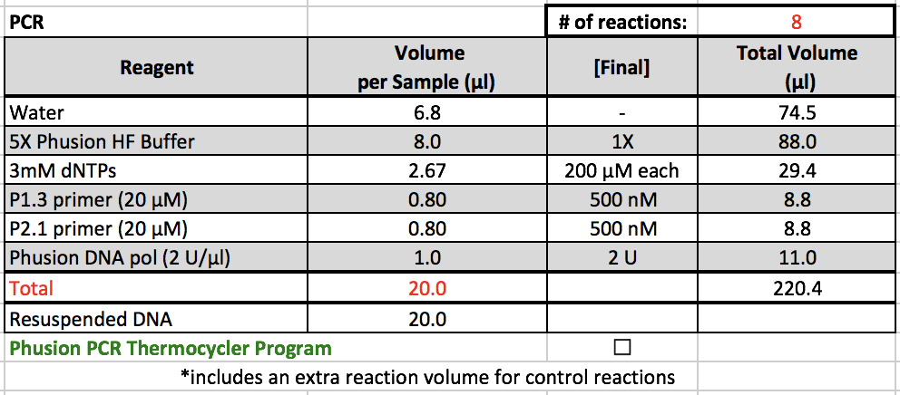

* 5X Phusion HF Buffer, 3mM dNTPs, P1.3 primer, and P2.1 primer are located in a ChIP box in the -20˚C freezer.
	*  The primers are located in their own, individually labelled boxes next to the master mix boxes.
* Phusion DNA pol is kept in the <a href="https://assets.thermofisher.com/TFS-Assets/LCD/product-images/F9106-01~p.eps-650.jpg"target="_blank">enzyme box</a> in the -20˚C freezer.

######PCR Notes

**PCR Phusion Thermocycler Program**

1. Turn on the thermocycler labelled "Skellar," and select `Matt's folder/PCR Phusion XY`.   Try to do this before adding the PCR master mix to give the thermocycler time to heat up. 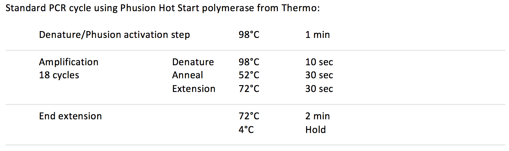

2. Create the PCR positive control and the PCR negative control.
	* Positive control: 20 uL PCR master mix + 19 uL water + 1 uL previous Illumina-compatible library.
	* Negative control: 20 uL PCR master mix + 20 uL water
3. After adding PCR master mix, move samples and the PCR positive and negative controls to the thermocycler and run the program.

4. After 18 cycles, move 10 uL of each sample that is to be used for the library check into new strip tubes.
	* For YEP, this typically includes the last strip tube of samples (containing samples 40-48. 46-48 should be the controls.)
	* For collaborator samples, every sample should be QC-ed using the library check.
5. The remaining 30 uL of sample should be left in the under-bench 4˚C refrigerator and used for downstream processing, such as <a href="https://cegrcode.github.io/GeneralLab/electrophoresis/#gel-excision" target="_blank">Gel Excision</a>.
6. Continue PCR on the remaining 10 uL and the PCR positive and negative controls for another 6 cycles (24 total) to visualize via agarose gel electrophoresis, also known as the <a href="https://cegrcode.github.io/GeneralLab/electrophoresis/#library-check" target="_blank">Library Check</a>.

######Post PCR
After completing PCR, a <a href="https://cegrcode.github.io/GeneralLab/electrophoresis/#library-check" target="_blank">library check</a> and <a href="https://cegrcode.github.io/GeneralLab/electrophoresis/#gel-excision" target="_blank">gel excision</a> are required. These can be completed simultaneously on Day 3. However, if you are new to this protocol or are short on time, it is recommended that the library check is completed on Day 3, and gel excision is completed the following day. The links below will direct to the respective protocols on the <a href="https://cegrcode.github.io/GeneralLab/electrophoresis/" target="_blank">Gel Electrophoresis</a> page.

* <a href="https://cegrcode.github.io/GeneralLab/electrophoresis/#library-check" target="_blank">Library check</a>
* <a href="https://cegrcode.github.io/GeneralLab/electrophoresis/#gel-excision" target="_blank">Gel excision</a>

**NOTE:** Samples should be stored at 4˚C when not in use.

***
