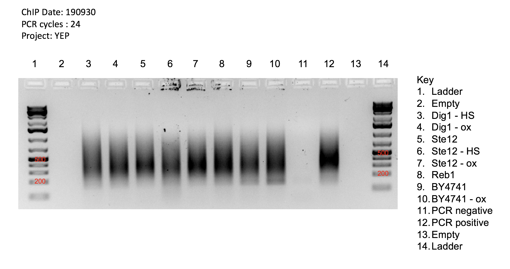
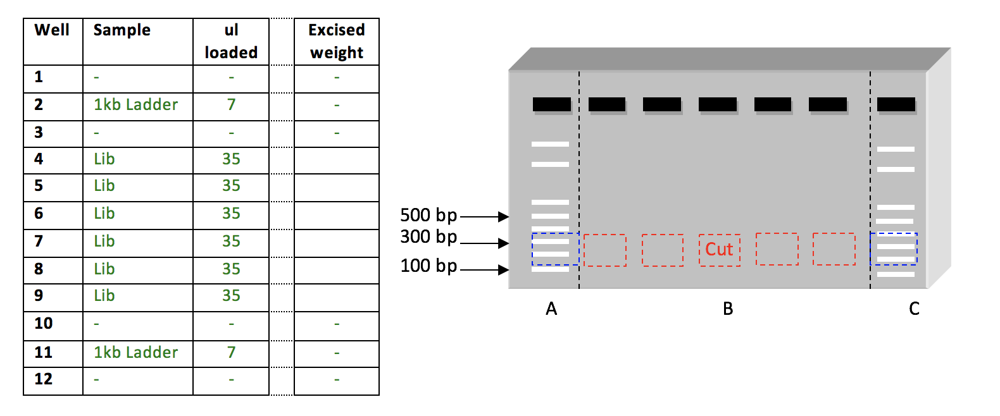

***

This page is meant to serve as a centralized repository for all <a href="https://www.pughlab.psu.edu/" target="_blank">Pugh Lab</a> protocols related to running agarose and polyacrylamide gels.

***

## Agarose Gels

***

**General Notes:**

### Sonication Check

| ***Recipes (Prepare ahead of time)*** |
|---|
| [2X Proteinase K Buffer][2x-proteinase-k-buffer-50-ml]|
| [TE][te-tris-edta-500-ml] + RNase |

&nbsp;

**Supplies**

* Phenol-Cloroform:Iso-amyl alcohol (Common reagents fridge)
	* When aliquoting lab stock, only transfer the bottom layer
* 3M Sodium Acetate (3M NaOAc) – located with RT aliquots
* 100% EtOH, chilled at -20°C
* 70% EtOH, chilled at -20°C
* 20mg/mL glycogen at -80° (Freezer 801)
* 1.5mL tubes, pre-labeled
* Pre-cooled centrifuge 4°C, turn on at step II-6
* PPE including safety glasses throughout, gloves throughout, and a lab coat when working with PCIA

##### Quick Reverse Crosslink

1.	Locate the 50 uL sonication check sample from the -80°C fridge and let thaw.
2.	Add 175uL TE to each 50uL sonication check sample. Adjust for other sample volumes such that the total is 225 uL (i.e. for a 75 uL son check sample, add 150 uL TE buffer).
3.	Add 225uL 2X proK buffer.
4.	Add 2.5uL 20mg/mL proteinaseK.
5.	Incubate samples at 65°C for 30 minutes minimum.
	* You may also incubate the samples overnight at 65°C (no more than 16 hours) and skip step 6, continuing to PCIA Extraction/Ethanol Precipitation the following day for a good stopping point.
6.	Incubate samples at 95°C for 10 minutes. Caps will pop if not properly secured with colored tabs or an aluminum block on top.

##### PCIA Extraction/Ethanol Precipitation

1.	Extract by adding 450 uL PCIA. Vortex each sample for ~20 seconds. The sample will become cloudy.
	* Do this step in the fume hood
2.	Centrifuge samples 6 minutes at 14K rpm, RT.
	* Remove glycogen from the -80°C freezer and leave at RT while centrifugation is in progress.
3.	Carefully transfer 400uL of the upper aqueous layer to new 1.7 mL tube.
	* It is best to transfer the 400 uL by removing 200 uL at a time with a p200 micropipette.
	* If you manage to transfer some PCIA to the new tube, the sample will turn white when shaken or vortexed. If this occurs, revert to step 2.
4.	Add 42uL of 3M NaOAc to each sample.
5.	Add 1uL of 20mg/mL glycogen.
6.	Add 1000uL of ice-cold 100% EtOH to each sample. Vortex to mix thoroughly then incubate for 20 minutes at -80°C. Fast Temp a centrifuge capable of 14K rpm at this point.
	* You may also incubate overnight at -20°C for a good stopping point.
7.	Pellet by centrifuging for 15 minutes at 14K rpm, 4°C.
8.	Remove supernatant via pipette.
9.	Wash pellet with 500uL of ice-cold 70% EtOH. Add to the side of the tube to avoid disturbing pellet.
10.	Centrifuge 5 minutes at 14K rpm, 4°C.
11.	Carefully pour off or pipette off supernatant. Dry the pellet at room temperature for ~20 minutes or in the speed vac for ~15-20 minutes at 45°C.
	* If you need a good stopping point, the sample may be left at 4°C overnight resuspended in 10uL of ddH2O.
12.	Resuspend samples in 20uL of TE+RNase and incubate at 37°C for 30-60 minutes.
13.	Run a 1% agarose gel at 135V for 20-25 minutes. Upload an annotated gel image to appropriate Box folder.

### Library Check

*YEP note: Only the last 8 samples in a set of 48 are checked (which includes the Reb1 positive control and BY4741 negative control) under the assumption that those 8 are representative of the whole.*

1. Thoroughly clean and rinse an appropriate size gel box.
2. Make a 2% agarose gel (100 ml 1x TAE + 2g Agarose + 50 µl 1 mg/ml Ethidium Bromide = 2% gel). Microwave TAE + agarose on high in Erlenmeyer flask until agarose in fully dissolved and solution begins to boil (stop heating and swirl flask every 30 sec until boiling point is reached).
3. Place flask on an orbital shaker at room temp for 15 min to allow the gel to cool. Add ethidium bromide (50 µl at 1 mg/ml), swirl in flask, and then pour gel with 1.5 mm a comb. Allow gel to solidify for at least 15 min.
4. Spin down samples briefly.
5. Add 1/5 volume (2 µl) of 6X xylene loading buffer to 10 µl PCR sample (24 cycles).
	* Positive and negative PCR controls receive 8 uL of 6X xylene loading buffer
6. Place gel in gel box with the wells at the top (**Black electrode**) and fill gel box with 1x TAE buffer. Gel should be completely submerged.
7. Load 3 µl of 1kb Ladder in lane 1, and 10 µl of each PCR reaction in subsequent lanes.
8. Run gel at 145V for 23 min (run to **Red electrode**).
9. Take short wavelength UV image of gel. ChIP-exo libraries should appear as a smear between 200 and 600 bp in size. An adapter dimer band 150 bp in size may also be present.

### Gel Excision

##### Gel Purification

1. Thoroughly clean and rinse an appropriate size gel box.
2. Make a 2% agarose gel using molecular biology grade agarose 100 ml TAE + 2g Agarose + 50 ul 1 mg/ml Ethidium Bromide = 2% gel
3. Pour gel with thick comb
4. Spin down samples briefly.
	* Pool 10 uL of each sample into one tube. When pooling samples, make sure that samples with identical barcodes are not pooled together.
5. Add 1/5 volume of sequence-grade 6X xylene loading buffer to combined sample. (14 ul dye added to 70 ul sample)
6. According to the image below, load samples into wells.  Note: Libraries with the same indexes must not be run in the same gel.
7. Load 7 ul 1kb Ladder. Load the samples (region B) on an agarose gel between 1 kb ladders (regions A & C) as shown in the Figure. If possible, leave a one-lane gap between samples. 
1. Run gel at 145V for ~23min.
2. Following electrophoresis, excise Lanes A & C (dashed Black lines) from the gel. Leave “region B” of the gel at your bench.
3. Visualize Lanes A & C on a transilluminator, and mark the desired DNA fragment size on the DNA ladders.  A standard library should be size-selected from 200 – 500 bp.
4. Reassemble the gel at your bench, using Lanes A & C as markers, excise the sections of agarose containing DNA fragments of the desired size (Red boxes).
5. Place each gel excision into a 1.5 ml tube.
6. Record weight of each excised piece. Write this weight directly onto LoBind tube.
	* **NOTE:** Excised gel pieces must be under 0.3 g. If gel pieces exceed 0.3g, cut the piece in half and put one piece in a new tube, and the other in the original tube. Record the weight for both.
7. Take short wavelength UV image of excised gel.

##### Qiagen cleanup

*Notes:  All buffers and centrifuge spins should be at room temperature.*

1. Add 3 volumes of Buffer QG to 1 volume of gel (maximum gel weight of 300 mg per tube).
2. Dissolve the gel slice by vortexing at 50°C until the gel slice has completely dissolved (~10 min).
3. Add 1 gel volume of isopropanol to the sample and vortex.
4. Place a Qiaquick minielute column in a provided 2 ml collection tube.
5. Place all identical samples in the column and place as much (~750 ul) as will fit the column each time
6. Microfuge 1 min, 13,000 rpm, room temperature.
7. Discard flow-through. Place the Qiaquick minielute column back in the same collection tube.
8. Repeat until all three tubes of same sample is filtered through the same column.
9. Add 0.5 ml Buffer QG.
10. Microfuge 1 min, 13000 rpm, room temperature.
11. Discard flow through. Place the Qiaquick minielute column back in the same collection tube.
12. Add 0.75 ml Buffer PE.
13. Let samples stand at room temperature for 2-5 min.
14. Microfuge 1 min, 13000 rpm, room temperature.
15. Discard flow through and place column back into collection tube.
16. Spin down once more 1 min, 13000 rpm, room temperature in order to remove all EtOH.
17. Discard flow through. Place the Qiaquick minielute column in a fresh 1.5 ml Lo-Bind tube and let sit to dry for 2 min.
18. **OPTIONAL:** Warm ddH2O or EB buffer at 50˚C for 5min.
19. Add 40 ul ddH2O directly to membrane of column. Let column stand for 1 min.  
	* 1/10th EB buffer can be used in place of ddH2O.
	* **OPTIONAL:**  If you suspect that your yields are low then: 2x 20ul elutions into separate tubes, Vinesh reports 2-10x more concentrated DNA in the 1st eluate.
20. Microfuge 1 min, 13,000 rpm, room temperature.
21. Calculate the crude concentration of the sample using the [Qubit][qubit-directions].
21. Store sample at -20˚C
22. Determine concentration of sample via qPCR. Note: A quick estimate of the DNA concentration can be made using the Qubit dsDNA high sensitivity assay kit. A normal library will have a concentration >1 ng/ml when diluted 1:200.

##### <a href="https://media.biocompare.com/m/37/article/162046/qubit.jpg" target="_blank">Qubit</a> Directions
1. Add 199 uL of dsDNA High Sensitivity Buffer (big bottle) and 1 uL of Qubit High Sensitivity Reagent to a 1.5 mL Eppendorf tube and gently vortex.
2. Transfer 199 uL of this mixture to a Qubit tube.
3. Add 1 uL of your sample to the mixture in the Qubit tube.
4. Gently vortex the solution and let it stand for **2 minutes**.
5. Set the Qubit to the "Quant-iT dsDNA, HS" setting.
6. Insert Qubit tube into the fluorimeter and calculate the concentration of the sample.
5. Record the concentration in your notebook and on the tube containing your pooled samples.

***

## Polyacrylamide Gels

***

### Oligo Purification

***

[qubit-directions]:/WetBench/electrophoresis#qubit-directions
[te-tris-edta-500-ml]:/WetBench/buffers#te-tris-edta-500-ml
[2x-proteinase-k-buffer-50-ml]:/WetBench/buffers#2x-proteinase-k-buffer-50-ml
