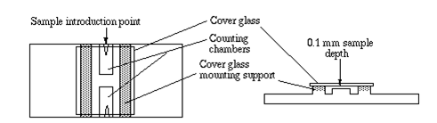
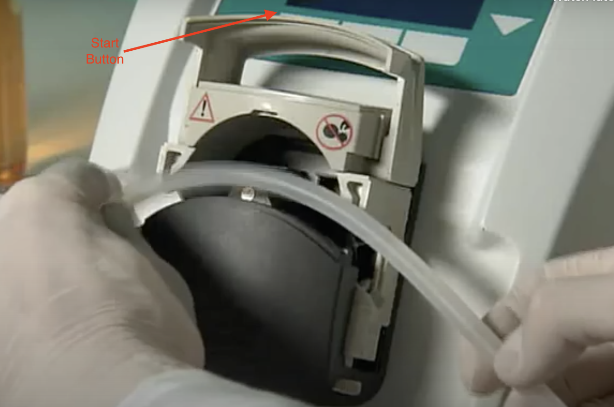
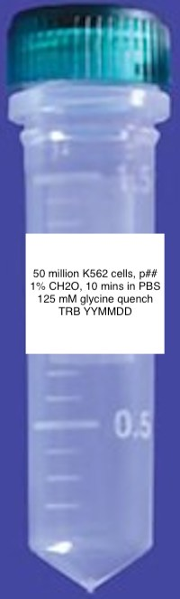
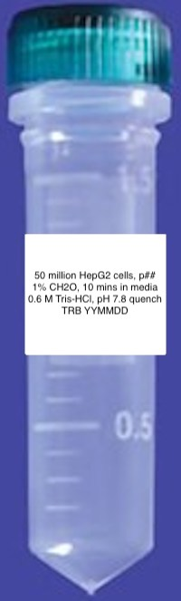
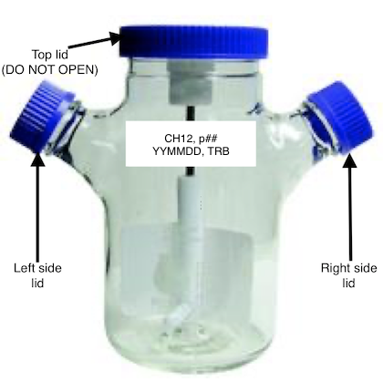

# Mammalian Processing

***

This page is meant to serve as a centralized repository for all <a href="https://www.pughlab.psu.edu/" target="_blank">Pugh Lab</a> protocols related to mammalian cell culture, as well as provide guidance to new members on proper aseptic technique.

***

## General Notes

***

### Environmental Health and Safety Requirements

All biological material is considered a biohazard until it has been crosslinked with formaldehyde. All waste (tips, paper towels, gloves) associated with cell culture processing prior to crosslinking must be disposed of in biohazard waste bags and autoclaved after processing is complete.

All solutions and surfaces that made contact with biological material prior to crosslinking must be neutralized with 10% bleach (final concentration for solutions) in order for it to be poured down the sink. Solutions must incubate with 10% bleach for at least 30 minutes under a chemical hood before decanting. Surfaces must be wiped down with 10% bleach solution, followed by water, and then 70% ethanol.

### Performing a Cell Count

Cell counts are performed before passaging and harvesting cells to ascertain the culture's cell density so that they can be properly split or harvested and then cryogenically frozen in well-defined aliquot sizes for downstream processing.

Note: This guide assumes all necessary equipment and consumables have already been wiped down with 70% ethanol and placed in the biological safety hood.

1. If not already done, pipette 1 mL of media from cell culture flask using a 5 mL serological pipette and dispense into a 15 mL conical.
	* Be sure to keep lid of flask in-hand and face-down while transferring media to prevent contamination.
	* Note: Adherent cells (like HepG2 line) must be trypsinized before taking an 	aliquot for a cell count.
2. Remove the 15 mL conical from the biological safety hood in its tube rack, and bring it to the <a href="https://www.thermofisher.com/order/catalog/product/AMEX1000#/AMEX1000" target="_blank">EVOS Microscope</a>.
3. Locate the hemocytometer and the glass cover slip, and place the glass cover slip on top of the hemocytometer platform in the center as shown below. 
4. Pipette 20 uL of the cell-containing media into one of the hemocytometer's chambers using a p200 pipette.
5. Turn on the EVOS Microscope and position the hemocytometer so the chamber's grid containing the liquid can be visualized.
	* Note: You may have to adjust the lens to the correct magnification--if using 	correct magnification, you should see 9 large squares.
6. Cells will be counted from the large squares in each of the corners (top left, top right, bottom left, bottom right, see below).
	* Some cells may appear to be touching the edges of the squares or be straddling the edge--only count those touching the top and left edges of the square, and 		exclude those touching the bottom and right edges. (In principle, can be any two sides chosen to accept or exclude).
	* Count the cells using a manual cell counter and record the numbers for each 	corner square. 
7. Multiply the mean of the cell counts by 10^4 to convert the number's units to cells/mL
	* Each large square has a volume of 10^-4 cm^3, and 1 cm^3 = 1 mL.
8. Place a Kimwipe down on the lab bench and move the hemocytometer to the bench.
9. Remove the glass coverslip, spray both sides with 70% ethanol, and wipe it down with a separate Kimwipe.
10. Spray the hemocytometer platform with 70% ethanol and wipe it down with a separate Kimwipe.
11. Discard the 15 mL conical containing the remainder of the cell-containing media in the biohazard receptacle.

### Replacing CO2 Tank

To be added.

### Autoclaving Tubing for Peristaltic Pump

To be added.

***

## K562 Myelogenous Leukemia Cell Line

***

### Cell Line Information

Suspension cells.

### Buffers and Solutions

#### Seeding

Buffer/Solution | Use | Amount Needed
:--------- | :------ | :-----:
<a href="https://cegrcode.github.io/GeneralLab/buffers/#complete-iscoves-modified-dulbeccos-medium-imdm-111-l" target="_blank">Complete IMDM</a>| Media | 29 mL

&nbsp;

#### Scale-Up From Seeding

Day | Buffer/Solution | Use | Amount Needed
:---------- | :--------- | :------ | :-----:
Monday | <a href="https://cegrcode.github.io/GeneralLab/buffers/#complete-iscoves-modified-dulbeccos-medium-imdm-111-l" target="_blank">Complete IMDM</a>| Media | 62 mL
Tuesday | <a href="https://cegrcode.github.io/GeneralLab/buffers/#complete-iscoves-modified-dulbeccos-medium-imdm-111-l" target="_blank">Complete IMDM</a>| Media | 122 mL
Wednesday | <a href="https://cegrcode.github.io/GeneralLab/buffers/#complete-iscoves-modified-dulbeccos-medium-imdm-111-l" target="_blank">Complete IMDM</a>| Media | 200 mL
Thursday | <a href="https://cegrcode.github.io/GeneralLab/buffers/#complete-iscoves-modified-dulbeccos-medium-imdm-111-l" target="_blank">Complete IMDM</a>| Media | 400 mL
Friday | <a href="https://cegrcode.github.io/GeneralLab/buffers/#complete-iscoves-modified-dulbeccos-medium-imdm-111-l" target="_blank">Complete IMDM</a>| Media | 800 mL
Saturday | <a href="https://cegrcode.github.io/GeneralLab/buffers/#complete-iscoves-modified-dulbeccos-medium-imdm-111-l" target="_blank">Complete IMDM</a>| Media | 1.4 L

&nbsp;

#### Scale-Up From Friday Harvest

Day | Buffer/Solution | Use | Amount Needed
:---------- | :--------- | :------ | :-----:
Friday | <a href="https://cegrcode.github.io/GeneralLab/buffers/#complete-iscoves-modified-dulbeccos-medium-imdm-111-l" target="_blank">Complete IMDM</a>| Media | 375 mL
Saturday | <a href="https://cegrcode.github.io/GeneralLab/buffers/#complete-iscoves-modified-dulbeccos-medium-imdm-111-l" target="_blank">Complete IMDM</a>| Media | 750 mL
Sunday | <a href="https://cegrcode.github.io/GeneralLab/buffers/#complete-iscoves-modified-dulbeccos-medium-imdm-111-l" target="_blank">Complete IMDM</a>| Media | 1.5 L

&nbsp;

#### Harvest

Buffer/Solution | Use | Amount Per Harvest
:--------- | :------  | :------:
<a href="https://cegrcode.github.io/GeneralLab/buffers/#complete-iscoves-modified-dulbeccos-medium-imdm-111-l" target="_blank">Complete IMDM</a> | Media | 1.5 L/375 mL
<a href="https://cegrcode.github.io/GeneralLab/buffers/#complete-protease-inhibitor-edta-free-cpi-1-ml" target="_blank">CPI</a> | Protease Inhibitor | 1 mL
<a href="http://www.emsdiasum.com/microscopy/products/chemicals/formaldehyde.aspx#15700" target="_blank">32% Formaldehyde, Methanol-Free, 10 mL</a> (Old PCRP XL) | Crosslinking | 4.03 mL
<a href="http://www.emsdiasum.com/microscopy/products/chemicals/formaldehyde.aspx#15700" target="_blank">16% Formaldehyde, Methanol Free, 100 mL</a> | Crosslinking | 100/175 mL
<a href="https://cegrcode.github.io/GeneralLab/buffers/#25-m-glycine-1-l" target="_blank">2.5 M Glycine</a> (Old PCRP XL) | Quenching | 6.8 mL
<a href="https://cegrcode.github.io/GeneralLab/buffers/#3-m-tris-hcl-ph-78-4-l" target="_blank">3 M Tris-HCl, pH 7.8</a> | Quenching | 400/700 mL
<a href="https://cegrcode.github.io/GeneralLab/buffers/#1x-pbs-1-l" target="_blank">1X PBS</a> | Wash Buffer | 150/200 mL

Different volumes above demarcated by slashes indicate required amounts for regular vs. Friday harvest volumes (1.5 L vs. 2.625 L, respectively).

&nbsp;

### Seeding

*Note: It is recommended to perform seeding on Friday afternoon.*

1. Turn UV light on in the biological safety hood to sterilize the exposed surfaces in the hood.
2. After 30 minutes of sterilization, make <a href="https://cegrcode.github.io/GeneralLab/buffers/#complete-iscoves-modified-dulbeccos-medium-imdm-111-l" target="_blank">complete IMDM</a>. Place one complete media bottle in the 37˚C water bath and let warm up for 15 minutes. Store remaining complete media bottles at 4˚C.
3. While the media warms up prepare a table-top centrifuge by heating it to 37˚C, and obtain the following things:
	* One 15 mL conical tube, two T-25 flasks, a tube rack, a serological pipette, three 10 mL serological tips, four 5 mL serological tips, p1000 pipette and tips, a roll of masking tape, and a black sharpie.
	* Label the 15 mL conical tube and two pieces of thick masking tape with cell line (K562), passage number (p1 for seeding), date, and initials in black sharpie.
	* Wipe down gloves and then all aforementioned items, except for masking tape and sharpie (they stay outside of hood), with 70% ethanol before placing in the hood.
4. When complete media reaches 37˚C, wipe the exterior of the bottle with 70% ethanol and place in the hood.
5. Add 9 mL of complete media with a 10 mL serological tip to the 15 mL conical tube.
6. Add 5 mL of complete media with two separate 5 mL serological tips to each of the T-25 flasks.
7. Rapidly thaw K562 seed stock in 37˚C water bath (DO NOT SUBMERGE TUBE), douse tube in 70% ethanol, dry with a paper towel, and place in the tube rack under the hood.
8. Transfer entire seed stock of K562 (1 mL) to 15 mL conical tube containing 9 mL of complete media using a p1000 pipette.
9. Remove 15 mL conical tube from hood and spin for 5 minutes at 125*g, 37˚C.
10. Wipe conical tube with 70% ethanol, bring back into hood, decant the supernatant with a 10 mL serological tip, and re-suspend the cell pellet in 10 mL complete media using a new 10 mL serological tip.
11. Transfer 5 mL of solution containing cells to each T-25 flask, using a new 5 mL serological each time.
	* Remove T-25 flasks from hood, wipe down with 70% ethanol, and place each piece of dated masking tape on the exterior of the flask as shown below on the left.
	* Place the T-25 flasks in the 37˚C, 5% CO2 incubator with the label-face up and lid tilted up as shown below on the right. 
&nbsp;
  
&nbsp;
 
&nbsp;
 
&nbsp;
  
&nbsp;
 
&nbsp;
 
&nbsp;
 
&nbsp;
 
&nbsp;
 
&nbsp;
 
&nbsp;
 
&nbsp;
 
&nbsp;
 
&nbsp;

12. Check on cells in 2-3 days by visualizing an aliquot under the microscope and performing a <a href="https://cegrcode.github.io/GeneralLab/mammalian/#performing-a-cell-count" target="_blank">cell count</a> before beginning scale-up procedure.
13. Remove everything from the hood, discard all serological tips, the 15 mL conical, and the K562 seeding tube in the biohazard receptacle, place remaining complete media at 4˚C, turn off the centrifuge, wipe down interior of the hood with 70% ethanol, and UV the hood for 30 minutes.

### Scale-Up

#### From Seeding

For the experienced user, follow this outline:

Day | Current Flask | Number of Flasks | Current Culture Size | Next Flask | Number of Flasks | Final Culture Size
:---------- | :---------: | :------: | :-----: | :-------: | :-----: | :-------:
Monday | T-25 | 2 | 20 mL (10 per flask) | T-175 | 2 | 80 mL (40 per flask)
Tuesday | T-175 | 2 | 80 mL (40 per flask) | 500 mL spinner | 1 | 200 mL
Wednesday | 500 mL spinner | 1 | 200 mL | 500 mL spinner (same flask) | 1 | 400 mL
Thursday | 500 mL spinner | 1 | 400 mL | 1 L spinner | 1 | 800 mL
Friday | 1 L spinner | 1 | 800 mL | 3 L spinner | 1 | 1600 mL
Saturday | 3 L spinner | 1 | 1600 mL | 3 L spinner (same flask) | 1 | 3000 mL

&nbsp;

##### Monday

1. Turn on the UV light in the biological safety hood for 30 minutes and warm an open bottle of <a href="https://cegrcode.github.io/GeneralLab/buffers/#complete-iscoves-modified-dulbeccos-medium-imdm-111-l" target="_blank">complete IMDM</a> in a 37˚C water bath.
2. While the hood is being cleaned and the media is warming up, obtain the following things:
	* Two T-175 flasks
	* Two 5 mL serological tips
	* Three 10 mL serological tips
	* Two 50 mL serological tips
	* Serological pipette
	* Roll of thick masking tape
	* Black sharpie
3. Label two pieces of thick masking tape with cell line (K562), passage number (p2), date, and initials in black sharpie and set them aside for later.
4. Once the UV light in the hood turns off, wipe down all of the aforementioned items besides the masking tape and the sharpie and place in the hood.
5. Obtain the two T-25 flasks from the incubator, remove their tape labels to place in a lab notebook, wipe the exterior of the flask with 70% ethanol and place under the hood.
	* Perform a <a href="https://cegrcode.github.io/GeneralLab/mammalian/#performing-a-cell-count" target="_blank">cell count</a> for each T-25 flask and record in a notebook.
6. Fetch the media bottle and wipe down its exterior with 70% ethanol and place in the hood.
7. Carefully transfer the 9 mL in each T-25 flask to one T-175 flask with a new 10 mL serological tip for each T-25 flask.
	* *Note: Keep flasks standing upright while manipulating media.*
8. Use a 10 mL and a 50 mL serological tip to transfer 62 mL of fresh media into the T-175 flask containing the 18 mL of cell-containing media from the T-25 flasks.
9. Transfer 40 mL of the media from the initial T-175 flask to the clean T-175 flask.
10. Secure the lids on the T-175 flasks, remove them from the hood, wipe them down with 70% ethanol, and affix the tape labels in the orientation shown below on the left.
	* Place the T-175 flasks in the 37˚C, 5% CO2 incubator with the label face-up and the lid tilted up as shown below on the right. 
&nbsp;
  
&nbsp;
 
&nbsp;
 
&nbsp;
 
&nbsp;
  
&nbsp;
 
&nbsp;
 
&nbsp;
 
&nbsp;
 
&nbsp;
 
&nbsp;
 
&nbsp;
 
&nbsp;
 
&nbsp;

11. Discard the empty T-25 flasks and the used serological tips in the biohazard receptacle, and remove all other items from the hood.
	* Wipe the interior with 70% ethanol and then turn the UV light on for 30 minutes.
12. Perform the next scale-up phase at the same time on the next day.

##### Tuesday

13. Repeat steps from previous day, including the <a href="https://cegrcode.github.io/GeneralLab/mammalian/#performing-a-cell-count" target="_blank">cell count</a> for each T-175 flask, but replace required items/consumables with following list:
	* One bottle of warm media (from previous day)
	* Two 5 mL serological tips
	* One 500 mL spinner flask
	* Five 50 mL serological tips
	* Serological pipette
	* Roll of thick masking tape (label should say p3 instead of p2)
	* Black sharpie
14. Transfer the full 39 mL from each T-175 flask into the 500 mL spinner flask through one of its side lids with two separate 50 mL serological tips.
	* *Note: Never put down the side lid in the hood.*
15. Use three separate 50 mL serological tips to transfer a total of 122 mL of fresh media to the 500 mL spinner flask containing 80 mL of cell-containing media through the same side lid.
16. Be sure that the label is affixed to the flask as shown below after wiping with 70% ethanol, loosening the side lids to final thread, and ensuring that the stir plate is on the correct setting (___) before closing the door to the 37˚C, 5% CO2 incubator. 
&nbsp;
  
&nbsp;
 
&nbsp;
 
&nbsp;
 
&nbsp;
 
&nbsp;
 
&nbsp;
 
&nbsp;
 
&nbsp;
 
&nbsp;

17. Discard the empty T-175 flasks and serological tips in the biohazard receptacle, and remove all other items from the hood.
	* Wipe the interior with 70% ethanol and then turn the UV light on for 30 minutes.
18. Perform next scale-up phase at the same time on the next day.

##### Wednesday

19. Repeat steps from previous day, but replace required items/consumables with following list:
	* One bottle of warm media (from previous day)
	* One autoclaved <a href="https://us.vwr.com/store/product/4698442/nalgene-polypropylene-straight-sided-jars-thermo-scientific" target="_blank">Nalgene jar</a> containing plastic peristaltic pump tubing
	* One 5 mL serological tip
	* Serological pipette
	* 500 mL plastic beaker with 200 mL dH2O
	* Roll of thick masking tape (label should say p4)
	* Black sharpie
20. After the UV light shuts off, fetch the aforementioned items (minus masking tape and black sharpie), wipe them down with 70% ethanol and place them in the hood.
21. Open the door to the 37˚C, 5% CO2 incubator, tighten the side lids on the 500 mL spinner flask and wipe flask down with 70% ethanol before placing inside the hood.
	* Press the "lightening bolt" button on the outside of the hood to turn on the outlet that provides electricity for the peristaltic pump.
22. Loosen the right side lid on the flask as well as the lid for the complete media bottle (flask should be all the way on the left, followed by media and then peristaltic pump).
	* Perform a <a href="https://cegrcode.github.io/GeneralLab/mammalian/#performing-a-cell-count" target="_blank">cell count</a> for the 500 mL flask.
23. Remove the plastic tubing from the Nalgene bottle and nestle it into the compartment on the front of the peristaltic pump, close the compartment, and press the start button on control pad as shown below. 
	* Take the left end of the tubing in your right hand and the right end of the 	tubing in your left hand (pump feeds out of the right end and takes in through 		the left end).
	* Carefully remove the lid of the media with your right hand and place the left end of the tubing into the bottle while keeping the lid in hand.
	* Next, carefully remove the right side lid of the flask with your left hand and insert the right end of the tubing into the flask, being sure not to touch the 		walls of the flask with the tubing.
24. Activate the pump using the foot pedal to start pumping complete media into the flask.
	* Transfer 200 mL of media into the 500 mL flask using the gradations on the flask as a guide.
25. Once the media has been transferred, remove the right end of the tubing from the 500 mL flask and place it in the 500 mL beaker with dH2O, fasten the right side lid on the flask tightly, and remove the left end of the tubing from the media and place in the 500 mL beaker with dH2O.
26. Remove the 500 mL spinner flask from the hood, wipe down with 70% ethanol, and place the pre-labeled masking tape on the flask as shown below.
	* Be sure to loosen the side lids on the 500 mL flask to the final thread before closing the incubator door, and check that the setting on the magnetic stir plate reads (___). 
&nbsp;
  
&nbsp;
 
&nbsp;
 
&nbsp;
 
&nbsp;
 
&nbsp;
 
&nbsp;
 
&nbsp;
 
&nbsp;
 
&nbsp;

27. Remove all items from the hood.
	* Wipe down the interior of the hood with 70% ethanol and turn on the UV light for 30 minutes.
	* Replace the used media bottle back in the 4˚C refrigerator.
	* Clean the tubing and Nalgene jar with <a href="https://www.amazon.com/Procter-Gamble-608-25574-Ivory-Detergent/dp/B00PKHS9WO" target="_blank">Ivory soap</a> two times with tap water, and then rinse once with dH2O.
28. Complete next phase of scale-up on the following day at the same time.

##### Thursday

29. Repeat steps from previous day, but replace required items/consumables with following list:
	* One bottle of warm media (from previous day)
	* 1 L spinner flask
	* One autoclaved <a href="https://us.vwr.com/store/product/4698442/nalgene-polypropylene-straight-sided-jars-thermo-scientific" target="_blank">Nalgene jar</a> containing plastic peristaltic pump tubing
	* One 5 mL serological tip
	* Serological pipette
	* 500 mL plastic beaker with 200 mL dH2O
	* Roll of thick masking tape (label should say p5)
	* Black sharpie
30. After the UV light shuts off, fetch the media and the aforementioned items, minus the masking tape and sharpie, and wipe with 70% ethanol before placing them in the hood.
31. Open the door to the 37˚C, 5% CO2 incubator, tighten the side lids on the 500 mL spinner flask and wipe flask down with 70% ethanol before placing inside the hood.
	* Press the "lightening bolt" button on the outside of the hood to turn on the outlet that provides electricity for the peristaltic pump.
32. Loosen the right side lid on the 500 mL and 1 L flasks, as well as the lid for the complete media bottle (1 L flask should be all the way on the left, followed by the 500 mL flask, the media and then the peristaltic pump).
	* Perform a <a href="https://cegrcode.github.io/GeneralLab/mammalian/#performing-a-cell-count" target="_blank">cell count</a> for the 500 mL flask.
33. Remove the plastic tubing from the Nalgene bottle and nestle it into the compartment on the front of the peristaltic pump, close the compartment, and press the start button on control pad as shown below. 
	* Take the left end of the tubing in your right hand and the right end of the 	tubing in your left hand (pump feeds out of the right end and takes in through 		the left end).
	* Carefully remove the lid of the media with your right hand and place the left end of the tubing into the bottle while keeping the lid in hand.
	* Next, carefully remove the right side lid of the 1 L flask with your left hand and insert the right end of the tubing into the flask, being sure not to touch the 		walls of the flask with the tubing.
34. Activate the pump using the foot pedal to start pumping complete media into the flask.
	* Transfer 400 mL of media into the 1 L flask using the gradations on the flask as a guide.
35. Once the media has been transferred, remove the left end of the tubing from the media bottle and replace the lid.
	* Remove the side lid of the 500 mL spinner flask, and place the left end of the tubing in the cell-containing media.
	* Activate the pump with the foot pedal, and transfer the 400 mL of cell-containing media from the 500 mL spinner flask to the 1 L spinner flask.
	* Once the cell-containing media has been transferred, remove the right end of the tubing from the 1 L flask and place it in the 500 mL beaker with dH2O, fasten the right side lid on the flask tightly, and remove the left end of the tubing from the 500 mL flask and place in the 500 mL beaker with dH2O.
36. Remove the 1 L spinner flask from the hood, wipe down with 70% ethanol, and place the pre-labeled masking tape on the flask as shown below.
	* Be sure to loosen the side lids on the 1 L flask to the final thread before closing the incubator door, and check that the setting on the magnetic stir plate reads (___). 
&nbsp;
  
&nbsp;
 
&nbsp;
 
&nbsp;
 
&nbsp;
 
&nbsp;
 
&nbsp;
 
&nbsp;
 
&nbsp;
 
&nbsp;
 
&nbsp;
 
&nbsp;

37. Remove all items from the hood.
	* Wipe down the interior of the hood with 70% ethanol and turn on the UV light for 30 minutes.
	* Replace the used media bottle back in the 4˚C refrigerator.
	* Clean the 500 mL spinner flask, the tubing, and the Nalgene jar with <a href="https://www.amazon.com/Procter-Gamble-608-25574-Ivory-Detergent/dp/B00PKHS9WO" target="_blank">Ivory soap</a> two times with tap water, and then rinse once with dH2O.
38. Complete next phase of scale-up on the following day at the same time.

##### Friday

39. Repeat steps from previous day, but replace required items/consumables with following list:
	* Two bottles of warm media (one from previous day and one new)
	* 3 L spinner flask
	* One autoclaved <a href="https://us.vwr.com/store/product/4698442/nalgene-polypropylene-straight-sided-jars-thermo-scientific" target="_blank">Nalgene jar</a> containing plastic peristaltic pump tubing
	* One 5 mL serological tip
	* Serological pipette
	* 500 mL plastic beaker with 200 mL dH2O
	* Roll of thick masking tape (label should say p6)
	* Black sharpie
40. After the UV light shuts off, fetch the media and the aforementioned items, minus the masking tape and sharpie, and wipe with 70% ethanol before placing them in the hood.
41. Open the door to the 37˚C, 5% CO2 incubator, tighten the side lids on the 1 L spinner flask and wipe flask down with 70% ethanol before placing inside the hood.
	* Press the "lightening bolt" button on the outside of the hood to turn on the outlet that provides electricity for the peristaltic pump.
42. Loosen the right side lid on the 1 L and 3 L flasks, as well as the lids for the complete media bottles (3 L flask should be all the way on the left, followed by the 1 L flask, the media and then the peristaltic pump).
	* Perform a <a href="https://cegrcode.github.io/GeneralLab/mammalian/#performing-a-cell-count" target="_blank">cell count</a> for the 1 L flask.
43. Remove the plastic tubing from the Nalgene bottle and nestle it into the compartment on the front of the peristaltic pump, close the compartment, and press the start button on control pad as shown below. 
	* Take the left end of the tubing in your right hand and the right end of the 	tubing in your left hand (pump feeds out of the right end and takes in through 		the left end).
	* Carefully remove the lid of the media with your right hand and place the left end of the tubing into the bottle while keeping the lid in hand.
	* Next, carefully remove the right side lid of the 3 L flask with your left hand and insert the right end of the tubing into the flask, being sure not to touch the 		walls of the flask with the tubing.
44. Activate the pump using the foot pedal to start pumping complete media into the flask.
	* Transfer 800 mL of media into the 3 L flask using the gradations on the flask as a guide.
	* You will have to switch media bottles to transfer 800 mL in total.
45. Once the media has been transferred, remove the left end of the tubing from the media bottle and replace the lid.
	* Remove the side lid of the 1 L spinner flask, and place the left end of the tubing in the cell-containing media.
	* Activate the pump with the foot pedal, and transfer the 800 mL of cell-containing media from the 1 L spinner flask to the 3 L spinner flask.
	* Once the cell-containing media has been transferred, remove the right end of the tubing from the 3 L flask and place it in the 500 mL beaker with dH2O, fasten the right side lid on the flask tightly, and remove the left end of the tubing from the 1 L flask and place in the 500 mL beaker with dH2O.
46. Remove the 3 L spinner flask from the hood, wipe down with 70% ethanol, and place the pre-labeled masking tape on the flask as shown below.
	* Be sure to loosen the side lids on the 3 L flask to the final thread before closing the incubator door, and check that the setting on the magnetic stir plate reads (___). 
&nbsp;
  
&nbsp;
 
&nbsp;
 
&nbsp;
 
&nbsp;
 
&nbsp;
 
&nbsp;
 
&nbsp;
 
&nbsp;
 
&nbsp;
 
&nbsp;
 
&nbsp;

47. Remove all items from the hood.
	* Wipe down the interior of the hood with 70% ethanol and turn on the UV light for 30 minutes.
	* Replace the used media bottle back in the 4˚C refrigerator.
	* Pour 10% bleach in the empty media bottle and allow 30 minutes of contact time before discarding the bottle in the biohazard receptacle.
	* Clean the 1 L spinner flask, the tubing, and the Nalgene jar with <a href="https://www.amazon.com/Procter-Gamble-608-25574-Ivory-Detergent/dp/B00PKHS9WO" target="_blank">Ivory soap</a> two times with tap water, and then rinse once with dH2O.
48. Complete next phase of scale-up on the following day at the same time.

##### Saturday

49. Repeat steps from previous day, but replace required items/consumables with following list:
	* Two bottles of warm media (one from previous day and one new)
	* One autoclaved <a href="https://us.vwr.com/store/product/4698442/nalgene-polypropylene-straight-sided-jars-thermo-scientific" target="_blank">Nalgene jar</a> containing plastic peristaltic pump tubing
	* One 5 mL serological tip
	* Serological pipette
	* 500 mL plastic beaker with 200 mL dH2O
	* Roll of thick masking tape (label should say p7)
	* Black sharpie
50. After the UV light shuts off, fetch the media and the aforementioned items, minus the masking tape and sharpie, and wipe with 70% ethanol before placing them in the hood.
51. Open the door to the 37˚C, 5% CO2 incubator, tighten the side lids on the 3 L spinner flask and wipe flask down with 70% ethanol before placing inside the hood.
	* Press the "lightening bolt" button on the outside of the hood to turn on the outlet that provides electricity for the peristaltic pump.
52. Loosen the right side lid on the 3 L flask, as well as the lids for the complete media bottles (3 L flask should be all the way on the left, followed by the media and then the peristaltic pump).
	* Perform a <a href="https://cegrcode.github.io/GeneralLab/mammalian/#performing-a-cell-count" target="_blank">cell count</a> for the 3 L flask.
53. Remove the plastic tubing from the Nalgene bottle and nestle it into the compartment on the front of the peristaltic pump, close the compartment, and press the start button on control pad as shown below. 
	* Take the left end of the tubing in your right hand and the right end of the 	tubing in your left hand (pump feeds out of the right end and takes in through 		the left end).
	* Carefully remove the lid of the media with your right hand and place the left end of the tubing into the bottle while keeping the lid in hand.
	* Next, carefully remove the right side lid of the 3 L flask with your left hand and insert the right end of the tubing into the flask, being sure not to touch the 		walls of the flask with the tubing.
54. Activate the pump using the foot pedal to start pumping complete media into the flask.
	* Transfer 1400 mL of media into the 3 L flask using the gradations on the flask as a guide.
	* You will have to switch media bottles to transfer 1400 mL in total.
55. Once the media has been transferred, remove the right end of the tubing from the 3 L flask and place it in the 500 mL beaker with dH2O, fasten the right side lid on the flask tightly, and then remove the left end of the tubing from the media bottle and place in the 500 mL beaker with dH2O.
56. Remove the 3 L spinner flask from the hood, wipe down with 70% ethanol, and place the pre-labeled masking tape on the flask as shown below.
	* Be sure to loosen the side lids on the 3 L flask to the final thread before closing the incubator door, and check that the setting on the magnetic stir plate reads (___). 
&nbsp;
  
&nbsp;
 
&nbsp;
 
&nbsp;
 
&nbsp;
 
&nbsp;
 
&nbsp;
 
&nbsp;
 
&nbsp;
 
&nbsp;
 
&nbsp;
 
&nbsp;

57. Remove all items from the hood.
	* Wipe down the interior of the hood with 70% ethanol and turn on the UV light for 30 minutes.
	* Replace the used media bottle back in the 4˚C refrigerator.
	* Pour 10% bleach in the empty media bottles and allow 30 minutes of contact time before discarding the bottle in the biohazard receptacle.
	* Clean the tubing and the Nalgene jar with <a href="https://www.amazon.com/Procter-Gamble-608-25574-Ivory-Detergent/dp/B00PKHS9WO" target="_blank">Ivory soap</a> two times with tap water, and then rinse once with dH2O.
58. Perform a <a href="https://cegrcode.github.io/GeneralLab/mammalian/#regularfriday-harvest-protocol" target="_blank">Regular Harvest</a> the following day (Sunday) at the same time.

##### Sunday

Follow the <a href="https://cegrcode.github.io/GeneralLab/mammalian/#regularfriday-harvest-protocol" target="_blank">Regular Harvest</a> protocol.

#### From Friday Harvest

For the experienced user, follow this outline:

Day | Current Flask | Number of Flasks | Current Culture Size | Next Flask | Number of Flasks | Final Culture Size
:---------- | :---------: | :------: | :-----: | :-------: | :-----: | :-------:
Friday | 3 L spinner | 1 | 375 mL | 3 L spinner (same flask) | 1 | 750 mL
Saturday | 3 L spinner | 1 | 750 mL | 3 L spinner (same flask) | 1 | 1500 mL
Sunday | 3 L spinner | 1 | 1500 mL | 3 L spinner (same flask) | 1 | 3000 mL

&nbsp;

##### Friday

See step 20 of <a href="https://cegrcode.github.io/GeneralLab/mammalian/#regularfriday-harvest-protocol" target="_blank">Friday Harvest</a> protocol for more details.

##### Saturday

1. Turn on the UV light in the biological safety hood for 30 minutes and warm an open bottle of <a href="https://cegrcode.github.io/GeneralLab/buffers/#complete-iscoves-modified-dulbeccos-medium-imdm-111-l" target="_blank">complete IMDM</a> in a 37˚C water bath.
2. While the hood is being cleaned and the media is warming up, obtain the following things:
	* One autoclaved <a href="https://us.vwr.com/store/product/4698442/nalgene-polypropylene-straight-sided-jars-thermo-scientific" target="_blank">Nalgene jar</a> containing plastic peristaltic pump tubing
	* One 5 mL serological tip
	* Serological pipette
	* 500 mL plastic beaker with 200 mL dH2O
	* Roll of thick masking tape
	* Black sharpie
3. Label one piece of thick masking tape with cell line (K562), passage number (p##), date, and initials in black sharpie and set them aside for later.
4. After the UV light shuts off, fetch the media and the aforementioned items, minus the masking tape and sharpie, and wipe with 70% ethanol before placing them in the hood.
5. Open the door to the 37˚C, 5% CO2 incubator, tighten the side lids on the 3 L spinner flask and wipe flask down with 70% ethanol before placing inside the hood.
	* Press the "lightening bolt" button on the outside of the hood to turn on the outlet that provides electricity for the peristaltic pump.
6. Loosen the right side lid on the 3 L flask, as well as the lid for the complete media bottle (3 L flask should be all the way on the left, followed by the media and then the peristaltic pump).
	* Perform a <a href="https://cegrcode.github.io/GeneralLab/mammalian/#performing-a-cell-count" target="_blank">cell count</a> for the 3 L flask.
7. Remove the plastic tubing from the Nalgene bottle and nestle it into the compartment on the front of the peristaltic pump, close the compartment, and press the start button on control pad as shown below. 
	* Take the left end of the tubing in your right hand and the right end of the 	tubing in your left hand (pump feeds out of the right end and takes in through 		the left end).
	* Carefully remove the lid of the media with your right hand and place the left end of the tubing into the bottle while keeping the lid in hand.
	* Next, carefully remove the right side lid of the 3 L flask with your left hand and insert the right end of the tubing into the flask, being sure not to touch the 		walls of the flask with the tubing.
8. Activate the pump using the foot pedal to start pumping complete media into the flask.
	* Transfer 750 mL of media into the 3 L flask using the gradations on the flask as a guide.
9. Once the media has been transferred, remove the right end of the tubing from the 3 L flask and place it in the 500 mL beaker with dH2O, fasten the right side lid on the flask tightly, and then remove the left end of the tubing from the media bottle and place in the 500 mL beaker with dH2O.
10. Remove the 3 L spinner flask from the hood, wipe down with 70% ethanol, and place the pre-labeled masking tape on the flask as shown below.
	* Be sure to loosen the side lids on the 3 L flask to the final thread before closing the incubator door, and check that the setting on the magnetic stir plate reads (___). 
&nbsp;
  
&nbsp;
 
&nbsp;
 
&nbsp;
 
&nbsp;
 
&nbsp;
 
&nbsp;
 
&nbsp;
 
&nbsp;
 
&nbsp;
 
&nbsp;
 
&nbsp;

11. Remove all items from the hood.
	* Wipe down the interior of the hood with 70% ethanol and turn on the UV light for 30 minutes.
	* Replace the used media bottle back in the 4˚C refrigerator.
	* Pour 10% bleach in any empty media bottles and allow 30 minutes of contact time before discarding the bottle in the biohazard receptacle.
	* Clean the tubing and the Nalgene jar with <a href="https://www.amazon.com/Procter-Gamble-608-25574-Ivory-Detergent/dp/B00PKHS9WO" target="_blank">Ivory soap</a> two times with tap water, and then rinse once with dH2O.
12. Perform the next scale-up phase at the same time on the next day.

##### Sunday

13. Repeat steps from previous day, but replace required items/consumables with following list:
	* Two warm media bottles
	* One autoclaved <a href="https://us.vwr.com/store/product/4698442/nalgene-polypropylene-straight-sided-jars-thermo-scientific" target="_blank">Nalgene jar</a> containing plastic peristaltic pump tubing
	* One 5 mL serological tip
	* Serological pipette
	* 500 mL plastic beaker with 200 mL dH2O
	* Roll of thick masking tape
	* Black sharpie
14. After the UV light shuts off, fetch the media and the aforementioned items, minus the masking tape and sharpie, and wipe with 70% ethanol before placing them in the hood.
15. Open the door to the 37˚C, 5% CO2 incubator, tighten the side lids on the 3 L spinner flask and wipe flask down with 70% ethanol before placing inside the hood.
	* Press the "lightening bolt" button on the outside of the hood to turn on the outlet that provides electricity for the peristaltic pump.
16. Loosen the right side lid on the 3 L flask, as well as the lids for the complete media bottles (3 L flask should be all the way on the left, followed by the media and then the peristaltic pump).
	* Perform a <a href="https://cegrcode.github.io/GeneralLab/mammalian/#performing-a-cell-count" target="_blank">cell count</a> for the 3 L flask.
17. Remove the plastic tubing from the Nalgene bottle and nestle it into the compartment on the front of the peristaltic pump, close the compartment, and press the start button on control pad as shown below. 
	* Take the left end of the tubing in your right hand and the right end of the 	tubing in your left hand (pump feeds out of the right end and takes in through 		the left end).
	* Carefully remove the lid of the media with your right hand and place the left end of the tubing into the bottle while keeping the lid in hand.
	* Next, carefully remove the right side lid of the 3 L flask with your left hand and insert the right end of the tubing into the flask, being sure not to touch the 		walls of the flask with the tubing.
18. Activate the pump using the foot pedal to start pumping complete media into the flask.
	* Transfer 1500 mL of media into the 3 L flask using the gradations on the flask as a guide.
	* You will have to move the left end of the tubing to a new media bottle to transfer the full 1500 mL to the 3 L spinner flask.
19. Once the media has been transferred, remove the right end of the tubing from the 3 L flask and place it in the 500 mL beaker with dH2O, fasten the right side lid on the flask tightly, and then remove the left end of the tubing from the media bottle and place in the 500 mL beaker with dH2O.
20. Remove the 3 L spinner flask from the hood, wipe down with 70% ethanol, and place the pre-labeled masking tape on the flask as shown below.
	* Be sure to loosen the side lids on the 3 L flask to the final thread before closing the incubator door, and check that the setting on the magnetic stir plate reads (___). 
&nbsp;
  
&nbsp;
 
&nbsp;
 
&nbsp;
 
&nbsp;
 
&nbsp;
 
&nbsp;
 
&nbsp;
 
&nbsp;
 
&nbsp;
 
&nbsp;
 
&nbsp;

21. Remove all items from the hood.
	* Wipe down the interior of the hood with 70% ethanol and turn on the UV light for 30 minutes.
	* Replace the used media bottle back in the 4˚C refrigerator.
	* Pour 10% bleach in any empty media bottles and allow 30 minutes of contact time before discarding the bottle in the biohazard receptacle.
	* Clean the tubing and the Nalgene jar with <a href="https://www.amazon.com/Procter-Gamble-608-25574-Ivory-Detergent/dp/B00PKHS9WO" target="_blank">Ivory soap</a> two times with tap water, and then rinse once with dH2O.
22. Perform a <a href="https://cegrcode.github.io/GeneralLab/mammalian/#regularfriday-harvest-protocol" target="_blank">Regular Harvest</a> the following day (Monday) at the same time.

### Creating Cell Stocks

10% glycerol stock of media, spin down cells, re-suspend in 10% glycerol media, slow descent to -80C, transfer to liquid nitrogen for long-term storage.

### Harvesting

#### Regular/Friday Harvest Consumables

Buffer/Solution/Consumable/Plasticware | Regular Harvest Amount | Friday Harvest Amount
:--------- | :------: | :------:
Labeled 2 mL Screw Cap tubes1 | 20 | 40
K562-labeled 50 mL conical tubes2 | 4 | 5
50 mL <a href="https://cegrcode.github.io/GeneralLab/buffers/#1x-pbs-1-l" target="_blank">1X PBS</a> w/ 2 µL/mL  <a href="https://cegrcode.github.io/GeneralLab/buffers/#complete-protease-inhibitor-edta-free-cpi-1-ml" target="_blank">CPI</a> aliquots3 | 3 | 4
500 mL <a href="https://www.thermofisher.com/order/catalog/product/3141-0250#/3141-0250" target="_blank">Nalgene centrifuge bottles</a>4 | 6 | 8
<a href="https://cegrcode.github.io/GeneralLab/buffers/#complete-iscoves-modified-dulbeccos-medium-imdm-111-l" target="_blank">Complete IMDM bottles</a>5 | 2 | 1
<a href="http://www.emsdiasum.com/microscopy/products/chemicals/formaldehyde.aspx#15700" target="_blank">16% Formaldehyde, Methanol Free, 100 mL</a>6 | 1 bottle (100 mL) | 2 bottles (175 mL)
<a href="https://cegrcode.github.io/GeneralLab/buffers/#3-m-tris-hcl-ph-78-4-l" target="_blank">3 M Tris-HCl, pH 7.8</a>7 | 400 mL | 700 mL

Superscripts in table above are referenced throughout protocol below where specific quantities are required.

&nbsp;

#### Regular/Friday Harvest Protocol

1. Turn on the UV light in the biological safety hood for 30 minutes and warm <a href="https://cegrcode.github.io/GeneralLab/buffers/#complete-iscoves-modified-dulbeccos-medium-imdm-111-l" target="_blank">complete IMDM</a>5 bottles in a 37˚C water bath.
2. Print <a href="https://us.vwr.com/store/product/12610555/cryo-babies-and-cryo-tags-laser-labels-diversified-biotech" target="_blank">Diversified Biotech Labels</a>1 with information included in the format shown below. 
3. Pre-label twenty 2 mL conical screw cap tubes1 from <a href="https://www.usascientific.com/ screw-cap-micro-tube-conical/p/sct-conical-nat" target="_blank">USA Scientific</a> with these printed labels as shown above (Note: label above represents old crosslinking and quenching (PCRP) conditions).
	* Additionally, label 50 mL conical tubes with K5622 on the lid.
4. Fast-temp two <a href="https://www.fishersci.ca/shop/products/sorvall-rc-6-plus-centrifuge/361010816" target="_blank">Thermo Scientific Sorvall Centrifuges</a>, a <a href="https://online-shop.eppendorf.us/US-en/Centrifugation-44533/Centrifuges-44534/Centrifuge-5810-5810R-PF-240994.html" target="_blank">Eppendorf table-top centrifuge</a>, and a <a href="https://online-shop.eppendorf.us/US-en/Centrifugation-44533/Centrifuges-44534/Centrifuge-5418R-PF-240995.html" target="_blank">Eppendorf microcentrifuge</a> to 4˚C.
5. Prepare 50 mL conicals containing 50 mL <a href="https://cegrcode.github.io/GeneralLab/buffers/#1x-pbs-1-l" target="_blank">1X PBS</a> and 100 µL <a href="https://cegrcode.github.io/GeneralLab/buffers/#complete-protease-inhibitor-edta-free-cpi-1-ml" target="_blank">CPI</a> (2 µL/mL)3 in an ice bucket.
6. Gather the following things:
	* **Common Necessities**
		* 500 mL <a href="https://www.thermofisher.com/order/catalog/product/3141-0250#/3141-0250" target="_blank">Nalgene centrifuge bottles</a>4 with orange gasket in lid
		* 500 mL plastic beaker with dH2O
		* 1 L aliquot of <a href="https://cegrcode.github.io/GeneralLab/buffers/#3-m-tris-hcl-ph-78-4-l" target="_blank">3 M Tris-HCl, pH 7.8</a>7
		* <a href="http://www.emsdiasum.com/microscopy/products/chemicals/formaldehyde.aspx#15700" target="_blank">16% Formaldehyde, Methanol Free, 100 mL</a>6
		* One autoclaved <a href="https://us.vwr.com/store/product/4698442/nalgene-polypropylene-straight-sided-jars-thermo-scientific" target="_blank">Nalgene jar</a> containing plastic peristaltic pump tubing
		* Serological pipette
		* A preset timer with two settings for 10 and 5 minutes
		* One 15 mL conical, a tube rack, and a 5 mL serological tip
	* **Regular Harvest Only**
		* 2 L plastic beaker with 1600 mL mark labeled
		* 4 L plastic beaker with 2 L mark labeled
		* 500 mL graduated cylinder
	* **Friday Harvest Only**
		* 4 L plastic beaker with 2800 mL mark labeled
		* 4 L plastic beaker with 3500 mL mark labeled
		* 1 L graduated cylinder
7. Once the UV light has turned off, wipe down gloves and all of the aforementioned items with 70% ethanol and place in the hood.
8. Pour 100 mL formaldehyde into the 2 L plastic beaker with 1600 mL marked, or 175 mL into 4 L plastic beaker with 2800 mL marked, depending upon harvest volume.
9. Measure out 400 mL of 3 M Tris-HCl, pH 7.8 into the 500 mL graduated cylinder and pour into the 4 L plastic beaker with 2 L marked, or 700 mL of 3 M Tris-HCl, pH 7.8 into 1 L graduated cylinder and pour into 4 L plastic beaker with 3500 mL labeled, depending upon harvest volume.
10. Turn on the outlet in the hood by pressing the "lightening bolt" button on the exterior of the hood.
11. Label a piece of thick masking tape with cell line (K562), passage number, date, and initials in black sharpie.
12. Wipe down gloves with 70% ethanol, locate the 3 L spinner flask and tighten the side lids before removing the from the magnetic stir plate in the incubator.
13. Remove thick masking tape from the flask (for your notes) and be sure that each of the side lids on the flask are tightened before wiping with 70% ethanol and placing under the hood.
	* Note: Best to tilt bottom of flask towards you when maneuvering the flask into the hood.
	* Note: Be sure to exclusively pull/pour media from one side of the flask and add media from the other.
14. Loosen the side lid on the left side of the flask and rotate it 180 degrees so that the loosened lid is now on the right.
	* Remove 1 mL of cell-containing media using a serological tip and dispense in the 15 mL conical.
	* Put the side lid on tightly, remove the flask from the hood, clean its exterior with 70% ethanol before placing back in the incubator, and once placed inside the 	incubator and on the stir plate, loosen both side lids to allow for ample gas 		transfer.
	* Perform a <a href="https://cegrcode.github.io/GeneralLab/mammalian/#performing-a-cell-count" target="_blank">cell count</a> (looking for 5 * 10^5 - 1 * 10^6 cells/mL).
15. Once a cell count has been performed, wash gloves with 70% ethanol, tighten the side lids of the 3 L flask, wipe down with 70% ethanol outside of the incubator, and place in the hood.
16. Loosen the left side lid and keep in-hand while carefully pouring cell-containing media into the plastic beaker containing formaldehyde.
	* Promptly start the 10-minute timer once finished pouring and swirl the beaker every 1-2 minutes.
	* Fasten the left side lid on the flask tightly.
17. While the cells are crosslinking, obtain the complete media bottle(s) from the 37˚C water bath and douse in 70% ethanol before placing under the hood.
	* Give the beaker with formaldehyde a swirl.
18. Loosen the right side lid on the flask as well as the two lid(s) for the complete media bottle(s) (flask should be all the way on the left, followed by media and then peristaltic pump).
19. Remove the plastic tubing from the Nalgene bottle and nestle it into the compartment on the front of the peristaltic pump, close the compartment, and press the start button on control pad as shown below. 
	* Take the left end of the tubing in your right hand and the right end of the 	tubing in your left hand (pump feeds out of the right end and takes in through 		the left end).
	* Carefully remove the lid of the media with your right hand and place the left end of the tubing into the bottle while keeping the lid in hand.
	* Next, carefully remove the right side lid of the flask with your left hand and insert the right end of the tubing into the flask, being sure not to touch the 		walls of the flask with the tubing.
20. Activate the pump using the foot pedal to start pumping complete media into the flask.
	* For a regular harvest, transfer 1.5 L of media to the 3 L flask and follow the steps below:
		* Once the first bottle is done, give the beaker with formaldehyde a swirl.
		* Remove the left end of the tubing with your right hand and replace the lid on the empty media bottle.
		* Transfer the left end of the tubing to the new media bottle and dispense the remaining media (~400 mL) into the flask.
		* Remove the right end of the tubing from the 3 L flask and place it in the empty media bottle, fasten the right side lid on the flask tightly, and remove the left end of the tubing from the partially-empty media bottle and place in the 500 mL 	beaker with dH2O.
	* For a Friday harvest, transfer ~375 mL of media to the 3 L flask and follow the steps below:
		* Once the media has been transferred, remove the right end of the tubing from the 3 L flask, place it in the 500 mL plastic beaker with dH2O and tighten the right side lid on the flask tightly.
		* Remove the left end of the tubing from the partially-empty media bottle and place in the 500 mL beaker with dH2O as well.
21. Once the 10-minute timer goes off, pour the cell-containing media and formaldehyde solution into the plastic beaker containing 3 M Tris-HCl, pH 7.8
	* Promptly start the 5-minute timer and mix by pouring half of solution into original beaker with formaldehyde and then pouring back into Tris beaker three times.
22. While the solution quenches, return the 3 L flask to the 37˚C incubator following the same aseptic transfer as before.
	* Be sure to place the thick piece of masking tape on the flask as shown below 	after cleaning with ethanol, loosening the side lids to the final thread, and checking that the stir plate is on the correct setting (___) before shutting the incubator door. 
23. Pre-clean the tubing by feeding dH2O through from the 500 mL beaker into the empty media bottle.
24. When the solution is finished quenching, split the solution into 500 mL Nalgene bottles4.
	* Spin the Nalgene bottles in the Sorvall centrifuges for 5 minutes at 1500*g and 4˚C.
	* While the cells are spinning, remove the empty media bottle, plastic beakers, tubing, tubing container, and partially-used complete media from the hood.
	* Place the dirty plasticware in the sink and store the complete media at 4˚C.
	* Wipe the interior of the hood with 70% ethanol, turn off the outlet in the hood, and turn on the UV light when finished.
25. After the cells are finished spinning, decant the supernatant into a clean 4 L beaker.
	* Add 20 mL cold 1X PBS w/ CPI via serological pipette to each 500 mL bottle and re-suspend the pellet.
	* Transfer two pellets to a pre-labeled 50 mL conical tube (labeled w/ K562) for a total of 40 mL per 50 mL conical tube.
26. Spin the 50 mL conicals in the tabletop centrifuge for 5 minutes at 1500*g and 4˚C.
	* While the cells are spinning, obtain a dewar of liquid nitrogen (see below for dewar appearance). 
&nbsp;
 
27. Decant the supernatant and re-suspend each pellet with 4.5 mL cold 1X PBS w/ CPI.
	* Pool all solutions into a new pre-labeled 50 mL conical.
	* Calculate how much more 1X PBS w/ CPI to add to make the concentration equal to 50*10^6 cells/mL.
	* e.g. Regular Harvest: Final cell concentration from cell count = 6.7 * 10^5 cells/mL * 1500 mL cell-containing solution = 1.005 * 10^9 cells. 50 * 10^6 cells/mL = 1.005 * 10^9 cells / x mL --> x mL = 1.005 * 10^9 cells / 50 * 10^6 cells/mL = 20.1 mL. So, must add 6.6 mL more.
28. Transfer 1 mL to each of the pre-labeled 2 mL conical screw cap tubes and spin for 5 minutes at 1500*g and 4˚C.
29. Decant supernatant and flash-freeze in liquid nitrogen.
30. Store tubes at -80˚C in box labeled with cell line, crosslinking conditions, and quenching conditions.
31. Pour concentrated bleach into 4 L beaker containing media waste from centrifugation to 10% final concentration and allow to incubate for 30 minutes before decanting down sink.
32. Wash all plasticware for mammalian processing with <a href="https://www.amazon.com/Procter-Gamble-608-25574-Ivory-Detergent/dp/B00PKHS9WO" target="_blank">Ivory soap</a> two times with tap water, and then rinse once with dH2O.

***

## HepG2 Hepatocarcinoma Cell Line

***

### Cell Line Information

Adherent cells.

### Buffers and Solutions

#### Seeding/Feeding

Day | Buffer/Solution | Use | Amount Per Flask
:--- | :--------- | :------ | :-----:
Seeding Day | <a href="https://cegrcode.github.io/GeneralLab/buffers/#complete-dulbeccos-modified-eagle-medium-dmem-111-l" target="_blank">Complete DMEM</a>| Media | 29 mL
Day After Seeding | <a href="https://cegrcode.github.io/GeneralLab/buffers/#complete-dulbeccos-modified-eagle-medium-dmem-111-l" target="_blank">Complete DMEM</a>| Media | 40 mL
Feeding Day | <a href="https://cegrcode.github.io/GeneralLab/buffers/#complete-dulbeccos-modified-eagle-medium-dmem-111-l" target="_blank">Complete DMEM</a>| Media | 40 mL

&nbsp;

#### Splitting

Buffer/Solution | Use | Amount Per Passage
:--------- | :------ | :-----:
<a href="https://cegrcode.github.io/GeneralLab/buffers/#complete-dulbeccos-modified-eagle-medium-dmem-111-l" target="_blank">Complete DMEM</a>| Media | 49 mL
<a href="https://www.thermofisher.com/order/catalog/product/25300054#/25300054" target="_blank">Trypsin-EDTA (0.05%)</a> | Enzyme | 12 mL
<a href="https://cegrcode.github.io/GeneralLab/buffers/#1x-pbs-1-l" target="_blank">1X PBS</a> | Wash Buffer | 40 mL

&nbsp;

#### Harvest

Buffer/Solution | Use | Amount Per Harvest
:--------- | :------ | :-----:
<a href="https://cegrcode.github.io/GeneralLab/buffers/#complete-dulbeccos-modified-eagle-medium-dmem-111-l" target="_blank">Complete DMEM</a> | Media | 12 mL
<a href="https://www.thermofisher.com/order/catalog/product/25300054#/25300054" target="_blank">Trypsin-EDTA (0.05%)</a> | Enzyme | 12 mL
<a href="https://cegrcode.github.io/GeneralLab/buffers/#complete-protease-inhibitor-edta-free-cpi-1-ml" target="_blank">CPI</a> | Protease Inhibitor | 1 mL
<a href="http://www.emsdiasum.com/microscopy/products/chemicals/formaldehyde.aspx#15700" target="_blank">32% Formaldehyde, Methanol-Free, 10 mL</a> | Crosslinking | 1.29 mL
<a href="https://cegrcode.github.io/GeneralLab/buffers/#25-m-glycine-1-l" target="_blank">2.5 M Glycine</a> (Old Quench) | Quenching | 1.5 mL
<a href="https://cegrcode.github.io/GeneralLab/buffers/#3-m-tris-hcl-ph-78-4-l" target="_blank">3 M Tris-HCl, pH 7.8</a> | Quenching | 9.5 mL
<a href="https://cegrcode.github.io/GeneralLab/buffers/#1x-pbs-1-l" target="_blank">1X PBS</a> | Wash Buffer | 100 mL

Amount Per Harvest corresponds to amount of each component needed per T-175 flask containing 40 mL of cells+media.

&nbsp;

### Seeding

1. Turn UV light on in the biological safety hood to sterilize the exposed surfaces in the hood.
2. After 30 minutes of sterilization, make <a href="https://cegrcode.github.io/GeneralLab/buffers/#complete-dulbeccos-modified-eagle-medium-dmem-111-l" target="_blank">Complete DMEM</a>. Place one complete media bottle in the 37˚C water bath and let warm up for 15 minutes. Store remaining complete media bottles at 4˚C.
3. While the media warms up obtain the following things: one T-175 flask, a tube rack, a serological pipette, one 50 mL serological tip, a p1000 pipette and tips, a roll of thick masking tape, and a black sharpie.
	* Label one piece of thick masking tape with cell line, passage number (p1 for seeding), date, and initials in black sharpie.
	* Wipe down gloves and then all aforementioned items, except for masking tape and sharpie (they stay outside of hood), with 70% ethanol before placing in the hood.
4. When complete media reaches 37˚C, wipe the exterior of the bottle with 70% ethanol and place in the hood.
5. Add 29 mL of complete media with a 50 mL serological tip to the T-175 flask.
6. Rapidly thaw HepG2 seed stock in 37˚C water bath (DO NOT SUBMERGE TUBE), douse tube in 70% ethanol, dry with a paper towel, and place in the tube rack under the hood.
7. Transfer entire seed stock of HepG2 (1 mL) to T-175 flask containing 29 mL of complete media using a p1000 pipette.
8. Remove T-175 flask from hood, wipe down with 70% ethanol, and place the piece of dated thick masking tape on the exterior of the flask as shown below on the left.
	* Place the T-175 flask in the 37˚C, 5% CO2 incubator with the label-face up and lid tilted up as shown below on the right. 
&nbsp;
  
&nbsp;
 
&nbsp;
 
&nbsp;
 
&nbsp;
  
&nbsp;
 
&nbsp;
 
&nbsp;
 
&nbsp;
 
&nbsp;
 
&nbsp;
 
&nbsp;
 
&nbsp;
 
&nbsp;

9. Return the next day to change the media for the cells (bring up to 40 mL).
	* Note: Cells must be split at least 1:8 three days after changing media following initial seeding.
10. Remove everything from the hood, discard all serological tips and the HepG2 seeding tube in the biohazard receptacle, place remaining complete media at 4˚C, wipe down interior of the hood with 70% ethanol, and UV the hood for 30 minutes.

### Splitting

1. Turn UV light on in the biological safety hood to sterilize the exposed surfaces in the hood for 30 minutes, and warm up one bottle of <a href="https://cegrcode.github.io/GeneralLab/buffers/#complete-dulbeccos-modified-eagle-medium-dmem-111-l" target="_blank">Complete DMEM</a> and <a href="https://www.thermofisher.com/order/catalog/product/25300054#/25300054" target="_blank">Trypsin-EDTA (0.05%)</a> in the 37˚C water bath for 30 minutes.
2. While the hood is being sterilized and the media is warming up, obtain the following things:
	* Eight T-175 flasks (could be more depending on scale-up timeframe)
	* One 50 mL aliquot of <a href="https://cegrcode.github.io/GeneralLab/buffers/#1x-pbs-1-l" target="_blank">1X PBS</a> in a 50 mL conical tube
	* Tube rack
	* 500 mL plastic beaker
	* Serological pipette
	* Five 25 mL serological pipette tips
	* Two 50 mL serological pipette tips
	* Roll of thick masking tape
	* Black sharpie
	* Preset 10-minute timer
3. Label eight pieces of masking tape with cell line, passage number, date, and initials in black sharpie.
4. Wipe down all materials besides the masking tape and sharpie with 70% ethanol and place under the hood when the UV sterilization is complete.
5. Transfer 37 mL of Complete DMEM to the eight empty T-175 flasks using a 50 mL serological tip.
6. Obtain the T-175 flask from the 37˚C incubator, remove the masking tape to place in notebook, and wipe down with 70% ethanol before placing in the hood.
7. Decant the old media using a 50 mL serological tip into the 500 mL plastic beaker.
8. Transfer 20 mL of 1X PBS into the T-175 flask with a 25 mL serological tip, swirl flask around to wash, and then decant the 1X PBS into the 500 mL plastic beaker with a separate 25 mL serological tip.
	* Repeat this step, reusing the same 25 mL serological tips.
9. Add 12 mL of 0.05% Trypsin-EDTA with a 25 mL serological tip and transfer the flask to the 37˚C, 5% CO2 incubator for 10 minutes after wiping down with 70% ethanol.
	* Start the timer once Trypsin-EDTA is added, and remove the T-175 flask every two minutes to forcefully beat the back of the flask (side opposite to lid) with palm three times.
10. After ten minutes of trypsin digestion is complete, return the T-175 flask to the hood after wiping down exterior with 70% ethanol, and add 12 mL of media to the flask with a 25 mL serological tip.
	* Mix well by pipetting up and down multiple times before next step.
11. Use a fresh 25 mL serological tip to transfer 3 mL of the cell-containing media to each of the eight T-175 flasks containing 37 mL of fresh media.
	* Rock the flask on its side to mix the cells well.
12. Remove the eight T-175 flasks from the hood and place one of the eight pieces of pre-labeled masking tape on each one as shown below on the left.
	* Place the flasks in the 37˚C, 5% CO2 incubator with the label side up and the lid tilted up as shown below on the right, and close the incubator door. 
&nbsp;
  
&nbsp;
 
&nbsp;
 
&nbsp;
 
&nbsp;
  
&nbsp;
 
&nbsp;
 
&nbsp;
 
&nbsp;
 
&nbsp;
 
&nbsp;
 
&nbsp;
 
&nbsp;
 
&nbsp;

13. Remove everything from the hood, discard all serological tips in the biohazard receptacle, place remaining complete media and Trypsin-EDTA at 4˚C and -20˚C, respectively, incubate solution in 500 mL beaker with bleach for 30 minutes before discarding, wipe down interior of the hood with 70% ethanol, and UV the hood for 30 minutes.
14. Cells must be visualized under a confocal microscope every 2-3 days to monitor confluency, and media must be changed every 2-3 days as well (these do not count as passages).
	* Harvest or split again at 80% confluency, depending upon number of cells needed.

### Creating Cell Stocks

10% glycerol stock of media, spin down cells, re-suspend in 10% glycerol media, slow descent to -80C, transfer to liquid nitrogen for long-term storage.

### Harvesting

*Note: This protocol is written under the assumption that the user will be harvesting seven T-175 flasks that have reached 80% confluency.*

1. Turn on the UV light in the biological safety hood for 30 minutes, and warm a <a href="https://cegrcode.github.io/GeneralLab/buffers/#complete-dulbeccos-modified-eagle-medium-dmem-111-l" target="_blank">complete DMEM</a> bottle and a <a href="https://www.thermofisher.com/order/catalog/product/25300054#/25300054" target="_blank">Trypsin-EDTA (0.05%)</a> bottle in a 37˚C water bath.
2. Print <a href="https://us.vwr.com/store/product/12610555/cryo-babies-and-cryo-tags-laser-labels-diversified-biotech" target="_blank">Diversified Biotech Labels</a> with information included in the format shown below. 
3. Pre-label two 2 mL conical screw cap tubes from <a href="https://www.usascientific.com/ screw-cap-micro-tube-conical/p/sct-conical-nat" target="_blank">USA Scientific</a> with these printed labels as shown above.
4. Fast-temp a <a href="https://online-shop.eppendorf.us/US-en/Centrifugation-44533/Centrifuges-44534/Centrifuge-5810-5810R-PF-240994.html" target="_blank">Eppendorf table-top centrifuge</a> and a <a href="https://online-shop.eppendorf.us/US-en/Centrifugation-44533/Centrifuges-44534/Centrifuge-5418R-PF-240995.html" target="_blank">Eppendorf microcentrifuge</a> to 4˚C.
5. Prepare one 50 mL conical containing 50 mL <a href="https://cegrcode.github.io/GeneralLab/buffers/#1x-pbs-1-l" target="_blank">1X PBS</a> and 100 µL <a href="https://cegrcode.github.io/GeneralLab/buffers/#complete-protease-inhibitor-edta-free-cpi-1-ml" target="_blank">CPI</a> (2 µL/mL) in an ice bucket.
6. For the biological safety hood, prepare/gather the following things:
	* Seven 1.29 mL aliquots of 32% formaldehyde in 15 mL conical tubes
	* Seven 9.5 mL aliquots of 9.5 mL 3 M Tris-HCl, pH 7.8 in 15 mL conical tubes
	* One bottle of hood-only 1X PBS containing at least 600 mL
	* Seven pre-labeled 0.5 mL tubes for performing a cell count on each flask
	* Seven 5 mL serological tips
	* Fourteen 25 mL serological tips
	* Seven 50 mL serological tips
	* Serological pipette
	* Four 50 mL conical tubes with HepG2 written on the lid
	* One 500 mL plastic beaker
	* p200 pipette tips
	* p200 pipette
	* Microcentrifuge tube rack
	* Conical tube rack
	* Preset timer with two settings: A count-up setting and a 10-minute timer
7. Once the hood is finished with its UV cycle, wipe down all of the aforementioned items with 70% ethanol and place them under the hood.
	* Also fetch the T-175 flasks from the incubator, as well as the media and the Trypsin, being sure to wipe them down carefully with 70% ethanol, and place them under the hood.
8. Working on one T-175 flask at a time, transfer 5 mL of media from the flask into a corresponding 1.29 mL aliquot of formaldehyde with a 5 mL serological pipette and mix well.
	* Transfer the solution back into the first T-175 flask using the same 5 mL serological tip and start the timer's counting up feature.
	* Gently mix by rocking the flask back and forth and repeat every couple of minutes.
	* Repeat the same procedure for the other flasks, being sure to add the formaldehyde mixture at each sequential minute mark (i.e. second one starts at one minute).
	* Total crosslinking time should be 10 minutes for each flask.
9. As each flask reaches its 10-minute mark, pour the 9.5 mL aliquots of 3 M Tris-HCl, pH 7.8 into the flask.
	* Start a separate count-up timer and gently mix by rocking back and forth.
	* The quenching step should last 5 minutes.
	* Repeat this for each flask as it reaches its 10-minute crosslinking time.
10. As the quenching reaction reaches its 5-minute point, for each flask, decant the solution by pouring into 500 mL plastic beaker, and add 40 mL of 1X PBS with a separate 50 mL serological tip for each flask.
	* Repeat the 1X PBS wash by pouring off old PBS and using the same serological tip from before to add 40 mL of new PBS.
11. Decant the old PBS into the 500 mL plastic beaker and transfer 12 mL of Trypsin using a 25 mL serological tip into the first T-175 flask.
	* Start the 10-minute timer and pipette 12 mL of Trypsin into the remaining T-175 flasks as quickly as possible, using a new 25 mL serological tip for each flask/
	* Move the T-175 flasks into the incubator after wiping down with 70% ethanol.
12. Once the timer goes off, remove the flasks from he hood and wipe each one down with 70% ethanol before placing back under the hood.
13. Pipette 12 mL of fresh media into each flask using a fresh 25 mL serological tip for each flask.
	* Pipette up and down ten times or so to dislodge the cells.
	* Using a p200 pipette, remove 30 µL from each flask and dispense into a corresponding 0.5 mL tube.
	* Transfer the 24 mL of cell-containing media into the four pre-labeled 50 mL conicals, 6 mL into each conical, with the same 25 mL serological tip for each flask (each conical should have 42 mL of cell-containing media).
14. Spin the cells in the pre-cooled table-top centrifuge for 5 minutes at 1500*g and 4˚C.
	* Perform a <a href="https://cegrcode.github.io/GeneralLab/mammalian/#performing-a-cell-count" target="_blank">cell count</a> while the cells are spinning.
15. When the spin is complete, decant the supernatant and re-suspend the first pellet in 20 mL of chilled 1X PBS w/ CPI using a 25 mL serological tip.
	* Use that same 20 mL to re-suspend the remaining pellets, such that all pellets are pooled into one 50 mL conical.
16. Spin the cells for 5 minutes at 1500*g and 4˚C in the same table-top centrifuge.
	* Obtain a small amount of liquid nitrogen in the bench-top dewar while the cells are spinning (see below for dewar appearance). 
&nbsp;
 
17. Decant the supernatant once the cells are finished spinning, and re-suspend the pellet in the requisite amount of 1X PBS + CPI to obtain a cell concentration of 50 M cells/mL.
	* e.g. For the seven harvested flasks, the densities were all calculated to be 6.25*10^5 cells/mL. 6.25*10^5 cells/mL/flask * 24 mL = 15*10^6 cells/flask. 15*10^6 cells/flask * 7 flasks = 105*10^6 cells.
	* To get 50*10^6 cells/mL, need 105*10^6 cells / 50*10^6 cells/mL = 2.1 mL
	* If pellet volume is 500 µL, need to add 1.6 mL of 1X PBS + CPI.
18. Split the re-suspended cell volume into 1 mL aliquots in the pre-labeled 2 mL screw cap tubes.
	* Spin for 5 minutes at 1500*g and 4˚C in the pre-chilled microcentrifuge.
19. Decant the supernatant when the spin has concluded and toss the tubes in the liquid nitrogen dewar to flash-freeze the cell pellets.
20. Transfer these tubes to a pre-labeled box in the -80˚C.
21. Turn off all centrifuges.
22. Remove all items from the hood.
	* Any remaining media should be placed at 4˚C and any remaining Trypsin should be placed at -20˚C.
	* All used serological tips and conical tubes in contact with cell culture media should be placed in the biohazard receptacle.
	* Empty media bottles should be incubated with 10% bleach for 30 minutes before disposing down sink and throwing away bottle in biohazard receptacle.
	* Interior of hood should be wiped down with 70% ethanol and the hood's UV light should be turned on before leaving.
23. Remaining T-175 flask should be split the following day by completing the <a href="https://cegrcode.github.io/GeneralLab/mammalian/#splitting_1" target="_blank">splitting</a> protocol.

***

## CH12 Murine B Cell Lymphoma Cell Line

***

### Cell Line Information

Suspension cells.

### Buffers and Solutions

#### Seeding

Buffer/Solution | Use | Amount Needed
:--------- | :------ | :-----:
<a href="https://cegrcode.github.io/GeneralLab/buffers/#complete-roswell-park-memorial-institute-rpmi-1640-medium-111-l" target="_blank">Complete RPMI 1640</a> | Media | 19 mL

&nbsp;

#### Scale-Up From Seeding

Day | Buffer/Solution | Use | Amount Needed
:---------- | :--------- | :------ | :-----:
Monday | <a href="https://cegrcode.github.io/GeneralLab/buffers/#complete-roswell-park-memorial-institute-rpmi-1640-medium-111-l" target="_blank">Complete RPMI 1640</a> | Media | 31 mL
Tuesday | <a href="https://cegrcode.github.io/GeneralLab/buffers/#complete-roswell-park-memorial-institute-rpmi-1640-medium-111-l" target="_blank">Complete RPMI 1640</a> | Media | 121 mL
Wednesday | <a href="https://cegrcode.github.io/GeneralLab/buffers/#complete-roswell-park-memorial-institute-rpmi-1640-medium-111-l" target="_blank">Complete RPMI 1640</a> | Media | 240 mL
Thursday | <a href="https://cegrcode.github.io/GeneralLab/buffers/#complete-roswell-park-memorial-institute-rpmi-1640-medium-111-l" target="_blank">Complete RPMI 1640</a> | Media | 400 mL
Friday | <a href="https://cegrcode.github.io/GeneralLab/buffers/#complete-roswell-park-memorial-institute-rpmi-1640-medium-111-l" target="_blank">Complete RPMI 1640</a> | Media | 800 mL
Saturday | <a href="https://cegrcode.github.io/GeneralLab/buffers/#complete-roswell-park-memorial-institute-rpmi-1640-medium-111-l" target="_blank">Complete RPMI 1640</a> | Media | 1.4 L

&nbsp;

#### Scale-Up From Friday Harvest

Day | Buffer/Solution | Use | Amount Needed
:---------- | :--------- | :------ | :-----:
Friday | <a href="https://cegrcode.github.io/GeneralLab/buffers/#complete-roswell-park-memorial-institute-rpmi-1640-medium-111-l" target="_blank">Complete RPMI 1640</a> | Media | 375 mL
Saturday | <a href="https://cegrcode.github.io/GeneralLab/buffers/#complete-roswell-park-memorial-institute-rpmi-1640-medium-111-l" target="_blank">Complete RPMI 1640</a> | Media | 750 mL
Sunday | <a href="https://cegrcode.github.io/GeneralLab/buffers/#complete-roswell-park-memorial-institute-rpmi-1640-medium-111-l" target="_blank">Complete RPMI 1640</a> | Media | 1.5 L

&nbsp;

#### Harvest

Buffer/Solution | Use | Amount Per Harvest
:--------- | :------  | :------:
<a href="https://cegrcode.github.io/GeneralLab/buffers/#complete-roswell-park-memorial-institute-rpmi-1640-medium-111-l" target="_blank">Complete RPMI 1640</a> | Media | 1.5 L/375 mL
<a href="https://cegrcode.github.io/GeneralLab/buffers/#complete-protease-inhibitor-edta-free-cpi-1-ml" target="_blank">CPI</a> | Protease Inhibitor | 1 mL
<a href="http://www.emsdiasum.com/microscopy/products/chemicals/formaldehyde.aspx#15700" target="_blank">16% Formaldehyde, Methanol Free, 100 mL</a> | Crosslinking | 100/175 mL
<a href="https://cegrcode.github.io/GeneralLab/buffers/#3-m-tris-hcl-ph-78-4-l" target="_blank">3 M Tris-HCl, pH 7.8</a> | Quenching | 400/700 mL
<a href="https://cegrcode.github.io/GeneralLab/buffers/#1x-pbs-1-l" target="_blank">1X PBS</a> | Wash Buffer | 150/200 mL

Different volumes above demarcated by slashes indicate required amounts for regular vs. Friday harvest volumes (1.5 L vs. 2.625 L, respectively).

&nbsp;

### Seeding

*Note: It is recommended to perform seeding on Friday afternoon.*

1. Turn UV light on in the biological safety hood to sterilize the exposed surfaces in the hood.
2. After 30 minutes of sterilization, make <a href="https://cegrcode.github.io/GeneralLab/buffers/#complete-roswell-park-memorial-institute-rpmi-1640-medium-111-l" target="_blank">Complete RPMI 1640</a>. Place the complete media bottle containing 2-Mercaptoethanol in the 37˚C water bath and let warm up for 15 minutes. Store remaining complete media bottles at 4˚C.
3. While the media warms up prepare a table-top centrifuge by heating it to 37˚C, and obtain the following things: one 15 mL conical tube, one T-25 flask, a tube rack, a serological pipette, three 10 mL serological tips, a p1000 pipette and tips, a roll of masking tape, and a black sharpie.
	* Label the 15 mL conical tube and one piece of thick masking tape with cell line (CH12), passage number (p1 for seeding), date, and initials in black sharpie.
	* Wipe down gloves and then all aforementioned items, except for masking tape and sharpie (they stay outside of hood), with 70% ethanol before placing in the hood.
4. When complete media reaches 37˚C, wipe the exterior of the bottle with 70% ethanol and place in the hood.
5. Add 9 mL of complete media with a 10 mL serological tip to the 15 mL conical tube.
6. Rapidly thaw CH12 seed stock in 37˚C water bath (DO NOT SUBMERGE TUBE), douse tube in 70% ethanol, dry with a paper towel, and place in the tube rack under the hood.
7. Transfer entire seed stock of CH12 (1 mL) to 15 mL conical tube containing 9 mL of complete media using a p1000 pipette.
8. Remove 15 mL conical tube from hood and spin for 3 minutes at 1500 rpm, 37˚C.
9. Wipe conical tube with 70% ethanol, bring back into hood, decant the supernatant with a 10 mL serological tip, and re-suspend the cell pellet in 10 mL complete media using a new 10 mL serological tip.
10. Transfer 10 mL of solution containing cells to the T-25 flask, using a new 10 mL serological tip.
	* Remove T-25 flask the from hood, wipe down with 70% ethanol, and place each piece of dated masking tape on the exterior of the flask as shown below on the left.
	* Place the T-25 flask in the 37˚C, 5% CO2 incubator with the label-face up and lid tilted up as shown below on the right. 
&nbsp;
  
&nbsp;
 
&nbsp;
 
&nbsp;
  
&nbsp;
 
&nbsp;
 
&nbsp;
 
&nbsp;
 
&nbsp;
 
&nbsp;
 
&nbsp;
 
&nbsp;
 
&nbsp;
 
&nbsp;

11. Check on cells in 2-3 days by visualizing an aliquot under the microscope and performing a <a href="https://cegrcode.github.io/GeneralLab/mammalian/#performing-a-cell-count" target="_blank">cell count</a> before beginning scale-up procedure.
12. Remove everything from the hood, discard all serological tips, the 15 mL conical, and the CH12 seeding tube in the biohazard receptacle, place remaining complete media at 4˚C, turn off the centrifuge, wipe down interior of the hood with 70% ethanol, and UV the hood for 30 minutes.

### Scale-Up

#### From Seeding

For the experienced user, follow this outline:

Day | Current Flask | Number of Flasks | Current Culture Size | Next Flask | Number of Flasks | Final Culture Size
:---------- | :---------: | :------: | :-----: | :-------: | :-----: | :-------:
Monday | T-25 | 1 | 10 mL | T-175 | 1 | 40 mL
Tuesday | T-175 | 1 | 40 mL | T-175 | 4 | 160 mL (40 per flask)
Wednesday | T-175 | 4 | 160 mL (40 per flask) | 500 mL spinner | 1 | 400 mL
Thursday | 500 mL spinner | 1 | 400 mL | 1 L spinner | 1 | 800 mL
Friday | 1 L spinner | 1 | 800 mL | 3 L spinner | 1 | 1600 mL
Saturday | 3 L spinner | 1 | 1600 mL | 3 L spinner (same flask) | 1 | 3000 mL

&nbsp;

##### Monday

1. Turn on the UV light in the biological safety hood for 30 minutes and warm an open bottle of <a href="https://cegrcode.github.io/GeneralLab/buffers/#complete-roswell-park-memorial-institute-rpmi-1640-medium-111-l" target="_blank">Complete RPMI 1640</a> in a 37˚C water bath.
2. While the hood is being cleaned and the media is warming up, obtain the following things:
	* One T-175 flask
	* One 5 mL serological tip
	* One 10 mL serological tip
	* One 50 mL serological tip
	* Serological pipette
	* Roll of thick masking tape
	* Black sharpie
3. Label one piece of thick masking tape with cell line (CH12), passage number (p2), date, and initials in black sharpie and set it aside for later.
4. Once the UV light in the hood turns off, wipe down all of the aforementioned items besides the masking tape and the sharpie and place in the hood.
5. Obtain the T-25 flask from the incubator, remove the tape label to place in a lab notebook, wipe the exterior of the flask with 70% ethanol and place under the hood.
	* Perform a <a href="https://cegrcode.github.io/GeneralLab/mammalian/#performing-a-cell-count" target="_blank">cell count</a> for the T-25 flask and record in a notebook.
6. Fetch the media bottle and wipe down its exterior with 70% ethanol and place in the hood.
7. Carefully transfer the 9 mL in the T-25 flask to one T-175 flask with a 10 mL serological tip.
	* *Note: Keep flasks standing upright while manipulating media.*
8. Use a 50 mL serological tip to transfer 31 mL of fresh media into the T-175 flask containing the 9 mL of cell-containing media from the T-25 flask.
9. Secure the lid on the T-175 flask, remove it from the hood, wipe it down with 70% ethanol, and affix the tape label in the orientation shown below on the left.
	* Place the T-175 flask in the 37˚C, 5% CO2 incubator with the label face-up and the lid tilted up as shown below on the right. 
&nbsp;
  
&nbsp;
 
&nbsp;
 
&nbsp;
 
&nbsp;
  
&nbsp;
 
&nbsp;
 
&nbsp;
 
&nbsp;
 
&nbsp;
 
&nbsp;
 
&nbsp;
 
&nbsp;
 
&nbsp;

10. Discard the empty T-25 flask and the used serological tips in the biohazard receptacle, and remove all other items from the hood.
	* Wipe the interior with 70% ethanol and then turn the UV light on for 30 minutes.
11. Perform the next scale-up phase at the same time on the next day.

##### Tuesday

12. Repeat steps from previous day, including the <a href="https://cegrcode.github.io/GeneralLab/mammalian/#performing-a-cell-count" target="_blank">cell count</a> for the T-175 flask, but replace required items/consumables with following list:
	* One bottle of warm media (from previous day)
	* One 5 mL serological tip
	* Four T-175 flasks
	* Five 50 mL serological tips
	* Serological pipette
	* Roll of thick masking tape (four labels should say p3 instead of p2)
	* Black sharpie
13. Transfer the full 39 mL from the T-175 flask into a new T-175 flask with a 50 mL serological tip.
	* *Note: Manipulate media with flasks standing up straight.*
14. Use three separate 50 mL serological tips to transfer a total of 121 mL of fresh media to the T-175 flask containing 39 mL of cell-containing media.
15. Use a fresh 50 mL serological tip to split the 160 mL of total media between the remaining three T-175 flasks.
16. Secure the lids on the T-175 flasks, remove it from the hood, wipe it down with 70% ethanol, and affix the tape label in the orientation shown below on the left.
	* Place the T-175 flasks in the 37˚C, 5% CO2 incubator with the label face-up and the lid tilted up as shown below on the right. 
&nbsp;
  
&nbsp;
 
&nbsp;
 
&nbsp;
 
&nbsp;
  
&nbsp;
 
&nbsp;
 
&nbsp;
 
&nbsp;
 
&nbsp;
 
&nbsp;
 
&nbsp;
 
&nbsp;
 
&nbsp;

17. Discard the empty T-175 flask and serological tips in the biohazard receptacle, and remove all other items from the hood.
	* Wipe the interior with 70% ethanol and then turn the UV light on for 30 minutes.
18. Perform next scale-up phase at the same time on the next day.

##### Wednesday

19. Repeat steps from previous day, but replace required items/consumables with following list:
	* One bottle of warm media (from previous day)
	* One autoclaved <a href="https://us.vwr.com/store/product/4698442/nalgene-polypropylene-straight-sided-jars-thermo-scientific" target="_blank">Nalgene jar</a> containing plastic peristaltic pump tubing
	* Four 5 mL serological tips
	* Four 50 mL serological tips
	* One 500 mL spinner flask
	* Serological pipette
	* 500 mL plastic beaker with 200 mL dH2O
	* Roll of thick masking tape (label should say p4)
	* Black sharpie
20. After the UV light shuts off, wipe all aforementioned items (minus masking tape and sharpie) with 70% ethanol and place them in the hood.
21. Open the door to the 37˚C, 5% CO2 incubator, obtain the four T-175 flasks, and wipe them down with 70% ethanol before placing inside the hood.
	* Press the "lightening bolt" button on the outside of the hood to turn on the outlet that provides electricity for the peristaltic pump.
22. Loosen the right side lid on the flask as well as the lid for the complete media bottle (flask should be all the way on the left, followed by media and then peristaltic pump).
	* Perform a <a href="https://cegrcode.github.io/GeneralLab/mammalian/#performing-a-cell-count" target="_blank">cell count</a> for the T175-flasks.
23. Transfer the cell-containing media from the T-175 flasks into the 500 mL spinner flask through the right side lid with fresh 50 mL serological tips for each T-175 flask.
	* *Note: Never put the side lids down in the hood.*
24. Remove the plastic tubing from the Nalgene bottle and nestle it into the compartment on the front of the peristaltic pump, close the compartment, and press the start button on control pad as shown below. 
	* Take the left end of the tubing in your right hand and the right end of the 	tubing in your left hand (pump feeds out of the right end and takes in through 		the left end).
	* Carefully remove the lid of the media with your right hand and place the left end of the tubing into the bottle while keeping the lid in hand.
	* Next, carefully remove the right side lid of the flask with your left hand and insert the right end of the tubing into the flask, being sure not to touch the 		walls of the flask with the tubing.
25. Activate the pump using the foot pedal to start pumping complete media into the flask.
	* Transfer 240 mL of media into the 500 mL flask using the gradations on the flask as a guide.
26. Once the media has been transferred, remove the right end of the tubing from the 500 mL flask and place it in the 500 mL beaker with dH2O, fasten the right side lid on the flask tightly, and remove the left end of the tubing from the media and place in the 500 mL beaker with dH2O.
27. Remove the 500 mL spinner flask from the hood, wipe down with 70% ethanol, and place the pre-labeled masking tape on the flask as shown below.
	* Be sure to loosen the side lids on the 500 mL flask to the final thread before closing the incubator door, and check that the setting on the magnetic stir plate reads (___). 
&nbsp;
  
&nbsp;
 
&nbsp;
 
&nbsp;
 
&nbsp;
 
&nbsp;
 
&nbsp;
 
&nbsp;
 
&nbsp;
 
&nbsp;

28. Remove all items from the hood.
	* Discard all serological tips and the T-175 flasks in the biohazard receptacle.
	* Wipe down the interior of the hood with 70% ethanol and turn on the UV light for 30 minutes.
	* Replace the used media bottle back in the 4˚C refrigerator.
	* Clean the tubing and Nalgene jar with <a href="https://www.amazon.com/Procter-Gamble-608-25574-Ivory-Detergent/dp/B00PKHS9WO" target="_blank">Ivory soap</a> two times with tap water, and then rinse once with dH2O.
29. Complete next phase of scale-up on the following day at the same time.

##### Thursday

30. Repeat steps from previous day, but replace required items/consumables with following list:
	* One bottle of warm media (from previous day)
	* 1 L spinner flask
	* One autoclaved <a href="https://us.vwr.com/store/product/4698442/nalgene-polypropylene-straight-sided-jars-thermo-scientific" target="_blank">Nalgene jar</a> containing plastic peristaltic pump tubing
	* One 5 mL serological tip
	* Serological pipette
	* 500 mL plastic beaker with 200 mL dH2O
	* Roll of thick masking tape (label should say p5)
	* Black sharpie
31. After the UV light shuts off, fetch the media and the aforementioned items, minus the masking tape and sharpie, and wipe with 70% ethanol before placing them in the hood.
32. Open the door to the 37˚C, 5% CO2 incubator, tighten the side lids on the 500 mL spinner flask and wipe flask down with 70% ethanol before placing inside the hood.
	* Press the "lightening bolt" button on the outside of the hood to turn on the outlet that provides electricity for the peristaltic pump.
33. Loosen the right side lid on the 500 mL and 1 L flasks, as well as the lid for the complete media bottle (1 L flask should be all the way on the left, followed by the 500 mL flask, the media and then the peristaltic pump).
	* Perform a <a href="https://cegrcode.github.io/GeneralLab/mammalian/#performing-a-cell-count" target="_blank">cell count</a> for the 500 mL flask.
34. Remove the plastic tubing from the Nalgene bottle and nestle it into the compartment on the front of the peristaltic pump, close the compartment, and press the start button on control pad as shown below. 
	* Take the left end of the tubing in your right hand and the right end of the 	tubing in your left hand (pump feeds out of the right end and takes in through 		the left end).
	* Carefully remove the lid of the media with your right hand and place the left end of the tubing into the bottle while keeping the lid in hand.
	* Next, carefully remove the right side lid of the 1 L flask with your left hand and insert the right end of the tubing into the flask, being sure not to touch the 		walls of the flask with the tubing.
35. Activate the pump using the foot pedal to start pumping complete media into the flask.
	* Transfer 400 mL of media into the 1 L flask using the gradations on the flask as a guide.
36. Once the media has been transferred, remove the left end of the tubing from the media bottle and replace the lid.
	* Remove the side lid of the 500 mL spinner flask, and place the left end of the tubing in the cell-containing media.
	* Activate the pump with the foot pedal, and transfer the 400 mL of cell-containing media from the 500 mL spinner flask to the 1 L spinner flask.
	* Once the cell-containing media has been transferred, remove the right end of the tubing from the 1 L flask and place it in the 500 mL beaker with dH2O, fasten the right side lid on the flask tightly, and remove the left end of the tubing from the 500 mL flask and place in the 500 mL beaker with dH2O.
37. Remove the 1 L spinner flask from the hood, wipe down with 70% ethanol, and place the pre-labeled masking tape on the flask as shown below.
	* Be sure to loosen the side lids on the 1 L flask to the final thread before closing the incubator door, and check that the setting on the magnetic stir plate reads (___). 
&nbsp;
  
&nbsp;
 
&nbsp;
 
&nbsp;
 
&nbsp;
 
&nbsp;
 
&nbsp;
 
&nbsp;
 
&nbsp;
 
&nbsp;
 
&nbsp;
 
&nbsp;

38. Remove all items from the hood.
	* Wipe down the interior of the hood with 70% ethanol and turn on the UV light for 30 minutes.
	* Discard all consumables in the biohazard receptacle.
	* Replace the used media bottle back in the 4˚C refrigerator.
	* Clean the 500 mL spinner flask, the tubing, and the Nalgene jar with <a href="https://www.amazon.com/Procter-Gamble-608-25574-Ivory-Detergent/dp/B00PKHS9WO" target="_blank">Ivory soap</a> two times with tap water, and then rinse once with dH2O.
39. Complete next phase of scale-up on the following day at the same time.

##### Friday

40. Repeat steps from previous day, but replace required items/consumables with following list:
	* Two bottles of warm media (one from previous day and one new-->be sure to add 2-Mercaptoethanol to new bottle before use)
	* 3 L spinner flask
	* One autoclaved <a href="https://us.vwr.com/store/product/4698442/nalgene-polypropylene-straight-sided-jars-thermo-scientific" target="_blank">Nalgene jar</a> containing plastic peristaltic pump tubing
	* One 5 mL serological tip
	* Serological pipette
	* 500 mL plastic beaker with 200 mL dH2O
	* Roll of thick masking tape (label should say p6)
	* Black sharpie
41. After the UV light shuts off, fetch the media and the aforementioned items, minus the masking tape and sharpie, and wipe with 70% ethanol before placing them in the hood.
42. Open the door to the 37˚C, 5% CO2 incubator, tighten the side lids on the 1 L spinner flask and wipe flask down with 70% ethanol before placing inside the hood.
	* Press the "lightening bolt" button on the outside of the hood to turn on the outlet that provides electricity for the peristaltic pump.
43. Loosen the right side lid on the 1 L and 3 L flasks, as well as the lids for the complete media bottles (3 L flask should be all the way on the left, followed by the 1 L flask, the media and then the peristaltic pump).
	* Perform a <a href="https://cegrcode.github.io/GeneralLab/mammalian/#performing-a-cell-count" target="_blank">cell count</a> for the 1 L flask.
44. Remove the plastic tubing from the Nalgene bottle and nestle it into the compartment on the front of the peristaltic pump, close the compartment, and press the start button on control pad as shown below. 
	* Take the left end of the tubing in your right hand and the right end of the 	tubing in your left hand (pump feeds out of the right end and takes in through 		the left end).
	* Carefully remove the lid of the media with your right hand and place the left end of the tubing into the bottle while keeping the lid in hand.
	* Next, carefully remove the right side lid of the 3 L flask with your left hand and insert the right end of the tubing into the flask, being sure not to touch the 		walls of the flask with the tubing.
45. Activate the pump using the foot pedal to start pumping complete media into the flask.
	* Transfer 800 mL of media into the 3 L flask using the gradations on the flask as a guide.
	* You will have to switch media bottles to transfer 800 mL in total.
46. Once the media has been transferred, remove the left end of the tubing from the media bottle and replace the lid.
	* Remove the side lid of the 1 L spinner flask, and place the left end of the tubing in the cell-containing media.
	* Activate the pump with the foot pedal, and transfer the 800 mL of cell-containing media from the 1 L spinner flask to the 3 L spinner flask.
	* Once the cell-containing media has been transferred, remove the right end of the tubing from the 3 L flask and place it in the 500 mL beaker with dH2O, fasten the right side lid on the flask tightly, and remove the left end of the tubing from the 1 L flask and place in the 500 mL beaker with dH2O.
47. Remove the 3 L spinner flask from the hood, wipe down with 70% ethanol, and place the pre-labeled masking tape on the flask as shown below.
	* Be sure to loosen the side lids on the 3 L flask to the final thread before closing the incubator door, and check that the setting on the magnetic stir plate reads (___). 
&nbsp;
  
&nbsp;
 
&nbsp;
 
&nbsp;
 
&nbsp;
 
&nbsp;
 
&nbsp;
 
&nbsp;
 
&nbsp;
 
&nbsp;
 
&nbsp;
 
&nbsp;

48. Remove all items from the hood.
	* Wipe down the interior of the hood with 70% ethanol and turn on the UV light for 30 minutes.
	* Discard all consumables in biohazard receptacle.
	* Replace the used media bottle back in the 4˚C refrigerator.
	* Pour 10% bleach in the empty media bottle and allow 30 minutes of contact time before discarding the bottle in the biohazard receptacle.
	* Clean the 1 L spinner flask, the tubing, and the Nalgene jar with <a href="https://www.amazon.com/Procter-Gamble-608-25574-Ivory-Detergent/dp/B00PKHS9WO" target="_blank">Ivory soap</a> two times with tap water, and then rinse once with dH2O.
49. Complete next phase of scale-up on the following day at the same time.

##### Saturday

50. Repeat steps from previous day, but replace required items/consumables with following list:
	* Two bottles of warm media (one from previous day and one new-->be sure to add 2-Mercaptoethanol before using new media bottle)
	* One autoclaved <a href="https://us.vwr.com/store/product/4698442/nalgene-polypropylene-straight-sided-jars-thermo-scientific" target="_blank">Nalgene jar</a> containing plastic peristaltic pump tubing
	* One 5 mL serological tip
	* Serological pipette
	* 500 mL plastic beaker with 200 mL dH2O
	* Roll of thick masking tape (label should say p7)
	* Black sharpie
51. After the UV light shuts off, fetch the media and the aforementioned items, minus the masking tape and sharpie, and wipe with 70% ethanol before placing them in the hood.
52. Open the door to the 37˚C, 5% CO2 incubator, tighten the side lids on the 3 L spinner flask and wipe flask down with 70% ethanol before placing inside the hood.
	* Press the "lightening bolt" button on the outside of the hood to turn on the outlet that provides electricity for the peristaltic pump.
53. Loosen the right side lid on the 3 L flask, as well as the lids for the complete media bottles (3 L flask should be all the way on the left, followed by the media and then the peristaltic pump).
	* Perform a <a href="https://cegrcode.github.io/GeneralLab/mammalian/#performing-a-cell-count" target="_blank">cell count</a> for the 3 L flask.
54. Remove the plastic tubing from the Nalgene bottle and nestle it into the compartment on the front of the peristaltic pump, close the compartment, and press the start button on control pad as shown below. 
	* Take the left end of the tubing in your right hand and the right end of the 	tubing in your left hand (pump feeds out of the right end and takes in through 		the left end).
	* Carefully remove the lid of the media with your right hand and place the left end of the tubing into the bottle while keeping the lid in hand.
	* Next, carefully remove the right side lid of the 3 L flask with your left hand and insert the right end of the tubing into the flask, being sure not to touch the 		walls of the flask with the tubing.
55. Activate the pump using the foot pedal to start pumping complete media into the flask.
	* Transfer 1400 mL of media into the 3 L flask using the gradations on the flask as a guide.
	* You will have to switch media bottles to transfer 1400 mL in total.
56. Once the media has been transferred, remove the right end of the tubing from the 3 L flask and place it in the 500 mL beaker with dH2O, fasten the right side lid on the flask tightly, and then remove the left end of the tubing from the media bottle and place in the 500 mL beaker with dH2O.
57. Remove the 3 L spinner flask from the hood, wipe down with 70% ethanol, and place the pre-labeled masking tape on the flask as shown below.
	* Be sure to loosen the side lids on the 3 L flask to the final thread before closing the incubator door, and check that the setting on the magnetic stir plate reads (___). 
&nbsp;
  
&nbsp;
 
&nbsp;
 
&nbsp;
 
&nbsp;
 
&nbsp;
 
&nbsp;
 
&nbsp;
 
&nbsp;
 
&nbsp;
 
&nbsp;
 
&nbsp;

58. Remove all items from the hood.
	* Wipe down the interior of the hood with 70% ethanol and turn on the UV light for 30 minutes.
	* Discard all consumables in biohazard receptacle.
	* Replace the used media bottle back in the 4˚C refrigerator.
	* Pour 10% bleach in the empty media bottles and allow 30 minutes of contact time before discarding the bottle in the biohazard receptacle.
	* Clean the tubing and the Nalgene jar with <a href="https://www.amazon.com/Procter-Gamble-608-25574-Ivory-Detergent/dp/B00PKHS9WO" target="_blank">Ivory soap</a> two times with tap water, and then rinse once with dH2O.
59. Perform a <a href="https://cegrcode.github.io/GeneralLab/mammalian/#regularfriday-harvest-protocol_1" target="_blank">Regular Harvest</a> the following day (Sunday) at the same time.

##### Sunday

Follow the <a href="https://cegrcode.github.io/GeneralLab/mammalian/#regularfriday-harvest-protocol_1" target="_blank">Regular Harvest</a> protocol.

#### From Friday Harvest

For the experienced user, follow this outline:

Day | Current Flask | Number of Flasks | Current Culture Size | Next Flask | Number of Flasks | Final Culture Size
:---------- | :---------: | :------: | :-----: | :-------: | :-----: | :-------:
Friday | 3 L spinner | 1 | 375 mL | 3 L spinner (same flask) | 1 | 750 mL
Saturday | 3 L spinner | 1 | 750 mL | 3 L spinner (same flask) | 1 | 1500 mL
Sunday | 3 L spinner | 1 | 1500 mL | 3 L spinner (same flask) | 1 | 3000 mL

&nbsp;

##### Friday

See step 20 of <a href="https://cegrcode.github.io/GeneralLab/mammalian/#regularfriday-harvest-protocol_1" target="_blank">Friday Harvest</a> protocol for more details.

##### Saturday

1. Turn on the UV light in the biological safety hood for 30 minutes and warm an open bottle of <a href="https://cegrcode.github.io/GeneralLab/buffers/#complete-roswell-park-memorial-institute-rpmi-1640-medium-111-l" target="_blank">Complete RPMI 1640</a> in a 37˚C water bath.
	* If it is a new media bottle, be sure to have added 2-Mercaptoethanol before using.
2. While the hood is being cleaned and the media is warming up, obtain the following things:
	* One autoclaved <a href="https://us.vwr.com/store/product/4698442/nalgene-polypropylene-straight-sided-jars-thermo-scientific" target="_blank">Nalgene jar</a> containing plastic peristaltic pump tubing
	* One 5 mL serological tip
	* Serological pipette
	* 500 mL plastic beaker with 200 mL dH2O
	* Roll of thick masking tape
	* Black sharpie
3. Label one piece of thick masking tape with cell line (CH12), passage number (p##), date, and initials in black sharpie and set them aside for later.
4. After the UV light shuts off, fetch the media and the aforementioned items, minus the masking tape and sharpie, and wipe with 70% ethanol before placing them in the hood.
5. Open the door to the 37˚C, 5% CO2 incubator, tighten the side lids on the 3 L spinner flask and wipe flask down with 70% ethanol before placing inside the hood.
	* Press the "lightening bolt" button on the outside of the hood to turn on the outlet that provides electricity for the peristaltic pump.
6. Loosen the right side lid on the 3 L flask, as well as the lid for the complete media bottle (3 L flask should be all the way on the left, followed by the media and then the peristaltic pump).
	* Perform a <a href="https://cegrcode.github.io/GeneralLab/mammalian/#performing-a-cell-count" target="_blank">cell count</a> for the 3 L flask.
7. Remove the plastic tubing from the Nalgene bottle and nestle it into the compartment on the front of the peristaltic pump, close the compartment, and press the start button on control pad as shown below. 
	* Take the left end of the tubing in your right hand and the right end of the 	tubing in your left hand (pump feeds out of the right end and takes in through 		the left end).
	* Carefully remove the lid of the media with your right hand and place the left end of the tubing into the bottle while keeping the lid in hand.
	* Next, carefully remove the right side lid of the 3 L flask with your left hand and insert the right end of the tubing into the flask, being sure not to touch the 		walls of the flask with the tubing.
8. Activate the pump using the foot pedal to start pumping complete media into the flask.
	* Transfer 750 mL of media into the 3 L flask using the gradations on the flask as a guide.
9. Once the media has been transferred, remove the right end of the tubing from the 3 L flask and place it in the 500 mL beaker with dH2O, fasten the right side lid on the flask tightly, and then remove the left end of the tubing from the media bottle and place in the 500 mL beaker with dH2O.
10. Remove the 3 L spinner flask from the hood, wipe down with 70% ethanol, and place the pre-labeled masking tape on the flask as shown below.
	* Be sure to loosen the side lids on the 3 L flask to the final thread before closing the incubator door, and check that the setting on the magnetic stir plate reads (___). 
&nbsp;
  
&nbsp;
 
&nbsp;
 
&nbsp;
 
&nbsp;
 
&nbsp;
 
&nbsp;
 
&nbsp;
 
&nbsp;
 
&nbsp;
 
&nbsp;
 
&nbsp;

11. Remove all items from the hood.
	* Wipe down the interior of the hood with 70% ethanol and turn on the UV light for 30 minutes.
	* Discard all consumables in biohazard receptacle.
	* Replace the used media bottle back in the 4˚C refrigerator.
	* Pour 10% bleach in any empty media bottles and allow 30 minutes of contact time before discarding the bottle in the biohazard receptacle.
	* Clean the tubing and the Nalgene jar with <a href="https://www.amazon.com/Procter-Gamble-608-25574-Ivory-Detergent/dp/B00PKHS9WO" target="_blank">Ivory soap</a> two times with tap water, and then rinse once with dH2O.
12. Perform the next scale-up phase at the same time on the next day.

##### Sunday

13. Repeat steps from previous day, but replace required items/consumables with following list:
	* Two warm media bottles (be sure they both have 2-Mercaptoethanol in them before using.
	* One autoclaved <a href="https://us.vwr.com/store/product/4698442/nalgene-polypropylene-straight-sided-jars-thermo-scientific" target="_blank">Nalgene jar</a> containing plastic peristaltic pump tubing
	* One 5 mL serological tip
	* Serological pipette
	* 500 mL plastic beaker with 200 mL dH2O
	* Roll of thick masking tape
	* Black sharpie
14. After the UV light shuts off, fetch the media and the aforementioned items, minus the masking tape and sharpie, and wipe with 70% ethanol before placing them in the hood.
15. Open the door to the 37˚C, 5% CO2 incubator, tighten the side lids on the 3 L spinner flask and wipe flask down with 70% ethanol before placing inside the hood.
	* Press the "lightening bolt" button on the outside of the hood to turn on the outlet that provides electricity for the peristaltic pump.
16. Loosen the right side lid on the 3 L flask, as well as the lids for the complete media bottles (3 L flask should be all the way on the left, followed by the media and then the peristaltic pump).
	* Perform a <a href="https://cegrcode.github.io/GeneralLab/mammalian/#performing-a-cell-count" target="_blank">cell count</a> for the 3 L flask.
17. Remove the plastic tubing from the Nalgene bottle and nestle it into the compartment on the front of the peristaltic pump, close the compartment, and press the start button on control pad as shown below. 
	* Take the left end of the tubing in your right hand and the right end of the 	tubing in your left hand (pump feeds out of the right end and takes in through 		the left end).
	* Carefully remove the lid of the media with your right hand and place the left end of the tubing into the bottle while keeping the lid in hand.
	* Next, carefully remove the right side lid of the 3 L flask with your left hand and insert the right end of the tubing into the flask, being sure not to touch the 		walls of the flask with the tubing.
18. Activate the pump using the foot pedal to start pumping complete media into the flask.
	* Transfer 1500 mL of media into the 3 L flask using the gradations on the flask as a guide.
	* You will have to move the left end of the tubing to a new media bottle to transfer the full 1500 mL to the 3 L spinner flask.
19. Once the media has been transferred, remove the right end of the tubing from the 3 L flask and place it in the 500 mL beaker with dH2O, fasten the right side lid on the flask tightly, and then remove the left end of the tubing from the media bottle and place in the 500 mL beaker with dH2O.
20. Remove the 3 L spinner flask from the hood, wipe down with 70% ethanol, and place the pre-labeled masking tape on the flask as shown below.
	* Be sure to loosen the side lids on the 3 L flask to the final thread before closing the incubator door, and check that the setting on the magnetic stir plate reads (___). 
&nbsp;
  
&nbsp;
 
&nbsp;
 
&nbsp;
 
&nbsp;
 
&nbsp;
 
&nbsp;
 
&nbsp;
 
&nbsp;
 
&nbsp;
 
&nbsp;
 
&nbsp;

21. Remove all items from the hood.
	* Wipe down the interior of the hood with 70% ethanol and turn on the UV light for 30 minutes.
	* Discard all consumables in biohazard receptacle.
	* Replace the used media bottle back in the 4˚C refrigerator.
	* Pour 10% bleach in any empty media bottles and allow 30 minutes of contact time before discarding the bottle in the biohazard receptacle.
	* Clean the tubing and the Nalgene jar with <a href="https://www.amazon.com/Procter-Gamble-608-25574-Ivory-Detergent/dp/B00PKHS9WO" target="_blank">Ivory soap</a> two times with tap water, and then rinse once with dH2O.
22. Perform a <a href="https://cegrcode.github.io/GeneralLab/mammalian/#regularfriday-harvest-protocol_1" target="_blank">Regular Harvest</a> the following day (Monday) at the same time.

### Creating Cell Stocks

10% glycerol stock of media, spin down cells, re-suspend in 10% glycerol media, slow descent to -80C, transfer to liquid nitrogen for long-term storage.

### Harvesting

#### Regular/Friday Harvest Consumables

Buffer/Solution/Consumable/Plasticware | Regular Harvest Amount | Friday Harvest Amount
:--------- | :------: | :------:
Labeled 2 mL Screw Cap tubes1 | 20 | 40
CH12-labeled 50 mL conical tubes2 | 4 | 5
50 mL <a href="https://cegrcode.github.io/GeneralLab/buffers/#1x-pbs-1-l" target="_blank">1X PBS</a> w/ 2 µL/mL  <a href="https://cegrcode.github.io/GeneralLab/buffers/#complete-protease-inhibitor-edta-free-cpi-1-ml" target="_blank">CPI</a> aliquots3 | 3 | 4
500 mL <a href="https://www.thermofisher.com/order/catalog/product/3141-0250#/3141-0250" target="_blank">Nalgene centrifuge bottles</a>4 | 6 | 8
<a href="https://cegrcode.github.io/GeneralLab/buffers/#complete-roswell-park-memorial-institute-rpmi-1640-medium-111-l" target="_blank">Complete RPMI 1640</a>5 | 2 | 1
<a href="http://www.emsdiasum.com/microscopy/products/chemicals/formaldehyde.aspx#15700" target="_blank">16% Formaldehyde, Methanol Free, 100 mL</a>6 | 1 bottle (100 mL) | 2 bottles (175 mL)
<a href="https://cegrcode.github.io/GeneralLab/buffers/#3-m-tris-hcl-ph-78-4-l" target="_blank">3 M Tris-HCl, pH 7.8</a>7 | 400 mL | 700 mL

Superscripts in table above are referenced throughout protocol below where specific quantities are required.

&nbsp;

#### Regular/Friday Harvest Protocol

1. Turn on the UV light in the biological safety hood for 30 minutes and warm <a href="https://cegrcode.github.io/GeneralLab/buffers/#complete-roswell-park-memorial-institute-rpmi-1640-medium-111-l" target="_blank">Complete RPMI 1640</a>5 bottles in a 37˚C water bath.
	* Ensure that all media bottles have 2-Mercaptoethanol in them before using.
2. Print <a href="https://us.vwr.com/store/product/12610555/cryo-babies-and-cryo-tags-laser-labels-diversified-biotech" target="_blank">Diversified Biotech Labels</a>1 with information included in the format shown below. 
3. Pre-label twenty 2 mL conical screw cap tubes1 from <a href="https://www.usascientific.com/ screw-cap-micro-tube-conical/p/sct-conical-nat" target="_blank">USA Scientific</a> with these printed labels as shown above.
	* Additionally, label 50 mL conical tubes with CH122 on the lid.
4. Fast-temp two <a href="https://www.fishersci.ca/shop/products/sorvall-rc-6-plus-centrifuge/361010816" target="_blank">Thermo Scientific Sorvall Centrifuges</a>, a <a href="https://online-shop.eppendorf.us/US-en/Centrifugation-44533/Centrifuges-44534/Centrifuge-5810-5810R-PF-240994.html" target="_blank">Eppendorf table-top centrifuge</a>, and a <a href="https://online-shop.eppendorf.us/US-en/Centrifugation-44533/Centrifuges-44534/Centrifuge-5418R-PF-240995.html" target="_blank">Eppendorf microcentrifuge</a> to 4˚C.
5. Prepare 50 mL conicals containing 50 mL <a href="https://cegrcode.github.io/GeneralLab/buffers/#1x-pbs-1-l" target="_blank">1X PBS</a> and 100 µL <a href="https://cegrcode.github.io/GeneralLab/buffers/#complete-protease-inhibitor-edta-free-cpi-1-ml" target="_blank">CPI</a> (2 µL/mL)3 in an ice bucket.
6. Gather the following things:
	* **Common Necessities**
		* 500 mL <a href="https://www.thermofisher.com/order/catalog/product/3141-0250#/3141-0250" target="_blank">Nalgene centrifuge bottles</a>4 with orange gasket in lid
		* 500 mL plastic beaker with dH2O
		* 1 L aliquot of <a href="https://cegrcode.github.io/GeneralLab/buffers/#3-m-tris-hcl-ph-78-4-l" target="_blank">3 M Tris-HCl, pH 7.8</a>7
		* <a href="http://www.emsdiasum.com/microscopy/products/chemicals/formaldehyde.aspx#15700" target="_blank">16% Formaldehyde, Methanol Free, 100 mL</a>6
		* One autoclaved <a href="https://us.vwr.com/store/product/4698442/nalgene-polypropylene-straight-sided-jars-thermo-scientific" target="_blank">Nalgene jar</a> containing plastic peristaltic pump tubing
		* Serological pipette
		* A preset timer with two settings for 10 and 5 minutes
		* One 15 mL conical, a tube rack, and a 5 mL serological tip
	* **Regular Harvest Only**
		* 2 L plastic beaker with 1600 mL mark labeled
		* 4 L plastic beaker with 2 L mark labeled
		* 500 mL graduated cylinder
	* **Friday Harvest Only**
		* 4 L plastic beaker with 2800 mL mark labeled
		* 4 L plastic beaker with 3500 mL mark labeled
		* 1 L graduated cylinder
7. Once the UV light has turned off, wipe down gloves and all of the aforementioned items with 70% ethanol and place in the hood.
8. Pour 100 mL formaldehyde into the 2 L plastic beaker with 1600 mL marked, or 175 mL into 4 L plastic beaker with 2800 mL marked, depending upon harvest volume.
9. Measure out 400 mL of 3 M Tris-HCl, pH 7.8 into the 500 mL graduated cylinder and pour into the 4 L plastic beaker with 2 L marked, or 700 mL of 3 M Tris-HCl, pH 7.8 into 1 L graduated cylinder and pour into 4 L plastic beaker with 3500 mL labeled, depending upon harvest volume.
10. Turn on the outlet in the hood by pressing the "lightening bolt" button on the exterior of the hood.
11. Label a piece of thick masking tape with cell line (CH12), passage number, date, and initials in black sharpie.
12. Wipe down gloves with 70% ethanol, locate the 3 L spinner flask and tighten the side lids before removing the from the magnetic stir plate in the incubator.
13. Remove thick masking tape from the flask (for your notes) and be sure that each of the side lids on the flask are tightened before wiping with 70% ethanol and placing under the hood.
	* Note: Best to tilt bottom of flask towards you when maneuvering the flask into the hood.
	* Note: Be sure to exclusively pull/pour media from one side of the flask and add media from the other.
14. Loosen the side lid on the left side of the flask and rotate it 180 degrees so that the loosened lid is now on the right.
	* Remove 1 mL of cell-containing media using a serological tip and dispense in the 15 mL conical.
	* Put the side lid on tightly, remove the flask from the hood, clean its exterior with 70% ethanol before placing back in the incubator, and once placed inside the 	incubator and on the stir plate, loosen both side lids to allow for ample gas 		transfer.
	* Perform a <a href="https://cegrcode.github.io/GeneralLab/mammalian/#performing-a-cell-count" target="_blank">cell count</a> (looking for 5 * 10^5 - 1 * 10^6 cells/mL).
15. Once a cell count has been performed, wash gloves with 70% ethanol, tighten the side lids of the 3 L flask, wipe down with 70% ethanol outside of the incubator, and place in the hood.
16. Loosen the left side lid and keep in-hand while carefully pouring cell-containing media into the plastic beaker containing formaldehyde.
	* Promptly start the 10-minute timer once finished pouring and swirl the beaker every 1-2 minutes.
	* Fasten the left side lid on the flask tightly.
17. While the cells are crosslinking, obtain the complete media bottle(s) from the 37˚C water bath and douse in 70% ethanol before placing under the hood.
	* Give the beaker with formaldehyde a swirl.
18. Loosen the right side lid on the flask as well as the two lid(s) for the complete media bottle(s) (flask should be all the way on the left, followed by media and then peristaltic pump).
19. Remove the plastic tubing from the Nalgene bottle and nestle it into the compartment on the front of the peristaltic pump, close the compartment, and press the start button on control pad as shown below. 
	* Take the left end of the tubing in your right hand and the right end of the 	tubing in your left hand (pump feeds out of the right end and takes in through 		the left end).
	* Carefully remove the lid of the media with your right hand and place the left end of the tubing into the bottle while keeping the lid in hand.
	* Next, carefully remove the right side lid of the flask with your left hand and insert the right end of the tubing into the flask, being sure not to touch the 		walls of the flask with the tubing.
20. Activate the pump using the foot pedal to start pumping complete media into the flask.
	* For a regular harvest, transfer 1.5 L of media to the 3 L flask and follow the steps below:
		* Once the first bottle is done, give the beaker with formaldehyde a swirl.
		* Remove the left end of the tubing with your right hand and replace the lid on the empty media bottle.
		* Transfer the left end of the tubing to the new media bottle and dispense the remaining media (~400 mL) into the flask.
		* Remove the right end of the tubing from the 3 L flask and place it in the empty media bottle, fasten the right side lid on the flask tightly, and remove the left end of the tubing from the partially-empty media bottle and place in the 500 mL 	beaker with dH2O.
	* For a Friday harvest, transfer ~375 mL of media to the 3 L flask and follow the steps below:
		* Once the media has been transferred, remove the right end of the tubing from the 3 L flask, place it in the 500 mL plastic beaker with dH2O and tighten the right side lid on the flask tightly.
		* Remove the left end of the tubing from the partially-empty media bottle and place in the 500 mL beaker with dH2O as well.
21. Once the 10-minute timer goes off, pour the cell-containing media and formaldehyde solution into the plastic beaker containing 3 M Tris-HCl, pH 7.8
	* Promptly start the 5-minute timer and mix by pouring half of solution into original beaker with formaldehyde and then pouring back into Tris beaker three times.
22. While the solution quenches, return the 3 L flask to the 37˚C incubator following the same aseptic transfer as before.
	* Be sure to place the thick piece of masking tape on the flask as shown below 	after cleaning with ethanol, loosening the side lids to the final thread, and checking that the stir plate is on the correct setting (___) before shutting the incubator door. 
23. Pre-clean the tubing by feeding dH2O through from the 500 mL beaker into the empty media bottle.
24. When the solution is finished quenching, split the solution into 500 mL Nalgene bottles4.
	* Spin the Nalgene bottles in the Sorvall centrifuges for 5 minutes at 1500*g and 4˚C.
	* While the cells are spinning, remove the empty media bottle, plastic beakers, tubing, tubing container, and partially-used complete media from the hood.
	* Place the dirty plasticware in the sink and store the complete media at 4˚C.
	* Wipe the interior of the hood with 70% ethanol, turn off the outlet in the hood, and turn on the UV light when finished.
25. After the cells are finished spinning, decant the supernatant into a clean 4 L beaker.
	* Add 20 mL cold 1X PBS w/ CPI via serological pipette to each 500 mL bottle and re-suspend the pellet.
	* Transfer two pellets to a pre-labeled 50 mL conical tube (labeled w/ CH12) for a total of 40 mL per 50 mL conical tube.
26. Spin the 50 mL conicals in the tabletop centrifuge for 5 minutes at 1500*g and 4˚C.
	* While the cells are spinning, obtain a dewar of liquid nitrogen (see below for dewar appearance). 
&nbsp;
 
27. Decant the supernatant and re-suspend each pellet with 4.5 mL cold 1X PBS w/ CPI.
	* Pool all solutions into a new pre-labeled 50 mL conical.
	* Calculate how much more 1X PBS w/ CPI to add to make the concentration equal to 50*10^6 cells/mL.
	* e.g. Regular Harvest: Final cell concentration from cell count = 6.7 * 10^5 cells/mL * 1500 mL cell-containing solution = 1.005 * 10^9 cells. 50 * 10^6 cells/mL = 1.005 * 10^9 cells / x mL --> x mL = 1.005 * 10^9 cells / 50 * 10^6 cells/mL = 20.1 mL. So, must add 6.6 mL more.
28. Transfer 1 mL to each of the pre-labeled 2 mL conical screw cap tubes and spin for 5 minutes at 1500*g and 4˚C.
29. Decant supernatant and flash-freeze in liquid nitrogen.
30. Store tubes at -80˚C in box labeled with cell line, crosslinking conditions, and quenching conditions.
31. Pour concentrated bleach into 4 L beaker containing media waste from centrifugation to 10% final concentration and allow to incubate for 30 minutes before decanting down sink.
32. Wash all plasticware for mammalian processing with <a href="https://www.amazon.com/Procter-Gamble-608-25574-Ivory-Detergent/dp/B00PKHS9WO" target="_blank">Ivory soap</a> two times with tap water, and then rinse once with dH20.

***

## Lysis and Sonication

***

### Buffers and Solutions

Buffer/Solution | Use | Amount Per Sonication
:--------- | :------ | :-----:
<a href="https://cegrcode.github.io/GeneralLab/buffers/#complete-protease-inhibitor-edta-free-cpi-1-ml" target="_blank">CPI</a> | Protease Inhibitor | 1 mL
<a href="https://cegrcode.github.io/GeneralLab/buffers/#modified-farnham-lysis-buffer-2-l" target="_blank">Modified Farnham Lysis Buffer</a> | Cell Lysis Buffer | 25 mL
<a href="https://cegrcode.github.io/GeneralLab/buffers/#nuclear-lysis-buffer-ripa-variant-2-l" target="_blank">Nuclear Lysis Buffer -- RIPA</a> | Nuclear Lysis Buffer | 25 mL
<a href="https://cegrcode.github.io/GeneralLab/buffers/#1x-pbs-1-l" target="_blank">1X PBS</a> (Old PCRP) | Wash Buffer | 25 mL
<a href="https://cegrcode.github.io/GeneralLab/buffers/#10-mm-tris-hcl-ph-80-150-mm-nacl-2-l" target="_blank">10 mM Tris-HCl, pH 8.0 + 150 mM NaCl (Jordan) </a> | Wash Buffer | 25 mL |
<a href="http://www.emsdiasum.com/microscopy/products/chemicals/formaldehyde.aspx#15700" target="_blank">32% Formaldehyde</a> | Crosslinking | 1% Final Concentration |
<a href="https://cegrcode.github.io/GeneralLab/buffers/#25-m-glycine-1-l" target="_blank">2.5 M Glycine</a> | Quenching | 125 mM Final Concentration |
<a href="https://cegrcode.github.io/GeneralLab/buffers/#3-m-tris-hcl-ph-78-4-l" target="_blank">3 M Tris-HCl, pH 7.8</a> | Quenching | 0.6 M Final Concentration |

&nbsp;

### Protocol

####Crosslinking

*Note:* ***If cells have already been crosslinked***, *proceed to <a href="https://cegrcode.github.io/GeneralLab/mammalian/#lysis-and-sonication_1" target="_blank">lysis and sonication</a>.*

1. Prep buffers, samples, and equipment according to steps 1-4 from the <a href="https://cegrcode.github.io/GeneralLab/mammalian/#lysis-and-sonication_1" target="_blank">lysis and sonication</a> protocol.
	* Also aliquot <a href="http://www.emsdiasum.com/microscopy/products/chemicals/formaldehyde.aspx#15700" target="_blank">32% Formaldehyde</a> and <a href="https://cegrcode.github.io/GeneralLab/buffers/#25-m-glycine-1-l" target="_blank">2.5 M Glycine</a> or <a href="https://cegrcode.github.io/GeneralLab/buffers/#3-m-tris-hcl-ph-78-4-l" target="_blank">3 M Tris-HCl, pH 7.8</a>.
2. Re-suspend all cells in 1X PBS before crosslinking.
3. Use final concentration of 1% formaldehyde to crosslink the cells, and incubate for 10 minutes on a <a href="https://us.vwr.com/store/product/4787545/vwr-tube-rotator-and-rotisseries" target="_blank">rototorque</a> at room temperature.
	* e.g. If cells are in 3 mL 1X PBS, add 93.75 µL of 32% formaldehyde to crosslink.
4. Use a final concentration of 125 mM Glycine or 0.6 M Tris-HCl, pH 7.8 to quench the crosslinking reaction, and incubate for 5 minutes on a rototorque at room temperature.
	* e.g. If cells are in 3 mL 1X PBS, add 150 µL of 2.5 M Glycine to quench.
5. Centrifuge samples at 4˚C, 10K rpm, 3 min.
6. Decant supernatant.
7. Proceed with lysis and sonication.

####Lysis and Sonication

1. Fast-temp an <a href="https://online-shop.eppendorf.us/US-en/Centrifugation-44533/Centrifuges-44534/Centrifuge-5810-5810R-PF-240994.html" target="_blank">Eppendorf table-top centrifuge</a> and an <a href="https://online-shop.eppendorf.us/US-en/Centrifugation-44533/Centrifuges-44534/Centrifuge-5418R-PF-240995.html" target="_blank">Eppendorf microcentrifuge</a> to 4˚C.
2. Turn on one or both of the <a href="https://www.diagenode.com/en/p/bioruptor-pico-sonication-device#" target="_blank">Bioruptor Pico sonicators</a> (each sonicator holds 6 samples per run) by flipping switch on refrigeration unit, toggling switch on back of sonicator bath, and then pressing the power button on the refrigeration unit to start cooling the water bath to 4˚C.
3. Obtain an aliquot of <a href="https://cegrcode.github.io/GeneralLab/buffers/#modified-farnham-lysis-buffer-2-l" target="_blank">Modified Farnham Lysis Buffer</a>, <a href="https://cegrcode.github.io/GeneralLab/buffers/#nuclear-lysis-buffer-ripa-variant-2-l" target="_blank">Nuclear Lysis Buffer -- RIPA</a>, and <a href="https://cegrcode.github.io/GeneralLab/buffers/#1x-pbs-1-l" target="_blank">1X PBS</a>, and place these aliquots on ice.
	* Add in <a href="https://cegrcode.github.io/GeneralLab/buffers/#complete-protease-inhibitor-edta-free-cpi-1-ml" target="_blank">CPI</a> at 2 µL/mL to each buffer.
4. Obtain desired number of cell aliquots (50M cells each) from the -80˚C freezer and place on ice.
5. Re-suspend cells in 1 mL of Farnham Lysis buffer + CPI.
	* If all cells are identical in terms of treatment, they can be processed in a single 15 or 50 mL conical tube for the remainder of the experiment.
		* Pool all 1 mL re-suspended solutions into a single tube and dilute in half (see below for explanation).
	* If all cells are not identical, they must be processed separately.
		* Label a partner tube for each different cell/treatment type, add an extra 1 mL to tubes containing cells, and split evenly between partner tube and original tube (see below for explanation).
	* Regardless of which above situation applies to the experimental conditions, cells must be processed and sonicated at a concentration of, at most, 25 M cells/mL.
6. Incubate on a <a href="https://us.vwr.com/store/product/4787545/vwr-tube-rotator-and-rotisseries" target="_blank">rototorque</a> for 10 minutes at 4˚C.
	* After 10 minutes, pass the solution through a 25G needle into an appropriately-sized syringe 10 times (one pass=pulling into syringe, or pushing out of syringe. See below for pictorial description of a single pass through a needle). 
&nbsp;
   
&nbsp;
 
&nbsp;
 
&nbsp;
 
&nbsp;
 
&nbsp;
 
&nbsp;
 
&nbsp;
 
&nbsp;
 
&nbsp;
 
&nbsp;
 
&nbsp;

	* Replace the solution on the rototorque and incubate for another 10 minutes at 4˚C.
	* Note: If processing in a 15 or 50 mL conical tube, use lab tape found at benches to affix tube to rototorque; otherwise, just slide 2 mL screw cap tubes into slots on rototorque attachment.
7. If not already prepared, fill requisite number of <a href="https://us.vwr.com/store/product/4675790/falcon-centrifuge-tubes-polystyrene-sterile-corning" target="_blank">15 mL Falcon polystyrene tubes</a> with 300 µL of <a href="https://biospec.com/product/zirconia-silica-beads" target="_blank">0.1 mm zirconia/silica beads</a> using the yellow 150 µL scoop.
	* Note: 300 µL of beads refers to filling 15 mL Falcon polystyrene tube up to third tick from bottom of the tube, corresponding to 300 µL (see below). 
&nbsp;
  
&nbsp;

	* Note: Maximum sonication volume is 1 mL, so prepare enough tubes to account for entire volume being processed (e.g. processing 250 M cells, need 10 mL to obtain concentration of 25 M cells/mL --> prepare ten 15 mL Falcon polystyrene tubes).
8. Spin nuclei at 3148*g, 4˚C for 5 minutes if processing in a 15 or 50 mL conical tube.
	* Spin at 9391*g. 4˚C for 3 minutes if processing in a 2 mL screw cap tubes.
9. Aspirate supernatant and re-suspend pellet in volume of RIPA Buffer + CPI required to maintain cell concentration below 25 M cells/mL.
	* For 15 or 50 mL conical processing, add RIPA Buffer + CPI by serological pipette, break pellet up with serological pipette, and then pass the solution through a 21G needle twice (one in and one out) to homogenize the solution.
	* For 2 mL screw cap tubes, use P1000 to re-suspend pellets in RIPA Buffer + CPI.
10. Incubate on rototorque for 20 minutes at 4˚C.
11. Centrifuge at 3148*g, 4˚C for 5 minutes if processing in a 15 or 50 mL conical tube.
	* Centrifuge at 9391*g. 4˚C for 3 minutes if processing in a 2 mL screw cap tubes.
12. Aspirate supernatant and re-suspend chromatin pellet in volume of 1X PBS + CPI required to maintain cell concentration below 25 M cells/mL.
	* For 15 or 50 mL conical processing, add 1X PBS + CPI by serological pipette and break pellet up with serological pipette.
	* For 2 mL screw cap tubes, use P1000 to re-suspend pellets in 1X PBS + CPI.
	* Pass the solution through a 25G needle into an appropriately-sized syringe 4 times (one pass=pulling into syringe, or pushing out of syringe).
13. Transfer samples to requisite number of 15 mL Falcon polystyrene tubes in 1 mL aliquots.
14. Sonicate a balanced carousel (6 polystyrene tubes) for 10 cycles, 30 seconds on/off.
15. After sonication is complete, transfer the chromatin into a fresh 15 or 50 mL conical,  or fresh 2 mL screw cap tubes.
	* To maximize recovery of solution, tilt 15 mL Falcon polystyrene tube and shake to get zirconia/silica beads to collect against side of tube.
	* Place P1000 pipette tip on bare area of bottom of tube and create a semi-seal where only liquid can get through the gap.
	* Return the tube to a perpendicular orientation to the ground and begin to aspirate the solution.
	* When finished, quickly remove the tip from the beads without moving thumb and transfer to new tube.
16. Once transfer is complete, remove 50 µL from each unique sample for a sonication check to be performed later.
17. Store sonicated chromatin and sonication check sample(s) at 4˚C.
	* Mammalian chromatin shown to be viable for up to 1 week at 4˚C.
18. Turn off all centrifuges and sonicators.

***
