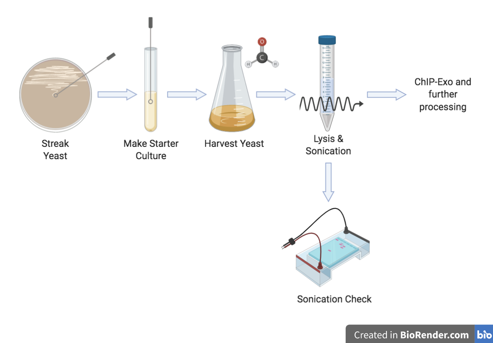
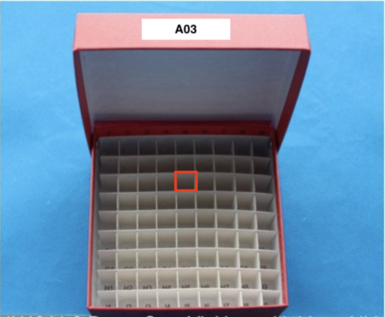
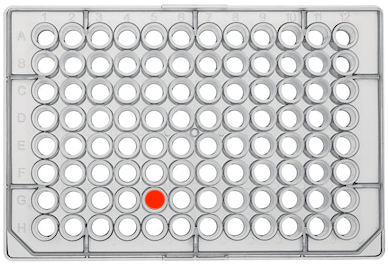
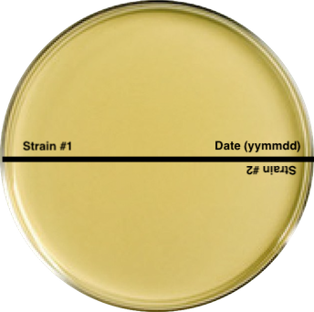
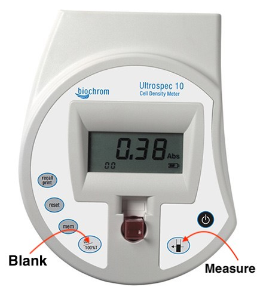
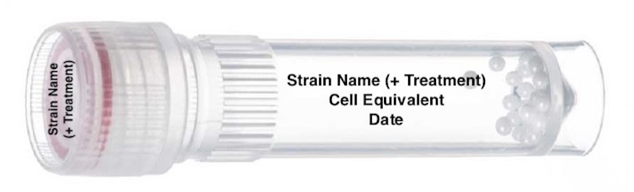
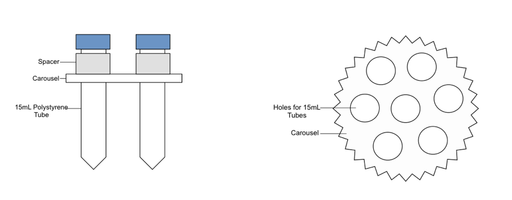

#Yeast Processing

Follow the protocols below to grow, harvest, and sonicate yeast. 

---

##Claiming Your Cohort (YEP Only)

---

A full cohort for YEP includes 15 different strains of yeast which will be exposed to three different conditions--YPD, heat shock, and oxidative stress. These strains can be found in Box (z-Lab_Processing/07_YEP/01_Tracking/a_YEP_Stress_Tracking). 

1. Scroll to the bottom of the spreadsheet.
2. Following the format of the cohorts above it, write the name of your cohort in the next fifteen cells in columns R, V, and Z.
	* Cohorts are named in alphabetical order.
3. Fill in the "Plated," "Harvest," "Sonication," and "ChIP" cells using the data_username format as you complete the respective protocol for each strain.

---

##Making Media

---

*General note:* To prepare for a typical harvest week for YEP, you will need 8 YPD agar plates and 4,005 ml of YPD media liquid (Make a little more than what you need). 

---

* Aliquot 15x200 mL of the liquid YPD into 15 <a href="https://images.sks-science.com/images/351054LRGt.jpg" target="_blank">side-arm flasks</a>.
* Aliquot 15x67 mL of liquid YPD into respective glass containers.
* You will also need extra stock media in order to make starter cultures.
 
###YPD Agar Plates

*Prepare on the day of plate pouring. Mix in a 1 L glass bottle because the agar will not dissolve until autoclaved.*

Component | Stock | Amount
:--------- | :--: | :------:
<a href="https://us.vwr.com/store/product/16078053/bactotm-yeast-extract-life-technologies#order" target="_blank">Yeast Extract</a> |  | 10 g
<a href="https://us.vwr.com/store/product/16078369/bactotm-peptone-life-technologies" target="_blank">Bacto Peptone</a>  |  | 20 g
<a href="https://www.fishersci.ca/shop/products/dextrose-d-glucose-anhydrous-granular-powder-certified-acs-fisher-chemical-6/p-98685" target="_blank">Dextrose</a> |  | 20 g
<a href="https://www.fishersci.com/shop/products/bd-bacto-dehydrated-agar-4/p-4886721" target="_blank">Bacto Agar</a> |  | 20 g

&nbsp;

Allow the peptone, yeast extract, and dextrose to fully dissolve before bringing the volume up to 500mL with dH2O. Add the agar, stir for a moment, remove the stir bar, cap the bottle and prepare for autoclaving. *Make sure the cap is lightly screwed on and not too tight or the bottle will explode in the autoclave.*

**Preparing and Pouring the 2% Agar**

1. Fill a 1 L bottle with 250-300 mL of distilled water.
2. Place a stir bar in the bottle, the bottle on a stirrer, and put the stirrer on low speed.
3. Add the <a href="https://us.vwr.com/store/product/16078053/bactotm-yeast-extract-life-technologies#order" target="_blank">yeast extract</a>, <a href="https://us.vwr.com/store/product/16078369/bactotm-peptone-life-technologies" target="_blank">peptone</a>, and <a href="https://www.fishersci.ca/shop/products/dextrose-d-glucose-anhydrous-granular-powder-certified-acs-fisher-chemical-6/p-98685" target="_blank">dextrose</a> and let them fully dissolve.
4. Adjust the final volume to 500 mL. 
5. Add 10 g of <a href="https://www.fishersci.com/shop/products/bd-bacto-dehydrated-agar-4/p-4886721" target="_blank">Bacto Agar</a> to the media. 
	* It will not mix into solution without heat.
6. Use the magnetic wand to remove the stir bar and lightly cap the bottle, placing autoclave tape on the lid.  
7. Autoclave the media using a liquid setting with a 20 minute exposure time.
8. While the agar is in the autoclave, spray down a work bench in the yeast harvest room with ethanol and lay down laminated paper.
9. Wipe down the paper with ethanol.
10. Take a sleeve of sterile plates and arrange them in stacks of 4, lid-up.
11. When the agar is done, place it in a 65C water bath until it cools enough to handle.
12. Use one hand to work with the plates and the other to pour enough agar into the dishes to cover the bottom with media.
13. When the plates have cooled, mark them with the date, wrap them tightly in saran wrap and store them upside down at 4C until day of use.  
 

###YPD Media Liquid

**This section includes protocols for:**

* Stock media
* 200 mL media flasks
* 67 mL aliquots

**Recipe**

*Add components to dH20. Start with half of the desired final volume. Use a graduated cylinder to bring to final volume*

Component | 1L | 2L | 3L | 4 L
--------- | -- | -- | -- | ---
<a href="https://us.vwr.com/store/product/16078053/bactotm-yeast-extract-life-technologies#order" target="_blank">Yeast Extract</a> |  10 g  |  20 g  |  30 g  |  40 g  |
<a href="https://us.vwr.com/store/product/16078369/bactotm-peptone-life-technologies" target="_blank">Bacto Peptone</a> | 20 g | 40 g | 60 g | 80 g |
<a href="https://www.fishersci.ca/shop/products/dextrose-d-glucose-anhydrous-granular-powder-certified-acs-fisher-chemical-6/p-98685" target="_blank">Dextrose</a> | 20 g | 40 g | 60 g | 80 g|

&nbsp;

Mix until the media is amber in color. Bring the final volume up to final volume with dH2O and transfer media into the flasks that will be used for overnight culture. Autoclave using a liquid setting with a 20 minute exposure time. If making a stock bottle of media, pour 50 ml into a conical tube for use in making starter cultures after the bottle has cooled. Starter culture media is to be dispensed using a pipette boy and serological pipette. 

####Stock Media

1. Fill a beaker large enough for the volume of media being prepared half way with dH2O.  Place it on the magnetic stirrer, place a stir bar at the bottom, and turn the knob up ¼ of the way. 
2. First weigh out the <a href="https://us.vwr.com/store/product/16078053/bactotm-yeast-extract-life-technologies#order" target="_blank">Yeast Extract</a> (10g/1 L) and add this to the beaker. 
3. Next add the <a href="https://us.vwr.com/store/product/16078369/bactotm-peptone-life-technologies" target="_blank">Bacto Peptone</a> (20 g/1 L) 
4. Add the <a href="https://www.fishersci.ca/shop/products/dextrose-d-glucose-anhydrous-granular-powder-certified-acs-fisher-chemical-6/p-98685" target="_blank">Dextrose</a> (20 g/1 L).
5. Use the water spray bottle or 50/100 mL graduated cylinder to wash powder into the mixture that clings to the side of the beaker. 
6. Mix until amber in color.
7. Pour the media into a graduated cylinder to adjust the volume with dH2O.
8. Using a graduated cylinder transfer the media into bottles (fill no more than half the capacity of the bottle, ie. no more than 250 mL in a 500mL bottle). LOOSELY cap the bottle and add a strip of autoclave tape. DO NOT tighten the cap or the bottle will explode in the autoclave.
9. Autoclave using a liquid setting with a 20 minute exposure time.
10. Leave the bottles to cool at room temperature. It is suggested that media be prepared in this manner at least a week in advance and observed for contamination. 

####200 ml Media Flasks

*If it makes the calculations easier, prepare media in variables of 200 and use the remainder as stock media. For example, if you only have 8x200 mL cultures that need to be prepared, make 2 L of media and use the remaining 400 mL as stock media that’s autoclaved in a 1 L glass bottle.*

11. Follow steps 1-7 for preparing stock media.
12. Using a 250 mL graduated cylinder, transfer 200 mL of media into each side-armed flask. Cover the opening of the flask with a piece of aluminum foil and a strip of autoclave tape.
	* **NOTE**: Use the 250 mL graduated cylinder with a Sharpie marking slightly above the 200 mL line. When aliquoting the media, pour to the sharpie marking (NOT the 200 mL line) for the most accurate volume.
13. Autoclave using a liquid setting with a 20 minute exposure time.
14. Leave the flasks to cool at room temperature until desired time of inoculation. It is suggested that media be prepared in this manner at least a week in advance so that flasks can be observed for contamination. 

####67 ml Media Aliquots

1. Follow steps 1-7 for preparing stock media
2. Using a pipette boy and serological pipette, transfer 67 mL of media into each side-armed flask or aliquot bottle. Cover the opening of the flask with a piece of aluminum foil and a strip of autoclave tape.
3. Autoclave using a liquid setting with a 20 minute exposure time.
4. Leave the flasks to cool at room temperature until desired time of inoculation. It is suggested that media be prepared in this manner at least a week in advance so that flasks can be observed for contamination. 

---

##Locating Your Yeast

---

Yeast stocks are either in cryogenic tubes or a 96 well plate in -80 freezers. Write the location of your strains on a sticky note before streaking.

**For YEP:**

1. Open "a_YEP_Stress_Tracking" in Box. 
2. Locate your cohort.
3. Columns B and C give the location of each strain.
	* **For cryogenic vials**, locations will be denoted using this format: "B01a1"
		+ "B01" corresponds to the box's label.
			* B01 = A01, B02 = A02, and so on through box 9
		+ "a1" corresponds to the row and column within the box, respectively.
		+ For example, if the box in the image below is labeled "A03," and the red rectangle on the image is located in row c and column 5, then the location code would be "B03c5" for the glycerol stock.

* **For 96 well plates**, locations will be denoted following this format: "1GS1A1"
	* "1GS1" corresponds to the box's label.
	* "A1" corresponds to the row and column within the plate, respectively.
	* **NOTE** It is *very* important that the orientation of the 96-well plate is correct before streaking.
		* Make sure that the flat corners are down/facing you before locating your sample on the plate. It will be difficult to see the column numbers and row letters because they will be iced over. 
	* In the image below, the red dot corresponds to "G5"

---

##Streaking

---

*Box Protocol:* z-Lab_Processing/02_Protocols/b_Cell growth & Harvest/Yeast Culture

| ***Recipes*** (*Prepare ahead of time*) |
| ------ |	
| <a href="https://cegrcode.github.io/GeneralLab/yeast/#ypd-agar-plates" target="_blank">YPD Agar Plates</a> |

---

1. Wipe down work area and gloves with ethanol. Ensure the work bench and hands are dry before lighting the Bunsen burner.
2. Light the Bunsen burner and perform all subsequent steps near the flame.
3. When selecting a plate, hold it up to the light to check for any signs of contamination. If there is any sign of growth on the plate, it must be discarded. 
4. Place the plates upside-down on the work-bench so they can come to room temperature.
	* Condensation can be wiped off of the bottom so that the plate can be labeled with strain information.
	* Draw line sectors on the plate with a marker. Mark the plate with the strain name and date of streaking, as well as your initials.
		* General rules of thumb: 1 plate per control strain; 2 normal strains per plate. 
5. Refer to your note with the names of your strains and their locations.
	* Only work with one strain at a time. It’s imperative that the stocks do not defrost.

6. **For Cryogenic Vials**
	* Remove the box of interest from the freezer rack and quickly locate and remove the desired sample. Return the box to the freezer while using an individual tube.
	* Twist off the cap of the stock and scrape a small amount of material onto a sterile plastic inoculation loop.
		* If the cap won’t twist off immediately, use your index fingers to warm the tube at the threading to remove the cap. Be careful not to defrost the entire tube.
	* Cap the stock vial and use your free hand to open the plate and streak the strain out in a zig-zagged (upsidedown pine tree) pattern from the outside of the plate to the middle of the plate.
	* This helps us to streak for individual colonies. 
	* Return the stock vial to its original location in the box and immediately put the box back in its correct location in the freezer.
7. **For 96 well plates**
	* **NOTE:** 96 well plate should be kept on ice when taken out of -80 freezer. 
	* Remove the plate of interest from the freezer rack, place it in your ice bucket, and bring it to the bench.
	* Use a 200 uL tip to break the foil above the well containing your sample.
	* Use a different 200 uL tip to scrape material from the well.
		* **NOTE:** Scrape more material from the well than you would from a cryogenic vial. Samples from 96 well plates generally need more material plated in order to form viable colonies.
	* Open the plate and streak the strain out in a zig-zagged (upsidedown pine tree) pattern from the outside of the plate to the middle of the plate.
	* Use a square of foil to cover the well (one side should be sticky).
	* Return the plate to its original location in the freezer.
11. Store the agar plate upside-down in the 30˚C incubator. Allow cells to grow over 2-3 days. Check periodically.
12. Wrap the perimeter tightly with a strip of parafilm.
13. Store the sealed plate at 4˚C for no more than 2 weeks.

---

##Starter Cultures

| ***Recipes*** (*Prepare ahead of time*) |
| ----- |
| <a href="https://cegrcode.github.io/GeneralLab/yeast/#stock-media" target="_blank">YPD Stock Media</a> |

---

###5 ml media tubes

1. Wipe down the bench top with ethanol.
2. Wipe down gloves with ethanol. Allow the ethanol to dry and then ignite the Bunsen burner.  
3. Use only sterile 16 mm test tubes. Label one tube per strain.  
4. Using a pipette boy, sterile serological pipette, and stock <a href="https://cegrcode.github.io/GeneralLab/yeast/#ypd-media-liquid" target="_blank">YPD Media</a>, transfer **5 ml** of media into each test tube. 
	* Open the YPD media bottle and run the lip of the bottle through the flame. 
	* Use a 5mL serological pipette to be able to draw up 5mL of sterile media.
		* **NOTE:** If possible, use a larger serological pipette to pull up the total volume you will need (for example, if you're making starter cultures for four different strains, draw up 20 mL of YPD and aliquot 5 mL per 16 mm tube). 
	* Holding the pipette boy in your dominant hand, use your pinky and ring finger to pull off the lid of the empty test tube. 
	* Flame the lip of the test tube until the glass is warm. Add 5 ml of media, flame the lip again, recap the tube and place into a rack on the side. **Practice proper sterile technique to prevent contamination.** 
	* Work with one test tube at a time, being careful to only transfer 5 mL of media to each tube.

###Inoculation

1. Upon removing the streaked media plate, examine it for contamination and homogenous colony morphology, size, and color. Record notes.
2. Scoop a colony of cells from the colonies on the plate using sterile disposable inoculation loops and quickly put the plate back on its lid. 
3. Holding the inoculation loop in the index finger and thumb of your dominant hand, remove the test tube cap with your ring and pinky finger. Flame the lip of the test tube prior to inoculation until the glass is relatively warm.
4. Without touching the inner sides of the test tube containing 5 mL of media, mix the cells vigorously into the media until the loop comes up clean. 
5. Flame the lip of the tube again before recapping it and setting it back into the rack.
6. Wrap the perimeter tightly with a strip of parafilm. 

###Growth

1. Shake the tubes in the <a href="https://analyticalinstrument.com/images/stories/virtuemart/product/NBincshake01.png" target="_blank">C25 incubator shaker</a> at **25˚C, 250 rpm**, throughout the afternoon (4-5 hours).
	* Place the tubes on an angle in the incubator to allow for the increased amount of surface area needed for growth and transfer of gases.  
	* Shake an un-inoculated tube to serve as blanks when conducting OD600 readings.
	* **DO NOT** close the lid of the incubator. It's better at keeping the temperature when the lid is open.
2. When checking the final ODs of the cultures, use the Yeast Encode 3.0 inoculation calculator (Excel file located in Box z-Lab_Processing/07_YEP/01_Tracking) to accurately predict harvest for the following day.
	* Set up Ultrospec 10 at the workstation.
	* Clear the stored memory before blanking with an un-inoculated tube.
	* Gently vortex the starter culture.
	* Place each test tube into the opening of the Ultrospec and record the OD.
		* **NOTE:** Make sure the sides of the tube are not pushed against the sides of the opening of the Ultraspec.
	* Record each OD in your notebook and update it in the Yeast Encode 3.0 inoculation calculator (Row 16 of the spreadsheet).
		* **NOTE:** Adjust values in the inoculation calculator spreadsheet accordingly. When harvesting for YEP, change the volume to 200 mL. Harvests typically begin between 8:30 AM and 9:30 AM the following day, so "Hours til harvest" is usually 16-17 hours. 
	* Calculate the amount to add to each culture using the inoculation calculator (value will appear in row 17 of the spreadsheet).
	* Use this formula to achieve desired starting OD600 if you do not want to use the calculator:
		* (Desired Large Culture OD)/(Starter Culture OD)*Vol. of Large Culture = mls to inoculate 

*Here is an example of what a table containing these values should look like in your notebook:*

Strain | OD @ 4:30 | Volume to Add
--------- | :--: | :--: 
Yku70 |  1.21  |  190 uL  
Gcr1 | 0.30 | 765 uL 
Azf1 | 0.53 | 433 uL 
Ctk1 | 0.88 | 261 uL

&nbsp;

---
##Seeding and Overnight Growth (4:00 PM, Day 1)
---
*Make sure the correct volume of media has been prepped in the correct flask. Volumes between 67 mL and 250 mL should be prepared in a side-arm flask. Volumes greater than this should be prepared in a 2L flask.*

| ***Recipes*** (*Prepare ahead of time*) |
| ----- |	
| <a href="https://cegrcode.github.io/GeneralLab/yeast/#ypd-media-liquid" target="_blank">YPD Media</a> |

---

1. Wipe down both the bench top and gloves with ethanol. Allow gloves to dry fully before igniting Bunsen burner. 
2. Use a pipette with aerosol barrier tips to transfer the measured volume of starter culture into a labeled flask, containing the desired volume of <a href="https://cegrcode.github.io/GeneralLab/yeast/#ypd-media-liquid" target="_blank">YPD Media</a>.
	* Remove the foil from flask. 
	* Flame the lip of the selected flask until it’s warm then lightly sit the lid on the opening of the flask until ready to inoculate. 
	* Gently vortex your starter culture.
	* Remove the test tube cap of your starter culture with your ring and pinky finger. 
	* Flame the lip of the test tube.
	* Draw up the correct amount of start culture using your pipette.
	* Remove the foil from the side-arm flask and expel the starter culture into it. 
	* Flame the lip of the side-arm flask and quickly replace the foil.
	* Swirl the culture together.
	* Repeat for each strain.
3. Incubate flasks in <a href="https://media.biocompare.com/m/37/product/3070014-400x300.jpg" target="_blank">orbital shaker</a> at **25˚C, 250 rpm**.
4. After inoculation of overnight flask cultures, spray ethanol into the spent starter culture tubes to kill what is there. Discard mixture down the drain. Rinse and discard tube into glass disposal bin. 

---

##Harvest (Day 2)

| ***Recipes*** (*Prepare ahead of time*) |
| -------- |	
| <a href="https://cegrcode.github.io/GeneralLab/yeast/#ypd-media-liquid" target="_blank">YPD Media</a> |
| <a href="https://www.fishersci.com/shop/products/formaldehyde-37-by-weight-molecular-biology-fisher-bioreagents-2/BP531500?searchHijack=true&searchTerm=BP531500&searchType=RAPID&matchedCatNo=BP531500" target="_blank">37% Formaldehyde</a> |
| <a href="https://cegrcode.github.io/GeneralLab/buffers/#25-m-glycine-1-l" target="_blank">2.5M Glycine</a> |
| <a href="https://cegrcode.github.io/GeneralLab/buffers/#st-buffer-1-l" target="_blank">ST Buffer</a> |
| <a href="https://cegrcode.github.io/GeneralLab/buffers/#10-mm-hydrogen-peroxide-100-ml" target="_blank">10 mM Hydrogen Peroxide</a> |
	
* Only prepare hydrogen peroxide when using a protocol which involves an oxidative stress condition

* **REMINDER:** For every 1 mL of <a href="https://cegrcode.github.io/GeneralLab/buffers/#st-buffer-1-l" target="_blank">ST buffer</a> used during a harvest, add 2 uL of <a href="https://cegrcode.github.io/GeneralLab/buffers/#complete-protease-inhibitor-edta-free-cpi-1-ml" target="_blank">CPI</a> to your aliquot of <a href="https://cegrcode.github.io/GeneralLab/buffers/#st-buffer-1-l" target="_blank">ST buffer</a>. For example, 100 mL of <a href="https://cegrcode.github.io/GeneralLab/buffers/#st-buffer-1-l" target="_blank">ST buffer</a> must have 200 uL of <a href="https://cegrcode.github.io/GeneralLab/buffers/#complete-protease-inhibitor-edta-free-cpi-1-ml" target="_blank">CPI</a> added to it before use. 

> After creating the starter culture, there are many different conditions in which the yeast can be seeded and harvested. 

---

###200 mL YPD, Heat Shock, and Oxidative Stress Harvest (YEP)

*After arriving in the lab in the morning (around 8:00 AM), fast temp incubators to 4˚C, turn on and set the temperature of the incubator used for heat shock treatments, and put heat shock aliquots in the water bath. Quickly check the ODs of the cultures to have an idea of how quickly yeast are growing. If harvesting in the afternoon, do this an hour before harvesting.*

*Make aliquots of reagents and buffers while you are waiting for cells to grow or while you have gaps in the protocol*

1. Place the aliquots of 67 mL of hot <a href="https://cegrcode.github.io/GeneralLab/yeast/#ypd-media-liquid" target="_blank">YPD Media</a> in a water bath at 55°C. Let this media reach 55°C. 
2. Prepare peroxide aliquots: 2 ml <a href="https://cegrcode.github.io/GeneralLab/buffers/#10-mm-hydrogen-peroxide-100-ml" target="_blank">10mM H2O2</a> in a 15 ml conical
3. Prepare the following <a href="https://www.fishersci.com/shop/products/formaldehyde-37-by-weight-molecular-biology-fisher-bioreagents-2/BP531500?searchHijack=true&searchTerm=BP531500&searchType=RAPID&matchedCatNo=BP531500" target="_blank">37% formaldehyde</a> aliquots: 
	* ***Heat Shock:*** 45 ml cold dH2O + 5 ml <a href="https://www.fishersci.com/shop/products/formaldehyde-37-by-weight-molecular-biology-fisher-bioreagents-2/BP531500?searchHijack=true&searchTerm=BP531500&searchType=RAPID&matchedCatNo=BP531500" target="_blank">37% formaldehyde</a> in a 50 ml conical, place on ice
	* ***Oxidative Stress and Normal Conditions:*** 2 ml <a href="https://www.fishersci.com/shop/products/formaldehyde-37-by-weight-molecular-biology-fisher-bioreagents-2/BP531500?searchHijack=true&searchTerm=BP531500&searchType=RAPID&matchedCatNo=BP531500" target="_blank">37% formaldehyde</a> in a 15 ml conical
4. Continue monitoring OD by side-arm and recording OD600 until it reaches 0.7-0.9 (ideally 0.8) 
	* *If OD600 exceeds 0.90, dilute the culture accordingly. Cells must double at least once before harvesting. For example, a culture diluted to 0.40 will take ~1.8 hours to double to 0.80. The culture in this example should not be harvested before reaching an OD of 0.80.* 
	* Note: You may use your hand to waft at the opening toward your nose. Yeast smells like bread making, whereas bacteria contamination will smell foul.  If foul, kill the culture using bleach.
5. Once an appropriate OD has been reached, split the 200 ml culture into three 67 ml replicates using a 50 ml serological pipette. 
6. *Quickly* apply the designated treatment to each 67 ml replicate prior to crosslinking.
	* ***Heat Shock:*** add one aliquot of 67 mL hot <a href="https://cegrcode.github.io/GeneralLab/yeast/#ypd-media-liquid" target="_blank">YPD media</a> to the flask. This should bring the total temperature to 37°C.  Swirl and place flask in a **37°C** shaker for **6 minutes**.
	* ***Oxidative Stress:*** add one aliquot of 2 ml 10 mM H202 to the flask. Swirl and incubate in a **25°C** shaker for **6 minutes**. 
	* ***Normal Conditions:*** incubate in a 25°C shaker for 6 minutes. 
7. *Quickly* add the corresponding <a href="https://www.fishersci.com/shop/products/formaldehyde-37-by-weight-molecular-biology-fisher-bioreagents-2/BP531500?searchHijack=true&searchTerm=BP531500&searchType=RAPID&matchedCatNo=BP531500" target="_blank">37% formaldehyde</a> aliquot while swirling flask to ensure rapid mixing. 
	* Return flasks to RT (**25˚C**) shaker for **15 minutes** to crosslink.
	* While cells are crosslinking, prepare aliquots of <a href="https://cegrcode.github.io/GeneralLab/buffers/#25-m-glycine-1-l" target="_blank">**2.5 M Glycine**</a> and place near the incubator.
		* ***Heat Shock:*** 12 ml each
		* ***Oxidative Stress and Normal Conditions:*** 4 ml each
8. *Quickly* add the <a href="https://cegrcode.github.io/GeneralLab/buffers/#25-m-glycine-1-l" target="_blank">**2.5 M Glycine**</a> and incubate for **5 min** in RT shaker.
9. Transfer contents of flask to 2 or 4 pre-labeled 50 ml conical tubes (2 for oxidative and normal, and 4 for heat shock).
10. Centrifuge in <a href="https://assets.fishersci.com/TFS-Assets/CCG/product-images/F127479~p.eps-650.jpg" target="_blank">Eppendorf 5810R tabletop</a>, **4000 rpm, 3 min, 4˚C**.   
11. Discard supernatant into sink.  Re-suspend one pellet with **20 ml cold <a href="https://cegrcode.github.io/GeneralLab/buffers/#st-buffer-1-l" target="_blank">ST buffer</a>** by pulse vortexing on high, then re-suspend the additional three pellets of the same sample by pouring in the re-suspended first pellet, and repeating until each culture is consolidated into one 50 mL conical tube. Keep tubes on ice.
12. Spin conical tubes in <a href="https://assets.fishersci.com/TFS-Assets/CCG/product-images/F127479~p.eps-650.jpg" target="_blank">Eppendorf 5810R tabletop</a>, **2400 rpm, 5 min, 4˚C**.  Pour off supernatant.
13. Re-suspend pellet in **1 ml cold <a href="https://cegrcode.github.io/GeneralLab/buffers/#st-buffer-1-l" target="_blank">ST buffer</a>**. 
14. Transfer to one pre-labeled 2 ml bead beater tube on ice (label with 67 ml CE). 
15. <a href="https://cdn3.volusion.com/vccfs.mvxtd/v/vspfiles/photos/epp-5424R-2.jpg?v-cache=1556876142" target="_blank">Centrifuge</a> tubes **2 min, 10K rpm, 4˚C**.  Aspirate supernatant with vacuum flask or pipette.
	* If using the vacuum flask, use the autoclaved, yellow 200 uL tips. 
16. Flash-freeze the cell pellets in liquid nitrogen and store at -80°C. 

*How to label 2mL bead beating tube:*

---

###YPD Harvest
*This protocol is commonly used to harvest BY4741 controls*

*After arriving in the lab in the morning (around 8:00 AM), fast temp incubators to 4˚C. Quickly check the ODs of the cultures to have an idea of how quickly yeast are growing. If harvesting in the afternoon, do this an hour before harvesting.*

Use this table to determine which volumes, tubes, centrifuges, and cell equivalents to use based on the desired harvest volume.  

| Step in Protocol                    | 67 mL         | 100 ml          | 500 mL    
| ----------------------------------- |:-------------:|:---------------:|:---------:
| 1<a href="https://www.fishersci.com/shop/products/formaldehyde-37-by-weight-molecular-biology-fisher-bioreagents-2/BP531500?searchHijack=true&searchTerm=BP531500&searchType=RAPID&matchedCatNo=BP531500" target="_blank">37% Formaldehyde</a>                        | 2 mL          |   3 mL          | 13.5 mL
| 2<a href="https://cegrcode.github.io/GeneralLab/buffers/#25-m-glycine-1-l" target="_blank">Glycine</a>                             | 4 mL          |   6 mL          | 26.5 mL
| 3Transfer contents of flask to _____ | 1 pre-labelled 50 mL Eppendorf tube/sample | 2 pre-labelled 50 mL Eppendorf tube/sample | 2 pre-labelled <a href="https://www.sigmaaldrich.com/content/dam/sigma-aldrich/product7/078/z353736.tif/_jcr_content/renditions/z353736-medium.jpg" target="_blank">GS3 tubes</a>/sample
| 4Centrifuge used for first spin down |<a href="https://assets.fishersci.com/TFS-Assets/CCG/product-images/F127479~p.eps-650.jpg" target="_blank">Eppendorf 5810R tabletop</a>|<a href="https://assets.fishersci.com/TFS-Assets/CCG/product-images/F127479~p.eps-650.jpg" target="_blank">Eppendorf 5810R tabletop</a>|<a href="https://assets.fishersci.com/TFS-Assets/CMD/product-images/F75149~p.eps-650.jpg" target="_blank">Sorvall floor centrifuge</a>
| 5Volume to resuspend pellet in Step 8| 1 mL/sample   |   1mL/sample    | 5 mL/sample
| 6Number of bead beater tubes needed  | 1/sample      |   1/sample      | 5/sample
| 7Cell Equivalent (CE)                | 67 CE         |   100 CE        | 100 CE

***Note about the Sorvall floor centrifuge:*** Do not over-fill tubes or they will leak in the centrifuge and disrupt the balance.  Only 6 tubes will fit in the centrifuge at once, if more than 6 tubes are needed, place them on ice immediately to keep cells cold until ready to centrifuge.  Always wipe out the rotor and the centrifuge as soon as you are finished with it to avoid damaging the instrument and leave the lid open for it to dry overnight.

**REMINDER:** For every 1 mL of <a href="https://cegrcode.github.io/GeneralLab/buffers/#st-buffer-1-l" target="_blank">ST buffer</a> used during a harvest, add 2 uL of <a href="https://cegrcode.github.io/GeneralLab/buffers/#complete-protease-inhibitor-edta-free-cpi-1-ml" target="_blank">CPI</a> to your aliquot of <a href="https://cegrcode.github.io/GeneralLab/buffers/#st-buffer-1-l" target="_blank">ST buffer</a>. For example, 100 mL of <a href="https://cegrcode.github.io/GeneralLab/buffers/#st-buffer-1-l" target="_blank">ST buffer</a> must have 200 uL of <a href="https://cegrcode.github.io/GeneralLab/buffers/#complete-protease-inhibitor-edta-free-cpi-1-ml" target="_blank">CPI</a> added to it before use. 

*Make aliquots of reagents and buffers while you are waiting for cells to grow or while you have gaps in the protocol.*

1. Continue monitoring OD by side-arm or cuvette (depending on type of flask) and recording OD600 until it reaches 0.7-0.9 (ideally 0.8) 
	* If OD600 exceeds 0.90, dilute the culture accordingly. Cells must double at least once before harvesting. For example, a culture diluted to 0.40 will take ~1.8 hours to double to 0.80. The culture in this example should not be harvested before reaching an OD of 0.80. 
	* Note: You may use your hand to waft at the opening toward your nose. Yeast smells like bread making, whereas bacteria contamination will smell foul.  If foul, kill the culture using bleach.
2. Providing that cells are not ready, aliquot out fresh **<a href="https://www.fishersci.com/shop/products/formaldehyde-37-by-weight-molecular-biology-fisher-bioreagents-2/BP531500?searchHijack=true&searchTerm=BP531500&searchType=RAPID&matchedCatNo=BP531500" target="_blank">37% formaldehyde</a>**1 into 15 mL conical tubes in the fume hood. 
	* If cells are ready, <a href="https://www.fishersci.com/shop/products/formaldehyde-37-by-weight-molecular-biology-fisher-bioreagents-2/BP531500?searchHijack=true&searchTerm=BP531500&searchType=RAPID&matchedCatNo=BP531500" target="_blank">formaldehyde</a> must be aliquotted and added almost simultaneously (see step 3).
3. Quickly add the **<a href="https://www.fishersci.com/shop/products/formaldehyde-37-by-weight-molecular-biology-fisher-bioreagents-2/BP531500?searchHijack=true&searchTerm=BP531500&searchType=RAPID&matchedCatNo=BP531500" target="_blank">37% formaldehyde</a>** while swirling flask to ensure rapid mixing.
	* Return flasks to RT (25˚C) shaker for **15 min** to crosslink.
	* While cells are crosslinking, aliquot out **<a href="https://cegrcode.github.io/GeneralLab/buffers/#25-m-glycine-1-l" target="_blank">2.5M Glycine</a>**2 and place near the incubator.
4. Quickly add the **<a href="https://cegrcode.github.io/GeneralLab/buffers/#25-m-glycine-1-l" target="_blank">2.5M Glycine</a>** and incubate for **5 min** in RT shaker.
5. Transfer contents of flask to pre-labeled tubes3. Centrifuge4 at **4000 rpm, 3 min, 4˚C**.   
6. Discard supernatant into sink.  Resuspend one pellet with **20 ml <a href="https://cegrcode.github.io/GeneralLab/buffers/#st-buffer-1-l" target="_blank">ST buffer</a>** by pulse vortexing on high, then resuspend the second pellet of the same sample by pouring in the resuspended first pellet. Keep tubes on ice.
7. Pour each culture into one 50 ml tube and spin in <a href="https://assets.fishersci.com/TFS-Assets/CCG/product-images/F127479~p.eps-650.jpg" target="_blank">Eppendorf 5810R tabletop</a>, **2400 rpm, 5 min, 4˚C**.  Pour off supernatant.
8. Resuspend pellet in **<a href="https://cegrcode.github.io/GeneralLab/buffers/#st-buffer-1-l" target="_blank">ST buffer</a>**5. Divide equally into bead beater tubes6 (label with CE)7.
9. <a href="https://cdn3.volusion.com/vccfs.mvxtd/v/vspfiles/photos/epp-5424R-2.jpg?v-cache=1556876142" target="_blank">Centrifuge</a> tubes for **2 min, 10,000 rpm, 4˚C**. Aspirate supernatant.
10. Flash-freeze in liquid nitrogen.

---

###YPD Harvest (Stress Condition: Heat Shock)

*After arriving in the lab in the morning (around 8:00 AM), fast temp incubators to 4˚C, turn on and set the temperature of the incubator used for heat shock treatments, and put heat shock aliquots in the water bath. Quickly check the ODs of the cultures to have an idea of how quickly yeast are growing. If harvesting in the afternoon, do this an hour before harvesting.*

Use this table to determine which volumes, tubes, centrifuges, and cell equivalents to use based on the desired harvest volume.  

| Step in Protocol                    | 67 mL             | 500 mL    
| ----------------------------------- |:-----------------:|:---------------:
| 1Heat shock aliquot      | 67 mL             | 500 mL
| 2<a href="https://www.fishersci.com/shop/products/formaldehyde-37-by-weight-molecular-biology-fisher-bioreagents-2/BP531500?searchHijack=true&searchTerm=BP531500&searchType=RAPID&matchedCatNo=BP531500" target="_blank">37% Formaldehyde</a>            | 5 mL + 45 mL ddH20| 35 mL + 265 mL ddH20
| 3<a href="https://cegrcode.github.io/GeneralLab/buffers/#25-m-glycine-1-l" target="_blank">2.5M Glycine</a>                 | 12 mL             | 84 mL
| 4Transfer contents of flask to _____ | 4 pre-labelled 50 mL Eppendorf tube/sample | 6 pre-labelled <a href="https://www.sigmaaldrich.com/content/dam/sigma-aldrich/product7/078/z353736.tif/_jcr_content/renditions/z353736-medium.jpg" target="_blank">GS3 tubes</a>/sample
| 5Centrifuge used for first spin down |<a href="https://assets.fishersci.com/TFS-Assets/CCG/product-images/F127479~p.eps-650.jpg" target="_blank">Eppendorf 5810R tabletop</a>|<a href="https://assets.fishersci.com/TFS-Assets/CMD/product-images/F75149~p.eps-650.jpg" target="_blank">Sorvall floor centrifuge</a>
| 6Volume to resuspend pellet in Step 8| 1 mL/sample   | 5 mL/sample
| 7Number of bead beater tubes needed  | 1/sample      | 5/sample
| 8Cell Equivalent (CE)                | 67 CE         | 100 CE

***Note about the Sorvall floor centrifuge:*** Do not over-fill tubes or they will leak in the centrifuge and disrupt the balance.  Only 6 tubes will fit in the centrifuge at once, if more than 6 tubes are needed, place them on ice immediately to keep cells cold until ready to centrifuge.  Always wipe out the rotor and the centrifuge as soon as you are finished with it to avoid damaging the instrument and leave the lid open for it to dry overnight.

**REMINDER:** For every 1 mL of <a href="https://cegrcode.github.io/GeneralLab/buffers/#st-buffer-1-l" target="_blank">ST buffer</a> used during a harvest, add 2 uL of <a href="https://cegrcode.github.io/GeneralLab/buffers/#complete-protease-inhibitor-edta-free-cpi-1-ml" target="_blank">CPI</a> to your aliquot of <a href="https://cegrcode.github.io/GeneralLab/buffers/#st-buffer-1-l" target="_blank">ST buffer</a>. For example, 100 mL of <a href="https://cegrcode.github.io/GeneralLab/buffers/#st-buffer-1-l" target="_blank">ST buffer</a> must have 200 uL of <a href="https://cegrcode.github.io/GeneralLab/buffers/#complete-protease-inhibitor-edta-free-cpi-1-ml" target="_blank">CPI</a> added to it before use. 

*Make aliquots of reagents and buffers while you are waiting for cells to grow or while you have gaps in the protocol.*

1. At least 25 minutes prior to harvest: Prepare the aliquots of **hot YPD**1 and place in a water bath at 55°C. Let this media reach 55°C. Prepare the aliquots of **<a href="https://www.fishersci.com/shop/products/formaldehyde-37-by-weight-molecular-biology-fisher-bioreagents-2/BP531500?searchHijack=true&searchTerm=BP531500&searchType=RAPID&matchedCatNo=BP531500" target="_blank">formaldehyde</a> + water**2 and place on ice. The <a href="https://www.fishersci.com/shop/products/formaldehyde-37-by-weight-molecular-biology-fisher-bioreagents-2/BP531500?searchHijack=true&searchTerm=BP531500&searchType=RAPID&matchedCatNo=BP531500" target="_blank">formaldehyde</a> + water solution should be prepared in 50 mL Eppendorf tubes or a glass bottle depending on the volume of YPD. This mixture must reach 4°C. 
2. Continue monitoring OD by side-arm or cuvette (depending on type of flask) and recording OD600 until it reaches 0.7-0.9 (ideally 0.8) 
	* *If OD600 exceeds 0.90, dilute the culture accordingly. Cells must double at least once before harvesting. For example, a culture diluted to 0.40 will take ~1.8 hours to double to 0.80. The culture in this example should not be harvested before reaching an OD of 0.80.*
	* Note: You may use your hand to waft at the opening toward your nose. Yeast smells like bread making, whereas bacteria contamination will smell foul. If foul, kill the culture using bleach.

3. Once an appropriate OD has been reached, add one aliquot of **hot YPD media**1 to the flask. This should bring the total temperature to 37°C.  Swirl, and place flask in a *37°C* shaker for **6 minutes**.
4. Add the **cold <a href="https://www.fishersci.com/shop/products/formaldehyde-37-by-weight-molecular-biology-fisher-bioreagents-2/BP531500?searchHijack=true&searchTerm=BP531500&searchType=RAPID&matchedCatNo=BP531500" target="_blank">37% formaldehyde</a> + water mixture**2, while swirling flask to ensure rapid mixing. The temperature should return rapidly to 25°C. 
	* Return flasks to RT (*25˚C*) shaker for **15 minutes** to crosslink.
	* While cells are crosslinking, aliquot out **<a href="https://cegrcode.github.io/GeneralLab/buffers/#25-m-glycine-1-l" target="_blank">2.5M Glycine</a>**3 and place near the incubator.
5. Add the **<a href="https://cegrcode.github.io/GeneralLab/buffers/#25-m-glycine-1-l" target="_blank">2.5M Glycine</a>**3 and incubate for **5 min** in RT shaker.
6. Transfer contents of flask to pre-labeled tubes4. Centrifuge5 at **4000 rpm, 3 min, 4˚C**. 
7. Discard supernatant into sink.  Resuspend one pellet with **20 ml <a href="https://cegrcode.github.io/GeneralLab/buffers/#st-buffer-1-l" target="_blank">ST buffer</a>** by pulse vortexing on high, then resuspend the second pellet of the same sample by pouring in the resuspended first pellet. Keep tubes on ice.
8. Pour each culture into one 50 ml tube and spin in <a href="https://assets.fishersci.com/TFS-Assets/CCG/product-images/F127479~p.eps-650.jpg" target="_blank">Eppendorf 5810R tabletop</a>, **2400 rpm, 5 min, 4˚C**.  Pour off supernatant.
9. Resuspend pellet in **<a href="https://cegrcode.github.io/GeneralLab/buffers/#st-buffer-1-l" target="_blank">ST buffer</a>**6. Divide equally into bead beater tubes.7
10. <a href="https://cdn3.volusion.com/vccfs.mvxtd/v/vspfiles/photos/epp-5424R-2.jpg?v-cache=1556876142" target="_blank">Centrifuge</a> tubes for **2 min, 10,000 rpm, 4˚C**. Aspirate supernatant.
11. Flash-freeze in liquid nitrogen.
12. Store -80°C freezer indefinitely.

---
###YPD Harvest (Stress Condition: Oxidative)
*After arriving in the lab in the morning (around 8:00 AM), fast temp incubators to 4˚C. Quickly check the ODs of the cultures to have an idea of how quickly yeast are growing. If harvesting in the afternoon, do this an hour before harvesting.*

| Step in Protocol                    | 67 mL             
| ----------------------------------- |:-----------------:
| 1<a href="https://cegrcode.github.io/GeneralLab/buffers/#10-mm-hydrogen-peroxide-100-ml" target="_blank">10 mM Hydrogen Peroxide (H202)</a>  aliquot      | 2 mL             
| 2<a href="https://www.fishersci.com/shop/products/formaldehyde-37-by-weight-molecular-biology-fisher-bioreagents-2/BP531500?searchHijack=true&searchTerm=BP531500&searchType=RAPID&matchedCatNo=BP531500" target="_blank">37% Formaldehyde</a>            | 2 mL
| 3<a href="https://cegrcode.github.io/GeneralLab/buffers/#25-m-glycine-1-l" target="_blank">Glycine</a>                 | 4 mL             
| 4Transfer contents of flask to _____ | 2 pre-labelled 50 mL Eppendorf tube/sample
| 5Centrifuge used for first spin down |<a href="https://assets.fishersci.com/TFS-Assets/CCG/product-images/F127479~p.eps-650.jpg" target="_blank">Eppendorf 5810R tabletop</a>
| 6Volume to resuspend pellet in Step 13| 1 mL/sample   
| 7Number of bead beater tubes needed  | 1/sample      
| 8Cell Equivalent (CE)                | 67 CE         

* **REMINDER:** For every 1 mL of <a href="https://cegrcode.github.io/GeneralLab/buffers/#st-buffer-1-l" target="_blank">ST buffer</a> used during a harvest, add 2 uL of <a href="https://cegrcode.github.io/GeneralLab/buffers/#complete-protease-inhibitor-edta-free-cpi-1-ml" target="_blank">CPI</a> to your aliquot of <a href="https://cegrcode.github.io/GeneralLab/buffers/#st-buffer-1-l" target="_blank">ST buffer</a>. For example, 100 mL of <a href="https://cegrcode.github.io/GeneralLab/buffers/#st-buffer-1-l" target="_blank">ST buffer</a> must have 200 uL of <a href="https://cegrcode.github.io/GeneralLab/buffers/#complete-protease-inhibitor-edta-free-cpi-1-ml" target="_blank">CPI</a> added to it before use. 

*Make aliquots of reagents and buffers while you are waiting for cells to grow or while you have gaps in the protocol.*

1. Prepare **<a href="https://cegrcode.github.io/GeneralLab/buffers/#10-mm-hydrogen-peroxide-100-ml" target="_blank">peroxide</a>** aliquots.1
1. Continue monitoring OD by side-arm and recording OD600 until it reaches 0.7-0.9 (ideally 0.8) 
	* *If OD600 exceeds 0.90, dilute the culture accordingly. Cells must double at least once before harvesting. For example, a culture diluted to 0.40 will take ~1.8 hours to double to 0.80. The culture in this example should not be harvested before reaching an OD of 0.80.*
	* Note: You may use your hand to waft at the opening toward your nose. Yeast smells like bread making, whereas bacteria contamination will smell foul.  If foul, discard by autoclaving.
2. Providing that cells are not ready, aliquot out **fresh <a href="https://www.fishersci.com/shop/products/formaldehyde-37-by-weight-molecular-biology-fisher-bioreagents-2/BP531500?searchHijack=true&searchTerm=BP531500&searchType=RAPID&matchedCatNo=BP531500" target="_blank">37% formaldehyde</a>**.2
	* If cells are ready, <a href="https://www.fishersci.com/shop/products/formaldehyde-37-by-weight-molecular-biology-fisher-bioreagents-2/BP531500?searchHijack=true&searchTerm=BP531500&searchType=RAPID&matchedCatNo=BP531500" target="_blank">formaldehyde</a> must be aliquoted and added immediately.
3. Quickly add one aliquot of **<a href="https://cegrcode.github.io/GeneralLab/buffers/#10-mm-hydrogen-peroxide-100-ml" target="_blank">10mM H2O2</a>** to the flask. Swirl and incubate in a 25°C shaker for **6 minutes**.
4. Quickly add the corresponding **<a href="https://www.fishersci.com/shop/products/formaldehyde-37-by-weight-molecular-biology-fisher-bioreagents-2/BP531500?searchHijack=true&searchTerm=BP531500&searchType=RAPID&matchedCatNo=BP531500" target="_blank">formaldehyde</a>**2 aliquot while swirling flask to ensure rapid mixing.
5. Return flasks to RT (25˚C) shaker for **15 minutes** to crosslink.
6. While cells are crosslinking, prepare aliquots of **<a href="https://cegrcode.github.io/GeneralLab/buffers/#25-m-glycine-1-l" target="_blank">2.5M Glycine</a>**3 and place near the incubator.
7. Quickly add the **<a href="https://cegrcode.github.io/GeneralLab/buffers/#25-m-glycine-1-l" target="_blank">2.5M Glycine</a>**3 and incubate for **5 min** in RT shaker.
8. Transfer contents of flask to pre-labeled tubes.4
9. Centrifuge5 at **4000 rpm, 3 min, 4˚C**.
10. Discard supernatant into sink. Re-suspend one pellet with **20 ml cold <a href="https://cegrcode.github.io/GeneralLab/buffers/#st-buffer-1-l" target="_blank">ST buffer</a>** by pulse vortexing on high, then re-suspend the additional pellet of the same sample by pouring in the re-suspended first pellet, and repeating until each culture is consolidated into one tube. Keep tubes on ice.
12. Spin conical tubes in <a href="https://assets.fishersci.com/TFS-Assets/CCG/product-images/F127479~p.eps-650.jpg" target="_blank">Eppendorf 5810R tabletop</a>, **2400 rpm, 5 min, 4˚C**. Pour off supernatant.
13. Re-suspend pellet in **cold <a href="https://cegrcode.github.io/GeneralLab/buffers/#st-buffer-1-l" target="_blank">ST buffer</a>**.6
14. Transfer to pre-labeled 2 ml bead beater tube on ice.7
15. <a href="https://cdn3.volusion.com/vccfs.mvxtd/v/vspfiles/photos/epp-5424R-2.jpg?v-cache=1556876142" target="_blank">Centrifuge</a> tubes *82 min, 10K rpm, 4˚C**. Aspirate supernatant with vacuum flask or pipette.
	* If using the vacuum flask, use the autoclaved, yellow 200 uL tips.
16. Flash-freeze the cell pellets in liquid nitrogen and store at -80°C.

---

###Anchor Away 100mL YPDA Harvest

#####Crosslinking and Harvest (Day 2)

*After arriving in the lab in the morning (around 8:00 AM), fast temp incubators to 4˚C. Quickly check the ODs of the cultures to have an idea of how quickly yeast are growing. If harvesting in the afternoon, do this an hour before harvesting.*

**REMINDER:** For every 1 mL of <a href="https://cegrcode.github.io/GeneralLab/buffers/#st-buffer-1-l" target="_blank">ST buffer</a> used during a harvest, add 2 uL of <a href="https://cegrcode.github.io/GeneralLab/buffers/#complete-protease-inhibitor-edta-free-cpi-1-ml" target="_blank">CPI</a> to your aliquot of <a href="https://cegrcode.github.io/GeneralLab/buffers/#st-buffer-1-l" target="_blank">ST buffer</a>. For example, 100 mL of <a href="https://cegrcode.github.io/GeneralLab/buffers/#st-buffer-1-l" target="_blank">ST buffer</a> must have 200 uL of <a href="https://cegrcode.github.io/GeneralLab/buffers/#complete-protease-inhibitor-edta-free-cpi-1-ml" target="_blank">CPI</a> added to it before use. 

*Make aliquots of reagents and buffers while you are waiting for cells to grow or while you have gaps in the protocol.*

1. Continue monitoring OD by side-arm and recording OD600 until it reaches 0.7 
	* *If OD600 exceeds 0.80, dilute the culture accordingly (cells will grow after auxin and rapamycin treatment, albeit slowly). Cells must double at least once before harvesting. For example, a culture diluted to 0.35 will take a few hours to double to 0.70. The culture in this example should not be harvested before reaching an OD of 0.70.* 
	* Note: You may use your hand to waft at the opening toward your nose. Yeast smells like bread making, whereas bacteria contamination will smell foul.  If foul, kill the culture using bleach.
2. Providing that cells are not ready, aliquot out **3 mL fresh <a href="https://www.fishersci.com/shop/products/formaldehyde-37-by-weight-molecular-biology-fisher-bioreagents-2/BP531500?searchHijack=true&searchTerm=BP531500&searchType=RAPID&matchedCatNo=BP531500" target="_blank">37% formaldehyde</a>** into 15 mL conical tubes in the fume hood. 
3. As soon as cells are ready, add 1 ml of auxin solution (100 mM stock, prepared in 100% ethanol) and 10 ul of rapamycin solution (10 mg/ml stock, prepared in DMSO). For control experiments, add 1 ml of 100% ethanol and 10 ul of DMSO. 
4. Shake cultures at **25˚C for 30 minutes**. 
5. Immediately add the **<a href="https://www.fishersci.com/shop/products/formaldehyde-37-by-weight-molecular-biology-fisher-bioreagents-2/BP531500?searchHijack=true&searchTerm=BP531500&searchType=RAPID&matchedCatNo=BP531500" target="_blank">37% formaldehyde</a>** while swirling flask to ensure rapid mixing.
	* Return flasks to 25˚C shaker for **15 min** to crosslink.
	* While cells are crosslinking, aliquot out **6 mL of <a href="https://cegrcode.github.io/GeneralLab/buffers/#25-m-glycine-1-l" target="_blank">2.5M Glycine</a>** into 15mL conical tubes and place near the incubator.
6. *Quickly* add the **<a href="https://cegrcode.github.io/GeneralLab/buffers/#25-m-glycine-1-l" target="_blank">2.5M Glycine</a>** and incubate for **5 min** in 25°C shaker.
7. Transfer contents of flask to two pre-labeled, pre-cooled (on ice) 50 mL conical tubes.
8. Centrifuge in <a href="https://assets.fishersci.com/TFS-Assets/CCG/product-images/F127479~p.eps-650.jpg" target="_blank">Eppendorf 5810R tabletop</a>, **4000 rpm, 3 min, 4˚C**.   
9. Discard supernatant into sink.  Re-suspend one pellet with **20 ml cold <a href="https://cegrcode.github.io/GeneralLab/buffers/#st-buffer-1-l" target="_blank">ST buffer</a>** by pulse vortexing on high, then re-suspend the additional three pellets of the same sample by pouring in the re-suspended first pellet, and repeating until each culture is consolidated into one 50 mL conical tube. Keep tubes on ice.
10. After consolidating each culture into one 50 mL tube, spin in <a href="https://assets.fishersci.com/TFS-Assets/CCG/product-images/F127479~p.eps-650.jpg" target="_blank">Eppendorf 5810R tabletop</a>, **2400 rpm, 5 min, 4˚C**.  Pour off supernatant.
11. Re-suspend pellet in **1 mL cold <a href="https://cegrcode.github.io/GeneralLab/buffers/#st-buffer-1-l" target="_blank">ST buffer</a>**. 
12. Transfer to a pre-labeled 2 mL bead beater tube on ice.
13. <a href="https://cdn3.volusion.com/vccfs.mvxtd/v/vspfiles/photos/epp-5424R-2.jpg?v-cache=1556876142" target="_blank">Centrifuge</a> tubes **2 min, 10K rpm, 4˚C**.  Aspirate supernatant with vacuum flask or pipette.
14. Flash-freeze the cell pellets in liquid nitrogen.
15. Store at -80°C indefinitely.

 

---

##Lysis and Sonication

| ***Recipes*** (*Prepare ahead of time*) |
| -------- |	
| <a href="https://cegrcode.github.io/GeneralLab/buffers/#fa-lysis-buffer-1-l" target="_blank">FA Lysis Buffer</a> |

---

*Before you start, fast temp table-top centrifuge and turn on sonicators to cool both to 4°C.*

#####Lysis

 

1. This protocol is written assuming the starting cell pellet contains ***67, 75, 100, or 250 ml cell equivalent (CE)***.
	* *75 CE is rarely used. Try to avoid using 250 CE as sonication efficacy decreases at a cell equivalent this high.*
2. Thaw cells at room temperature in RT plastic rack. Process on ice as soon as thawed.
3. Aliquot a working volume of <a href="https://cegrcode.github.io/GeneralLab/buffers/#fa-lysis-buffer-1-l" target="_blank">FA Lysis Buffer</a> by calculating the amount needed per sample. Add **<a href="https://cegrcode.github.io/GeneralLab/buffers/#complete-protease-inhibitor-edta-free-cpi-1-ml" target="_blank">CPI</a>** to the aliquot of <a href="https://cegrcode.github.io/GeneralLab/buffers/#fa-lysis-buffer-1-l" target="_blank">FA Lysis Buffer</a> in 0.2% volume (i.e. when using 50 mL <a href="https://cegrcode.github.io/GeneralLab/buffers/#fa-lysis-buffer-1-l" target="_blank">FA Lysis Buffer</a>, add 100uL of <a href="https://cegrcode.github.io/GeneralLab/buffers/#complete-protease-inhibitor-edta-free-cpi-1-ml" target="_blank">CPI</a>).
	* NOTE: Once <a href="https://cegrcode.github.io/GeneralLab/buffers/#complete-protease-inhibitor-edta-free-cpi-1-ml" target="_blank">CPI</a> is added to reagents, the working solution is only useable for two days.
	* For this protocol, calculate approximately *3.5 mL <a href="https://cegrcode.github.io/GeneralLab/buffers/#fa-lysis-buffer-1-l" target="_blank">FA Lysis Buffer</a>* per sample. Remaining <a href="https://cegrcode.github.io/GeneralLab/buffers/#fa-lysis-buffer-1-l" target="_blank">FA Lysis Buffer</a> used for creation of FAT in Chromatin Purification steps. (For 24 samples this is 84 mL; round up to 100 mL <a href="https://cegrcode.github.io/GeneralLab/buffers/#fa-lysis-buffer-1-l" target="_blank">FA Lysis Buffer</a>).
4. Add **1mL** of **<a href="https://cegrcode.github.io/GeneralLab/buffers/#fa-lysis-buffer-1-l" target="_blank">FA Lysis Buffer</a>** to each pellet and vortex.
5. Add **500 uL** of **0.5 mm zirconia beads** to each sample. Tightly screw on the cap.
6. Place tubes into pre-chilled (-20˚C) MBB-96 aluminum tube holder.  Bead beat samples according to the following conditions: 
	* Place aluminum block containing samples in Bead Beater and screw the clamps down tightly. Make sure machine is set to three minutes. Press start.
	* After 3 minutes, take out aluminum block containing samples, and place it in a -20°C for 7 min.
	* Bead beat for three cycles.
	* After the third cycle, place the aluminum block containing samples in the -20°C freezer for 4 min.
7. Set 13mm glass culture tubes up on ice. Label accordingly. 
8. Transfer lysate from bead beater tube to culture tube by doing the following:
	* Goggles and masks are recommended for this step
	* Heat a 22G needle to red hot at the end using a Bunsen burner.
	* Poke a hole in the bottom of the bead beater tube, and then place it into the culture tube.
	* Heat the needle again to poke a hole in the top of the bead beater tube.
	* Collect lysate by briefly spinning in clinical centrifuge at about 1/2 speed (only takes about 5 seconds).	
9. Vortex the culture tube and transfer lysates into labeled **1.7 mL** eppendorf tubes via pipette. 
	* Do not combine or split samples at this stage. **Transfer only one at a time—be sure to keep tubes appropriately labeled!**

#####Chromatin Purification

1. Centrifuge samples in microfuge **14K, 3 min, 4˚C**.  
2. Pipette off supernatant.
3. Resuspend chromatin pellets via pipette in **600 uL <a href="https://cegrcode.github.io/GeneralLab/buffers/#fa-lysis-buffer-1-l" target="_blank">FA Lysis Buffer</a>**
	* IT IS IMPORTANT TO **FULLY RESUSPEND** THE PELLET EACH TIME
	* This is also a *good stopping point*. You may leave the resuspended pellets up to one hour on ice.
4. Centrifuge **14K, 3 min, 4˚C**.  
5. Aspirate supernatant.
6. Resuspend chromatin pellets via pipette in indicated amount of **<a href="https://cegrcode.github.io/GeneralLab/buffers/#fa-lysis-buffer-1-l" target="_blank">FA Lysis Buffer</a>**

Cell Equivalent of Sample (mL) | Chromatin pellet resuspension volume (μL) 
:----------------------------: | :----------------------------------------: 
67 | 600
75 | 600
100 | 800
250 |1,000 

&nbsp;

#####Sonication – <a href="https://www.diagenode.com/img/product/shearing_technologies/bioruptor_pico.jpg" target="_blank">Diagenode Bioruptor Pico™</a>

1. Prepare the Bioruptor. 
	* To turn on Bioruptor, flip the power switch on the water cooler, flip the switch on the back of the sanitation unit, and then press the "cool" button on the water cooler. These steps should be done in order.
	* Make sure there is enough water in the water cooler.
2. Prepare the tubes for sonication. 
	* Have 15 mL polystyrene tubes labeled prior to use.
	* Add 300 µL of 0.1 mm beads to each tube.
	* Transfer re-suspended sample to the labeled 15 mL plastic polystyrene tubes.
	* Use the plastic carousel and metal spacers for 15 mL tubes to suspend the samples in the water bath.
	* If less than a full carousel of six tubes is being sonicated, balance the carousel with tubes containing sample-equivalent amounts of beads and ddH20.

3. Set the sonicator to the appropriate number/time of cycles corresponding to the chromatin amount (*see table below*). Press start. Close the Bioruptor lid.
4. When samples are done, transfer the sample, avoiding beads, to labeled 1.7 mL eppendorf tubes via pipette. 
5. From one tube of each carousel (i.e. choose one sample from each run of six tubes), transfer 50 uL of the supernatant to a freshly labeled tube. Be sure to indicate that the sample is a sonication check sample. (*NOTE: A 5 mL cell equivalent has been removed*)
	* If you are going to run a soncheck on the same day, store 50 uL soncheck sample at 4˚C until use. Otherwise, store with cohort in -80˚C freezer.
6. Flash freeze the sonicated chromatin using dry ice. Store in the -80°C freezer.

#####Setting the Bioruptor

Cell Equivalent of Sample (mL) | On Time Per Cycle (s) | Off Time Per Cycle (s) | Number of Cycles
:----------------------------: | :-------------------: | :--------------------: | :---------------:
67 | 15 | 30 | 8
75 | 15 | 30 | 8
100 | 15 | 30 | 12
250 | *30* | 30 | 10

---