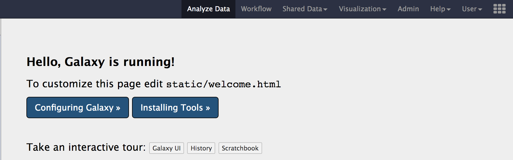
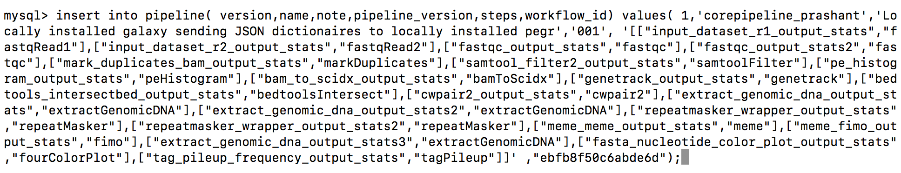

## Dependencies

- Assuming you have installed the required [development tools for Mac OS](http://127.0.0.1:8000/#development-tools)
- Install [samtools](http://samtools.sourceforge.net/-Install).
    - `brew install samtools`
- Install [yarn](https://yarnpkg.com/en/docs/install).
    - `brew install yarn`

----

## Installing Galaxy

_It is recommended that you clone galaxy to your `~/Desktop`, so that GALAXY's internal paths are shorter and avoid conda throwing any errors that your path exceeds the maximum characters for tool install paths_

_here we are going to work with `17.09` release of GALAXY._

- Open a `terminal` and clone GALAXY to your `~/Desktop`.

```
cd ~/Desktop
git clone -b release_17.09 https://github.com/galaxyproject/galaxy.git
```

- Start GALAXY

```
cd galaxy
sh run.sh
```

_Note that when you are starting galaxy for the first time, it takes some time to install required internal dependencies and setup its internal database. Once its gone through it, you should be able to see the start up page._

- Congratulations you have successfully installed GALAXY on your local machine.

|Useful resources & tutorials|
|---|
|[Get galaxy](https://galaxyproject.org/admin/get-galaxy/)|
|[Learn galaxy](https://galaxyproject.org/learn/)|
|[Dagobah training](https://github.com/galaxyproject/dagobah-training)|

-----

## Configuring Galaxy

**Setting up an Admin**

`galaxy.ini` file contains most of the configurations to your local galaxy. It has some predefined defaults which you might want to re-think before changing anything.

_We will be using `cegr@psu.edu` as the default admin, so that it can be used to integrate with PEGR in the PEGR tutorial, where we use our local galaxy to send out information to PEGR_

- Make sure your Galaxy is not online, before making any changes to configuration.
- Open your galaxy folder in `Finder` on your mac. you should see a `config/` folder.
- Inside the `config/`, you will find a `galaxy.ini.sample` file.
- Copy the `galaxy.ini.sample` within the same folder and rename the copied file to `galaxy.ini`
- Open the `galaxy.ini` in a text editor of your choice.
- Search for the line that starts with `admin_users` and add `cegr@psu.edu`


_Above image shows the change. make sure you have edited `~/Desktop/galaxy/config/galaxy.ini`_

- Start your Galaxy now, `sh run.sh`
- Click on `User` menu and then click `register`
- You should see a registration page as below


- Enter `cegr@psu.edu` as the email address and choose a `password`, `public name` of your choice.
- Once you login, you should now have the `Admin` menu show up on the menu bar on the top.



- When you click on the `Admin` tab, you should see the below page.


-----

## Adding Custom Genomes

_`sacCer3_cegr` is the customized yeast genome we are using within the lab. Though the differences are few (to the best of my knowledge), but are very important to keep in mind while performing general data analysis. This genome deviates from the UCSC recommendations_

_`sacCer3_cegr` contains `2-micron` regions & chromosome naming is using `decimal number` instead of `roman numerals.` This causes some disadvantages to use tools like bedGraphToBigWig, etc._

- Click on `Admin` tab, then under `Tools and Tool Shed` section, click on `Search Tool Shed`


- Click on `Galaxy Main Tool Shed`


- Search & Install below tools. you can copy and paste below tool names into the search box.

|Tool Name |
|-----|
|`data_manager_bwa_mem_index_builder`|
|`data_manager_fetch_genome_dbkeys_all_fasta`|
|`data_manager_sam_fasta_index_builder`|
|`data_manager_twobit_builder`|

- Below images previews the steps for installing a tool.


- Once you have installed all the above tools, You can verify the installation at `Admin > Tools and Tool shed > Manage installed tools`


- Download the `sacCer3_cegr` genome from [here](./image/data/sacCer3_cegr.fa)
- Upload the file you downloaded above into galaxy, using the `upload button` located on the tools menu, as shown in the image below.


- Once you have uploaded, you should see the file appear in the “history pane” on your right.
- Go to `Admin` tab, under `Data` section, Click on `Local data` to get `Data manager`


- We need to run below tools one after the other in the exact order mentioned below:

| Tool | Order |
|----|------|
|Create DBkey and reference geneome| #1|
| TwoBit| #2|
| BWA-MEM | #3|
| SAM Fasta| #4|

_All these tools are available from the `Admin > Data > Local data` section. Below are images for step-by-step execution of above tools in the same order. use them to fill out any default information that is required and follow along_

- You can specify sequence name to be `sacCer3_cegr` and leave everything as default in all the tools.


- Once you have run all the tools, you need to check couple of things that populate in the internal database of galaxy. You can check that information from your `Admin` page.
- Go to `Admin > Data > Local data` section, under `View Tool Data Table Entries`. Click on `__dbkeys__` you should see something like below.


- Similarly check `all_fasta`,`twobit`, `bwa_mem_indexes`. All of them should contain an entry for `sacCer3_cegr`. Path could be different in your case.


- If your able to see similar results as above images. `Congratulations!` you have successfully added a custom genome build into your galaxy.

-----

## Importing ChIP-exo Workflow

_We will install the core-sequencing workflow that the lab uses to analyze all the samples that are sequenced. This pipeline is run to create BAM files, peak calling using genetrack and MEME motif analysis._

- Download the workflow file [here.](./image/data/Galaxy-Workflow-paired_002.ga)
- Once you have downloaded the workflow. You can `import` it into your local galaxy from the `Workflow` tab using the `upload or import workflow` button located beside the search bar. _(see image below)._


- Once you have selected the workflow file and clicked `import`. You might see some errors such as below. Nothing to worry, the error messages is caused by tools that are not yet installed & are important for the workflow to run in your galaxy.


- Click on `edit` option under the workflow drop-down menu. To find out the missing tools.
- You need to install each tool manually from toolshed. Go to `Admin > Tools and Tool Shed > Search toolShed` to search and install each tool that is missing.

_Few tools have their toolnames in the workflow that end with `output_statistics`. These are the tools that are not available on `Galaxy toolshed` and need to be side-loaded separately, which we will do in the next section. so for now, you can ignore installing these tools and their errors._

----

## Integrating CEGR _`output_statistics`_

_This section is similar to adding custom tools into Galaxy, here is a  ([tutorial](https://galaxyproject.org/admin/tools/add-tool-tutorial/)). `cegr-galaxy` repo contains other important scripts that are used to run the core-sequencing pipeline on production galaxy. The repo has a `README` file detailing the usage of each script._

- Clone the repository containing the CEGR tools from [seqcode/cegr-galaxy](https://github.com/seqcode/cegr-galaxy)
    - `git clone https://github.com/seqcode/cegr-galaxy.git`

- Copy the entire `cegr_statistics` folder to this location `galaxy/tools/` within your local galaxy.
- Open `galaxy/config/tool_conf.xml` in a text editor of your choice.

_If the above file doesn't exist, there should be a file in the same config directory called `tool_conf.xml.main`, copy and rename the file to `tool_conf.xml`_

- Add below lines at the end of file, within the `</toolbox>` tag.

```
<section id="cegr_tools" name="CEGR">
    <tool file="cegr_statistics/bam_to_scidx_output_stats.xml" />
    <tool file="cegr_statistics/bedtools_intersectbed_output_stats.xml" />
    <tool file="cegr_statistics/bwa_mem_output_stats_single.xml" />
    <tool file="cegr_statistics/cwpair2_output_stats.xml" />
    <tool file="cegr_statistics/extract_genomic_dna_output_stats.xml" />
    <tool file="cegr_statistics/extract_genomic_dna_output_stats2.xml" />
    <tool file="cegr_statistics/extract_genomic_dna_output_stats3.xml" />
    <tool file="cegr_statistics/fasta_nucleotide_color_plot_output_stats.xml" />
    <tool file="cegr_statistics/fastqc_output_stats.xml" />
    <tool file="cegr_statistics/fastqc_output_stats2.xml" />
    <tool file="cegr_statistics/genetrack_output_stats.xml" />
    <tool file="cegr_statistics/input_dataset_r1_output_stats.xml" />
    <tool file="cegr_statistics/input_dataset_r2_output_stats.xml" />
    <tool file="cegr_statistics/mark_duplicates_bam_output_stats.xml" />
    <tool file="cegr_statistics/meme_fimo_output_stats.xml" />
    <tool file="cegr_statistics/meme_meme_output_stats.xml" />
    <tool file="cegr_statistics/pe_histogram_output_stats.xml" />
    <tool file="cegr_statistics/repeatmasker_wrapper_output_stats.xml" />
    <tool file="cegr_statistics/repeatmasker_wrapper_output_stats2.xml" />
    <tool file="cegr_statistics/samtool_filter2_output_stats.xml" />
    <tool file="cegr_statistics/tag_pileup_frequency_output_stats.xml" />
  </section>

```

_The above lines informs GALAXY, where it can find the tools and corresponding toolwrappers_

- The file `galaxy/config/tool_config.xml` should look something like below:


- Save the file and restart Galaxy. You should now see these tools appear under `Tools` menu within galaxy's `Analyze Data` tab similar to below.


- `Congratulations!` you have successfully installed `output_statistics` tools into your galaxy.

----

## Connecting Galaxy to PEGR

_Galaxy and PEGR communicate with each other using API keys. If you have not setup a local developmental PEGR. Set it up using these [instructions](./pegr.md) & come back to this section_

_In the above section we installed `output_statistics` tools. These are the tools that send back information to `PEGR`. We did not configure the tools in the above section, which we will do in this section._

**Changing Galaxy's port**

- First, we will configure `Galaxy` to run on a different `port` so that it does not conflict with `PEGR`'s default port.
- Open `galaxy/config/galaxy.ini` in a text editor and search for `port` setting. Change the port to `8090`. Below image shows the change in `galaxy.ini`.


**Generating Galaxy API key**

- Click on `Admin` tab, under `User Management` section, click on `API keys`.
- Click on `Generate` button to create an API key. Don't regenerate a new key, if you already have one at this point.

**CEGR `output_statistics` configuration**

- Open `galaxy/tools/stats_config.ini.sample` and add below information

```ini

# Configuration file for the CEGR Galaxy ChIP-exo statistics tools.

[defaults]

# This section contains default settings for command line parameters that
# can be overridden when they are passed to executed scripts.

PEGR_API_KEY =  <REPLACE THIS WITH PEGR API KEY>
PEGR_URL = http://localhost:8080/pegr/api/stats

GALAXY_API_KEY = <REPLACE THIS WITH YOUR GALAXY ADMIN USER's API KEY>
GALAXY_BASE_URL = http://localhost:8090


[tool_categories]

input_dataset_r1 = output_fastqRead1
input_dataset_r2 = output_fastqRead2
toolshed.g2.bx.psu.edu/repos/iuc/bam_to_scidx/bam_to_scidx/1.0.1 = output_bamToScidx
toolshed.g2.bx.psu.edu/repos/iuc/bedtools/bedtools_intersectbed/2.27.0.0 = output_bedtoolsIntersect
toolshed.g2.bx.psu.edu/repos/devteam/bwa/bwa_mem/0.7.17.1 = output_bwaMem
toolshed.g2.bx.psu.edu/repos/iuc/cwpair2/cwpair2/1.1.0 = output_cwpair2
toolshed.g2.bx.psu.edu/repos/iuc/genetrack/genetrack/1.0.1 = output_genetrack
toolshed.g2.bx.psu.edu/repos/iuc/extract_genomic_dna/Extract genomic DNA 1/3.0.3 = output_extractGenomicDNA
toolshed.g2.bx.psu.edu/repos/devteam/fastqc/fastqc/0.70 = output_fastqc
toolshed.g2.bx.psu.edu/repos/iuc/pe_histogram/pe_histogram/1.0.1 = output_peHistogram
toolshed.g2.bx.psu.edu/repos/bgruening/repeat_masker/repeatmasker_wrapper/0.1.2 =output_repeatMasker
toolshed.g2.bx.psu.edu/repos/iuc/meme_meme/meme_meme/4.11.2.0 = output_meme
toolshed.g2.bx.psu.edu/repos/iuc/fasta_nucleotide_color_plot/fasta_nucleotide_color_plot/1.0.1 = output_fourColorPlot
toolshed.g2.bx.psu.edu/repos/jjohnson/samtools_filter/samtools_filter/1.1.1 = output_samtoolFilter
toolshed.g2.bx.psu.edu/repos/devteam/picard/picard_MarkDuplicates/2.7.1.1 = output_markDuplicates
toolshed.g2.bx.psu.edu/repos/iuc/meme_fimo/meme_fimo/4.11.2.0 = output_fimo
toolshed.g2.bx.psu.edu/repos/iuc/tag_pileup_frequency/tag_pileup_frequency/1.0.1 = output_tagPileup


```

- Below is an example configuration, after you add your API Keys.


- Rename `stats_config.ini.sample` to `stats_config.ini`

**Install bioblend**

_bioblend is a python library to interact with Galaxy, using APIs_

- Installation instructions [here](https://bioblend.readthedocs.io/en/latest/#installation)
- If you have already installed [`Anaconda`](https://www.anaconda.com/) & [`pip`](https://pypi.org/project/pip/)
    - `pip install bioblend`
- Using bioblend [docs](https://bioblend.readthedocs.io/en/latest/api_docs/galaxy/docs.html)

**Adding core-sequencing workflowId into your local development PEGRdb**

_This step is important, as it lets PEGR know which workflow stats to accept and update on PEGR web frontend_

- Download `getWorkflowid.py` from [here](./image/data/getWorkflowid.py)
- Open the script and replace the `url` and `key` with your local galaxy url and API key respectively. After adding your API-key, looks like the below image:


- Start your galaxy
- Run the script to retrieve the workflowId. Below is an image showing expected output


- Your workflow id is `ebfb8f50c6abde6d` in the above example.
- Start your `MySQL` server and log into it using the username and password that you used while setting up `PEGR` or you can login as root  `mysql -u root -p`

```
use pegr;
describe pipeline;
```


- Edit below query with a `pipeline-name` of your choice and add the `workflowid` you retrieved from above script and execute it. Below is an example query that you need


```
insert into pipeline( version,name,note,pipeline_version,steps,workflow_id)
values( 1,

'<pipeline-name>',

'Locally installed galaxy sending JSON dictionaires to locally installed pegr','001', '[["input_dataset_r1_output_stats","fastqRead1"],["input_dataset_r2_output_stats","fastqRead2"],["fastqc_output_stats","fastqc"],["fastqc_output_stats2","fastqc"],["mark_duplicates_bam_output_stats","markDuplicates"],["samtool_filter2_output_stats","samtoolFilter"],["pe_histogram_output_stats","peHistogram"],["bam_to_scidx_output_stats","bamToScidx"],["genetrack_output_stats","genetrack"],["bedtools_intersectbed_output_stats","bedtoolsIntersect"],["cwpair2_output_stats","cwpair2"],["extract_genomic_dna_output_stats","extractGenomicDNA"],["extract_genomic_dna_output_stats2","extractGenomicDNA"],["repeatmasker_wrapper_output_stats","repeatMasker"],["repeatmasker_wrapper_output_stats2","repeatMasker"],["meme_meme_output_stats","meme"],["meme_fimo_output_stats","fimo"],["extract_genomic_dna_output_stats3","extractGenomicDNA"],["fasta_nucleotide_color_plot_output_stats","fourColorPlot"],["tag_pileup_frequency_output_stats","tagPileup"]]' ,

"<workflowid>");

```

- This how your query looks like after adding your pipeline-name and workflowid



- You are all set for executing the pipeline. _(if you have followed and set up the keys correctly, there should be no errors)_
