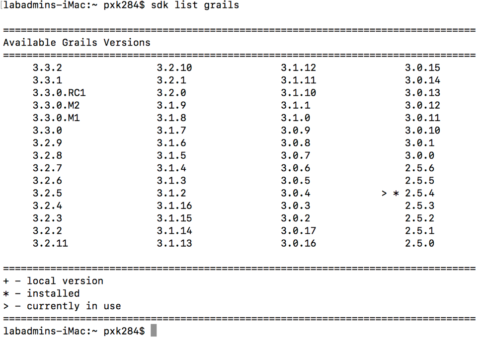
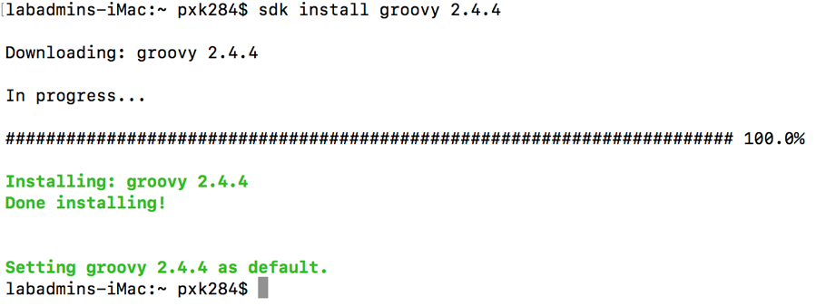
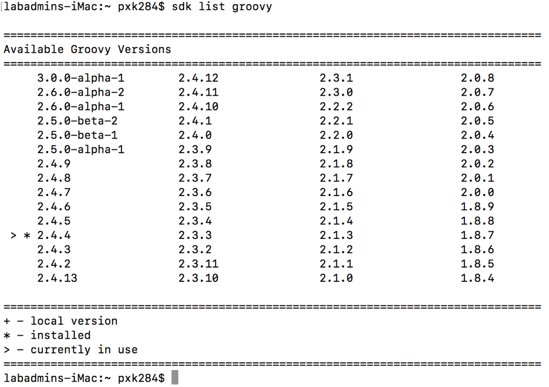
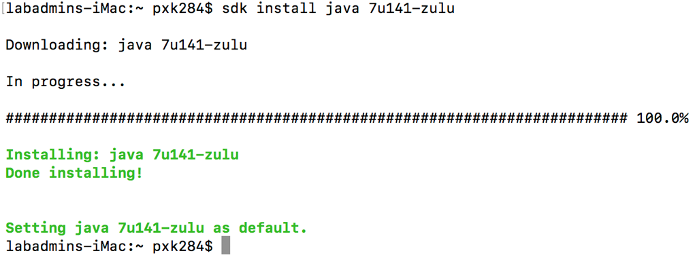
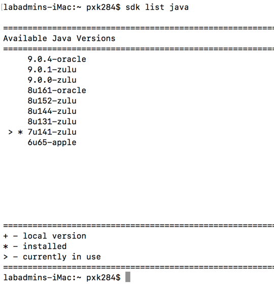
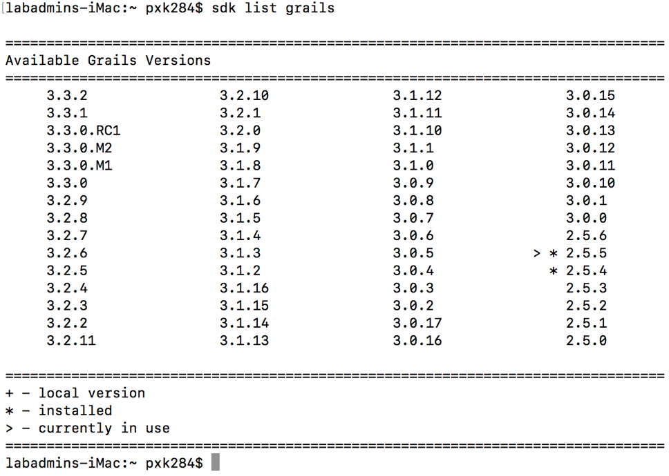
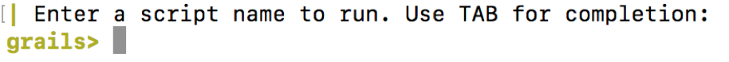

# PEGR

## Pre-Install

Here are the list of tools we will install prior to installing local PEGR:

  Sdkman
  Grails
  Groovy
  Java

### Install sdkman:

  - Install sdkman from the url: http://sdkman.io/install.html
  - Refer figure: sdman_install_1 to see the output for sdkman installation.
  - For documentation on usage of sdkman, go to: http://sdkman.io/usage.html

  * `$ sdk version` # check your sdkman version

### Install Grails:
* `$ sdk install grails 2.5.4` # install grails

figure: sdman_install_1

* `$ sdk list grails` # check your installation of grails
* `$ sdk use grails 2.5.4` # if you have default grails set to another version, change it to version grails 2.5.4

-	Now close the terminal and quit the terminal in your dashboard. [ Important!]

### Install Groovy:
* `$ sdk install groovy 2.4.4` # install groovy

•	Successful output:

•	Check your current version of groovy
* `$ sdk list groovy`

•	Successful output:

### Install Java:

* `$ sdk install java 7u141-zulu` # install Java (specific version needed for current PEGR)
* `$ sdk install java 8u141-zulu` # alternate version that is also compatible

•	Successful output:

* `$ sdk list java` # Check your current version of java

•	Successful output:

-	Now Close your terminal and quit the terminal on the dashboard.
- [ Need to do above step, if you want to run pegr locally ;)]

* `$ grails` # Make Grails install necessary dependencies

•	Grails will install necessary dependencies and once everything runs to completion, should see a similar output as below.

* `$ sdk install grails 2.5.5` # install grails 2.5.5
* `$ sdk list grails` # Check you’re using the grails version 2.5.5
* `$ grails` # install necessary dependencies

•	Successful output:

•	Press ctrl+C to exit the prompt.

## PEGR Install

•	Go to any directory of your choice and clone the PEGR git repo. This will create a folder “pegr” in your directory

* `$ git clone https://github.com/seqcode/pegr.git` # clone the PEGR git repo

•	Navigate to pegr/pegr/grails-app/conf/BuildConfig.groovy and edit these lines (if they are not)

- grails.project.target.level = 1.6 -> grails.project.target.level = 1.7
- grails.project.source.level = 1.6 -> grails.project.source.level = 1.7

•	Now Download the MySQL file located at: https://psu.app.box.com/file/175943271869

•	Rename the sql file to pegrDB
•	Go to System Preferences and you will find a MySql Icon. Click on that and start the SQL server.
•	If you have installed MySQL using homebrew, you can start the MySQL server using below command:

* `$ mysql.server start`

-	Open the terminal and navigate to the folder where you have the pegrDB.sql file
-	Connect to your server by typing in "mysql -u root -p", it will prompt you for that password it gave you.
[ if you installed MySQL using the .dmg file] otherwise, in the case of homebrew, there is no password set for root. You should be able to see the prompt mysql>
-	After successfully connected to the MySQL, use the below SQL command to set the password for root, since you don’t want to have admin access to your database through web application.

	* `mysql> ALTER USER ‘root’@’localhost’ IDENTIFIED BY ‘<your new password> ‘;`

•	Run below commands to create and switch to the new database:

	mysql> Create database pegr;
	mysql> use pegr;
	mysql> source pegrDB.sql
	mysql> show tables;

  •	Successful output:

•	For the sake of access to the database, create a new user by using the below commands
* `mysql>  create user ‘your_ username’@’localhost’ identified by ‘your_password’;`
* `mysql> grant all privileges on *.* to ‘your_username’@’localhost’;`

For an example,
* `mysql>  create user hedgiejo@localhost identified by mypassword12;`
* `mysql> grant all privileges on *.* to hedgiejo@localhost;`

•	The above creates a new user to access your “pegr” database.
•	Now You cannot login into the local instance of PEGR without a valid non-WebAccess account, so here is one way to modify an existing account to gain a login credentials.
•	Within your pegrDB, locate the user "labadmin" and replace the password value:

•	This can be done using the below SQL statement.

* `UPDATE user`
* `set password=something`
* `where username='labadmin';`

•	Above step is needed so that you can access PEGR using the username "labadmin" with the password of "reb$8$6q"
•	Open the BuildConfig.groovy file at pegr/grails-app/conf/BuildConfig.groovy and check the plugins block and verify that the build for the tomcat is appropiate to your version and add the below lines within the plugin block

compile ":spring-security-core:2.0.0"
compile "org.grails.plugins:quartz:1.0.1"
compile "org.grails.plugins:mail:1.0.7"

•	Also, within the dependencies block, uncomment runtime 'mysql' 	[if it is commented]
•	Now open DataSource.groovy at the pegr/grails-app/conf/DataSource.groovy and edit the datasource block to look like this:

environments {
    development {
        dataSource {
            dbCreate = "update" // one of 'create', 'create-drop', 'update', 'validate', ''
            url = "jdbc:mysql://localhost:3306/pegr"
			username=" your_username "
			password="YOURPASSWORDHERE"
        }
    }

•	Now go into the pegr folder and type "grails run-app".  

This will successfully start and provide with you an url (http://localhost:8081/pegr)
- usually which directs you to the login screen of PEGR.

•	Login using the following labadmin credentials:
* `Username: labadmin`
* `Password: passcode`
