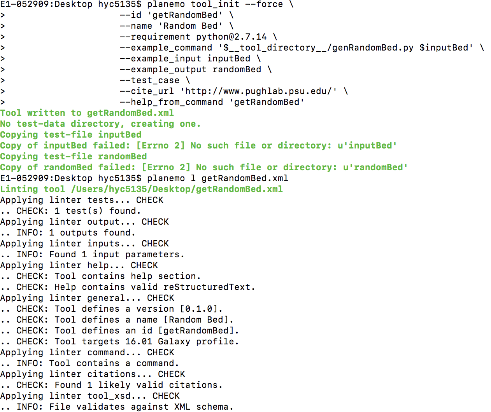

# Planemo

Here is the basic workflow:

- Pre-Install
- Install
- Example
- Test

## Pre-Installs

Install anaconda (locally) on your machine if it is not already installed: [anaconda.com/#download](https://www.anaconda.com/download).

Install wget on your machine, if it is not already installed:

* `$ brew install wget` - (mac)
* `$ sudo apt-get install wget` - (others)

Install virtualenv on your machine, if it is not already installed.

* `$ brew install virtualenv` - (mac)
* `$ sudo apt-get install virtualenv` - (others)

NOTE: make sure local galaxy is installed.

Go the tutorial link:  [galaxyproject.org/admin/#get-galaxy](https://galaxyproject.org/admin/get-galaxy/).

Install pip on your machine, if it is not already installed.

* `$ brew install pip` - (mac)
* `$ sudo apt-get install pip` - (others)

* `	$ virtualenv .venv; . .venv/bin/activate`
* `	$ pip install –-upgrade pip # Upgrade pip if needed.`
* `	$ pip install planemo`

Couple of dependencies are installed and you should see the galaxy running at localhost:8080

Basic tutorial starting point: [planemo.readthedocs.io/en/latest/#installation.html](https://planemo.readthedocs.io/en/latest/installation.html).

## Version

### Tips

A lot of troubles with the initial setup comes from the version conflict of multiple tools and dependencies. One can find the list of compatible version below:

python
planemo
galaxy

## Example

### Seqtk

Use conda to install Seqtk:

* `$ conda install --force --yes -c bioconda seqtk=1.2`
* `$ seqtk seq` - check if seqtk is installed

Download an example FASTQ file

*	`$ wget https://raw.githubusercontent.com/galaxyproject/galaxy-test-data/master/2.fastq`
*	`$ seqtk seq -A 2.fastq > 2.fasta`
*	`$ cat 2.fasta`
	-	If you are unable to download or execute wget command, simply copy & paste the text and save as both 2.fastq and 2.fasta and continue along the steps:

 	>EAS54_6_R1_2_1_413_324
  CCCTTCTTGTCTTCAGCGTTTCTCC
  >EAS54_6_R1_2_1_540_792
  TTGGCAGGCCAAGGCCGATGGATCA
  >EAS54_6_R1_2_1_443_348
  GTTGCTTCTGGCGTGGGTGGGGGGG

Run the following command to generate seqtk_seq.xml file. These contain minimal requirements for the xml file.

		$ planemo tool_init --force \
                    --id 'seqtk_seq' \
                    --name 'Convert to FASTA (seqtk)' \
                    --requirement seqtk@1.2 \
                    --example_command 'seqtk seq -a 2.fastq > 2.fasta' \
                    --example_input 2.fastq \
                    --example_output 2.fasta \
                    --test_case \
                    --cite_url 'https://github.com/lh3/seqtk' \
                    --help_from_command 'seqtk seq'

Explanation of each  command options:
(for more information, see https://planemo.readthedocs.io/en/latest/commands.html)

		id						Short identifier for new tool (no whitespace).
		force					Overwrite existing tool if present.
		name					Name for new tool.
		description				Short description for new tool.
		requirement 			Name of the package.  requirements will be set using Bioconda.
		example_command			Example to command with paths to build Cheetah template from. Must follow with --example_input and --example_output.
		example_input			Replace input file.
		example_output			Replace output file.
		test_case				Generate test-data directory with tool test cases from the supplied example.
		cite_url				Supply a URL for citation.
		help_from_command		Auto populate help from supplied command.

## getRandomBed

Download getRandomBed.py tool:

Use the following commands to generate the xml file getRandomBed.xml

		planemo tool_init --force \
	                    --id 'getRandomBed' \
	                    --name 'Random Bed' \
	                    --requirement python@2.7.14 \
	                    --example_command '$__tool_directory__/genRandomBed.py $inputBed' \
	                    --example_input inputBed \
	                    --example_output randomBed \
	                    --test_case \
	                    --cite_url 'http://www.pughlab.psu.edu/' \
	                    --help_from_command 'getRandomBed'

Planemo lint to review tool for XML validity, syntax errors, and compliance with IUC best practices.

-Tip: Planemo lint command only checks if the syntax is correct, so if you are unable to pass the lint using planemo, check to make sure the above requirements are satisfied.

		planemo l

Output:

Functionality test

		planemo t

## Wrapping

Consider the following small Perl script.

		#!/usr/bin/perl -w

		# usage : perl toolExample.pl <FASTA file> <output file>

		open (IN, "<$ARGV[0]");
		open (OUT, ">$ARGV[1]");
		while (<IN>) {
		    chop;
		    if (m/^>/) {
		        s/^>//;
		        if ($. > 1) {
		            print OUT sprintf("%.3f", $gc/$length) . "\n";
		        }
		        $gc = 0;
		        $length = 0;
		    } else {
		        ++$gc while m/[gc]/ig;
		        $length += length $_;
		    }
		}
		print OUT sprintf("%.3f", $gc/$length) . "\n";
		close( IN );
		close( OUT );

Exercise: Create an xml file for the script with an output as follows:

		<tool id="gc_content" name="Compute GC content">
		  <description>for each sequence in a file</description>
		  <command>perl $__tool_directory__/gc_content.pl $input output.tsv</command>
		  <inputs>
		    <param format="fasta" name="input" type="data" label="Source file"/>
		  </inputs>
		  <outputs>
		    <data format="tabular" name="output" from_work_dir="output.tsv" />
		  </outputs>
		  <help>
		This tool computes GC content from a FASTA file.
		  </help>
		</tool>

Solution:

# Test

## Using Planemo to Test

This guide assumes that you have already installed Planemo and have a directory with one or more Galaxy tool XML files.

## 1) Lint
Planemo can check if the XML file adheres to the Galaxy coding standard using the lint (l) command.

* `$ planemo lint`
* `$ planemo l --help`

For demonstration, type the following in the same directory where your seqtk.xml is located.

* `$ planemo lint seqtk.xml`

The following output should be generated. If output says "Failed linting" at the end, see the error report guidelines here:
[github.com/galaxyproject/planemo/#issues](https://github.com/galaxyproject/planemo/#issues).

## 2) Test
The test command can be used to test the functionality of tool(s). In other words, it checks if the xml file works as supposed to.

* `$ planemo test` - test all the xml files in the current directory
* `$ planemo test --galaxy_root=../galaxy seqtk.xml` - with optional parameters and specify file(s) to run the test.

By default, planemo will search parent directories to see if any is a Galaxy instance.

* Important note: if you specify --galaxy_root folder, reverting it back might be difficult since the  planemo virtual environment path is set up to the galaxy directory. You can try to force planemo to download a disposable instance with the --install_galaxy flag.
* `$ planemo test --install_galaxy seqtk.xml`

The following output should be generated. If error occurs, refer to the error report page on GitHub.

Successful output:

			$ planemo t
			...
			All 1 test(s) executed passed.
			seqtk_seq[0]: passed

## 3) Serve
If the result says All test passed, then we can open Galaxy with the serve (or with s).

		$ planemo s
		...
		serving on http://127.0.0.1:8086
